# Emotes

## \[^a-zA-Z:\]

<table style="text-align: center;width: 100%">
<tr>
<td style='width: 20%'> <kbd>:+2:</kbd></td>
<td style='width: 20%'> <kbd>:000:</kbd></td>
<td style='width: 20%'>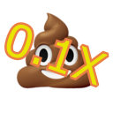 <kbd>:01x:</kbd></td>
<td style='width: 20%'> <kbd>:10000:</kbd></td>
<td style='width: 20%'> <kbd>:1000000:</kbd></td>
</tr>
<tr>
<td style='width: 20%'>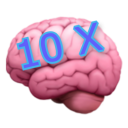 <kbd>:10x:</kbd></td>
<td style='width: 20%'> <kbd>:22peukku:</kbd></td>
<td style='width: 20%'>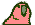 <kbd>:30fpsparrot:</kbd></td>
<td style='width: 20%'>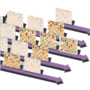 <kbd>:5d-chess:</kbd></td>
<td style='width: 20%'> <kbd>:5g:</kbd></td>
</tr>
<tr>
<td style='width: 20%'>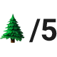 <kbd>:6-5:</kbd></td>
<td style='width: 20%'>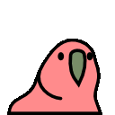 <kbd>:60fpsparrot:</kbd></td>
<td style='width: 20%'>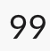 <kbd>:99:</kbd></td>
<td style='width: 20%'>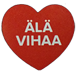 <kbd>:älä-vihaa:</kbd></td>
<td style='width: 20%'> <kbd>:ässä:</kbd></td>
</tr>
</table>

## a

<table style="text-align: center;width: 100%">
<tr>
<td style='width: 20%'> <kbd>:aa:</kbd></td>
<td style='width: 20%'> <kbd>:aaa:</kbd></td>
<td style='width: 20%'> <kbd>:aatos:</kbd></td>
<td style='width: 20%'>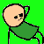 <kbd>:aaw_yeah:</kbd></td>
<td style='width: 20%'> <kbd>:abua:</kbd></td>
</tr>
<tr>
<td style='width: 20%'> <kbd>:accessibility:</kbd></td>
<td style='width: 20%'>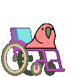 <kbd>:accessibleparrot:</kbd></td>
<td style='width: 20%'> <kbd>:afk:</kbd></td>
<td style='width: 20%'> <kbd>:ah:</kbd></td>
<td style='width: 20%'> <kbd>:ahshit:</kbd></td>
</tr>
<tr>
<td style='width: 20%'>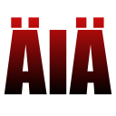 <kbd>:aia:</kbd></td>
<td style='width: 20%'> <kbd>:aiforia:</kbd></td>
<td style='width: 20%'> <kbd>:air-quote-left:</kbd></td>
<td style='width: 20%'> <kbd>:air-quote-right:</kbd></td>
<td style='width: 20%'>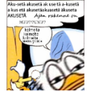 <kbd>:ajanrakenneonmuuttunut:</kbd></td>
</tr>
<tr>
<td style='width: 20%'> <kbd>:ajk:</kbd></td>
<td style='width: 20%'>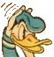 <kbd>:aku:</kbd></td>
<td style='width: 20%'>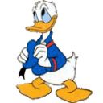 <kbd>:akuankka:</kbd></td>
<td style='width: 20%'>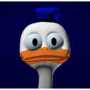 <kbd>:akusedo:</kbd></td>
<td style='width: 20%'> <kbd>:akx:</kbd></td>
</tr>
<tr>
<td style='width: 20%'> <kbd>:alavihaa:</kbd></td>
<td style='width: 20%'> <kbd>:alex-jones:</kbd></td>
<td style='width: 20%'> <kbd>:alibabacloud:</kbd></td>
<td style='width: 20%'> <kbd>:alibi:</kbd></td>
<td style='width: 20%'> <kbd>:aliens:</kbd></td>
</tr>
<tr>
<td style='width: 20%'> <kbd>:alko:</kbd></td>
<td style='width: 20%'>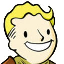 <kbd>:all-good:</kbd></td>
<td style='width: 20%'>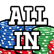 <kbd>:all-in:</kbd></td>
<td style='width: 20%'>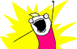 <kbd>:allthethings:</kbd></td>
<td style='width: 20%'>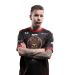 <kbd>:allu:</kbd></td>
</tr>
<tr>
<td style='width: 20%'> <kbd>:alma-logo:</kbd></td>
<td style='width: 20%'> <kbd>:alma:</kbd></td>
<td style='width: 20%'>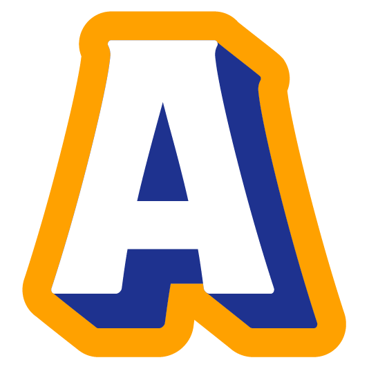 <kbd>:alphabet-white-a:</kbd></td>
<td style='width: 20%'> <kbd>:alphabet-white-at:</kbd></td>
<td style='width: 20%'>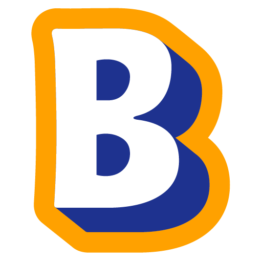 <kbd>:alphabet-white-b:</kbd></td>
</tr>
<tr>
<td style='width: 20%'> <kbd>:alphabet-white-c:</kbd></td>
<td style='width: 20%'>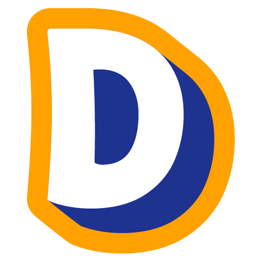 <kbd>:alphabet-white-d:</kbd></td>
<td style='width: 20%'>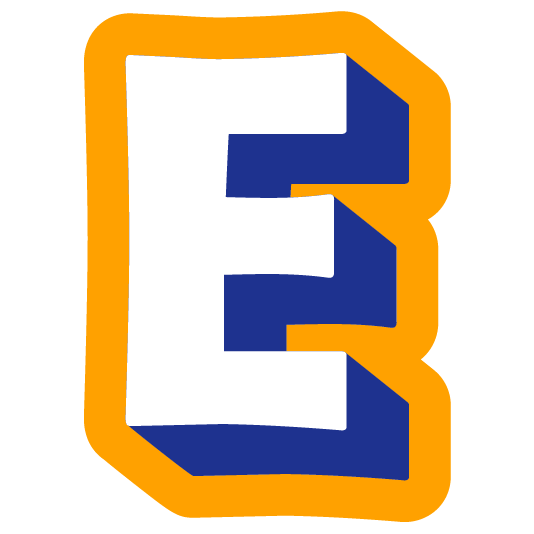 <kbd>:alphabet-white-e:</kbd></td>
<td style='width: 20%'> <kbd>:alphabet-white-exclamation:</kbd></td>
<td style='width: 20%'>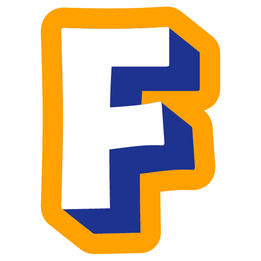 <kbd>:alphabet-white-f:</kbd></td>
</tr>
<tr>
<td style='width: 20%'>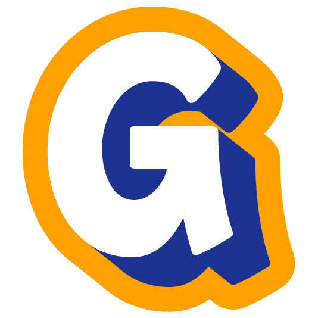 <kbd>:alphabet-white-g:</kbd></td>
<td style='width: 20%'> <kbd>:alphabet-white-h:</kbd></td>
<td style='width: 20%'> <kbd>:alphabet-white-hash:</kbd></td>
<td style='width: 20%'>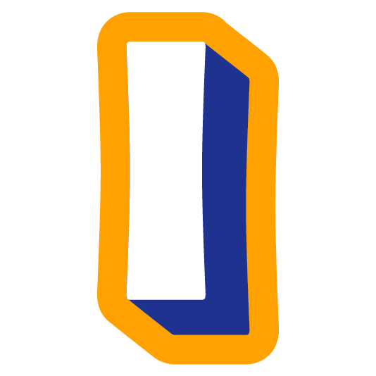 <kbd>:alphabet-white-i:</kbd></td>
<td style='width: 20%'> <kbd>:alphabet-white-j:</kbd></td>
</tr>
<tr>
<td style='width: 20%'>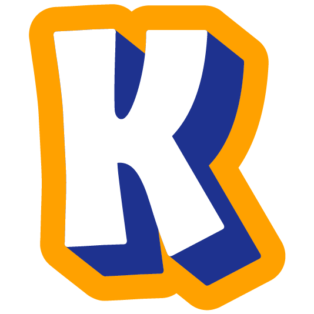 <kbd>:alphabet-white-k:</kbd></td>
<td style='width: 20%'>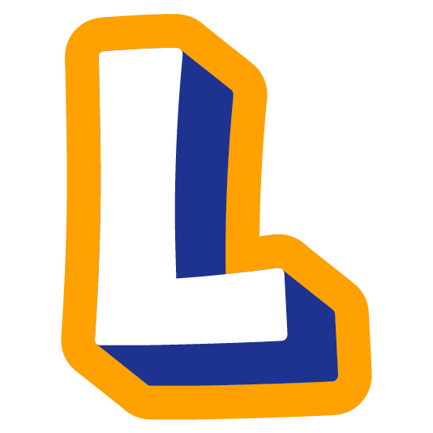 <kbd>:alphabet-white-l:</kbd></td>
<td style='width: 20%'> <kbd>:alphabet-white-m:</kbd></td>
<td style='width: 20%'>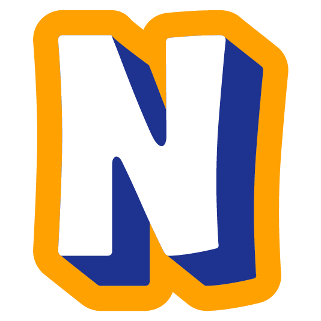 <kbd>:alphabet-white-n:</kbd></td>
<td style='width: 20%'>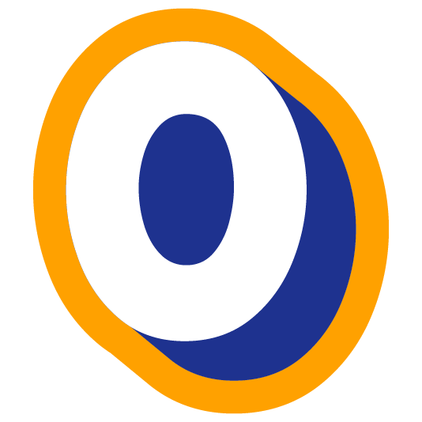 <kbd>:alphabet-white-o:</kbd></td>
</tr>
<tr>
<td style='width: 20%'>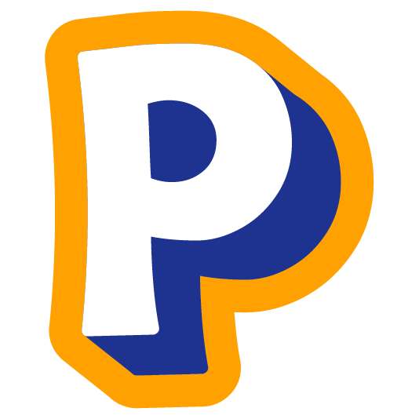 <kbd>:alphabet-white-p:</kbd></td>
<td style='width: 20%'> <kbd>:alphabet-white-q:</kbd></td>
<td style='width: 20%'> <kbd>:alphabet-white-question:</kbd></td>
<td style='width: 20%'>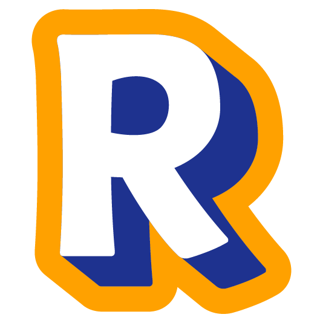 <kbd>:alphabet-white-r:</kbd></td>
<td style='width: 20%'> <kbd>:alphabet-white-s:</kbd></td>
</tr>
<tr>
<td style='width: 20%'> <kbd>:alphabet-white-t:</kbd></td>
<td style='width: 20%'> <kbd>:alphabet-white-u:</kbd></td>
<td style='width: 20%'> <kbd>:alphabet-white-v:</kbd></td>
<td style='width: 20%'> <kbd>:alphabet-white-w:</kbd></td>
<td style='width: 20%'> <kbd>:alphabet-white-x:</kbd></td>
</tr>
<tr>
<td style='width: 20%'> <kbd>:alphabet-white-y:</kbd></td>
<td style='width: 20%'>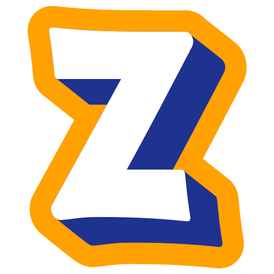 <kbd>:alphabet-white-z:</kbd></td>
<td style='width: 20%'>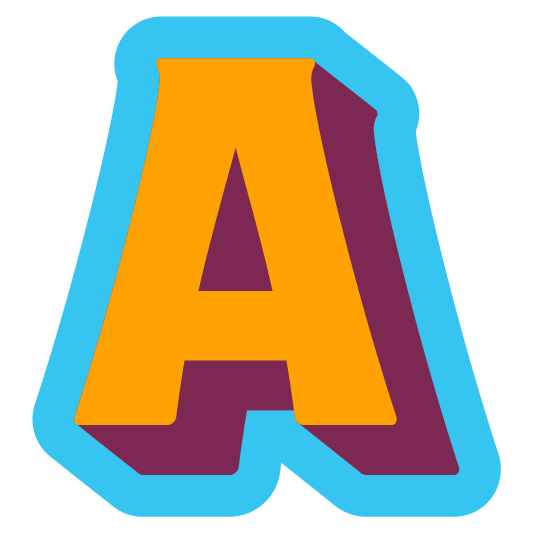 <kbd>:alphabet-yellow-a:</kbd></td>
<td style='width: 20%'> <kbd>:alphabet-yellow-at:</kbd></td>
<td style='width: 20%'>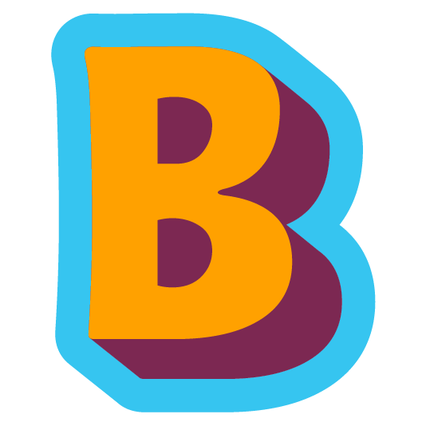 <kbd>:alphabet-yellow-b:</kbd></td>
</tr>
<tr>
<td style='width: 20%'>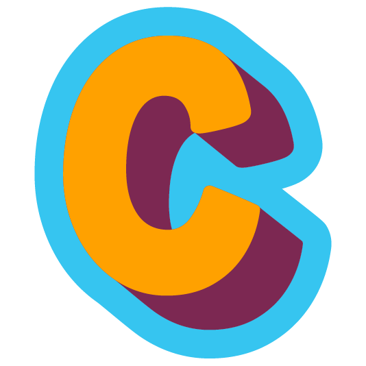 <kbd>:alphabet-yellow-c:</kbd></td>
<td style='width: 20%'>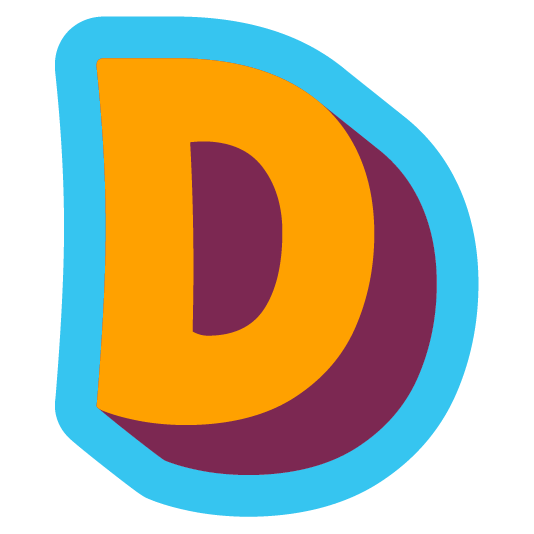 <kbd>:alphabet-yellow-d:</kbd></td>
<td style='width: 20%'>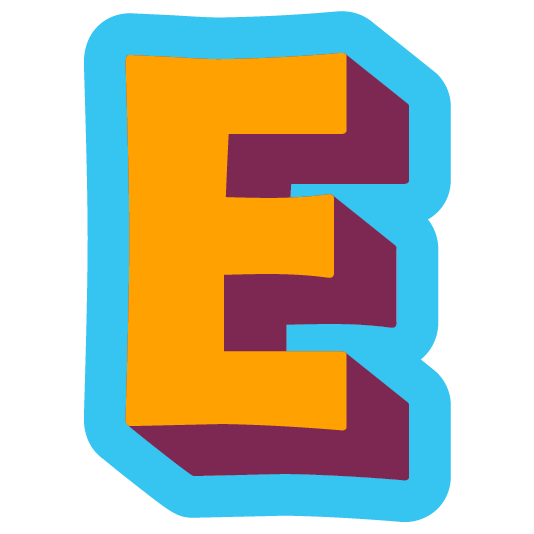 <kbd>:alphabet-yellow-e:</kbd></td>
<td style='width: 20%'> <kbd>:alphabet-yellow-exclamation:</kbd></td>
<td style='width: 20%'>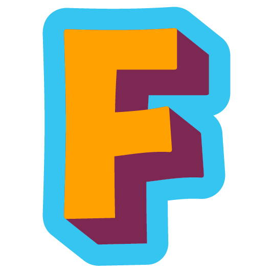 <kbd>:alphabet-yellow-f:</kbd></td>
</tr>
<tr>
<td style='width: 20%'>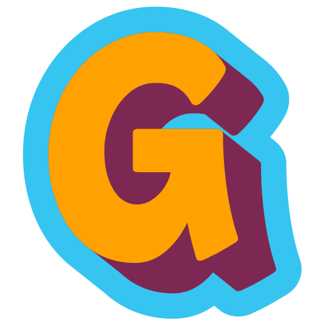 <kbd>:alphabet-yellow-g:</kbd></td>
<td style='width: 20%'>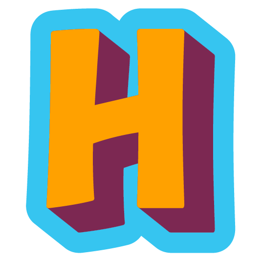 <kbd>:alphabet-yellow-h:</kbd></td>
<td style='width: 20%'>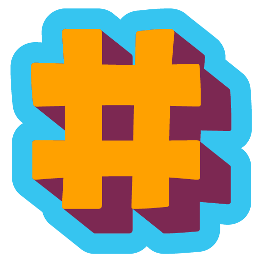 <kbd>:alphabet-yellow-hash:</kbd></td>
<td style='width: 20%'>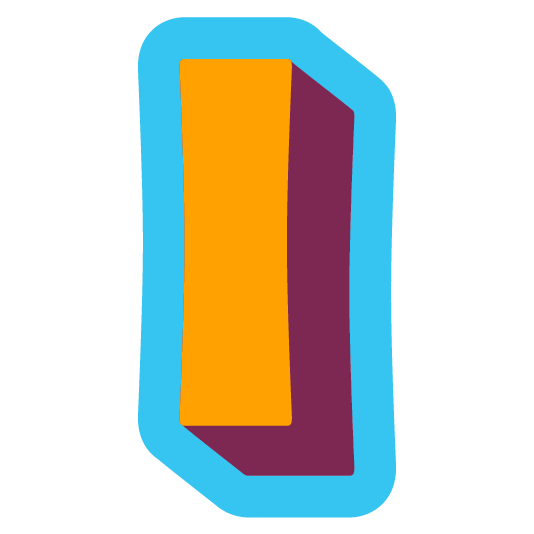 <kbd>:alphabet-yellow-i:</kbd></td>
<td style='width: 20%'> <kbd>:alphabet-yellow-j:</kbd></td>
</tr>
<tr>
<td style='width: 20%'>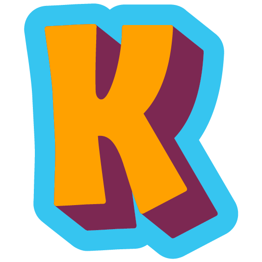 <kbd>:alphabet-yellow-k:</kbd></td>
<td style='width: 20%'>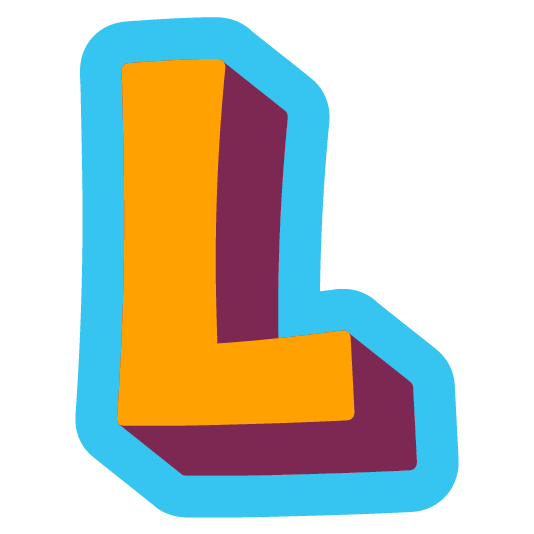 <kbd>:alphabet-yellow-l:</kbd></td>
<td style='width: 20%'> <kbd>:alphabet-yellow-m:</kbd></td>
<td style='width: 20%'>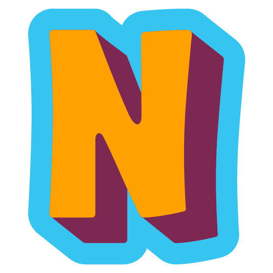 <kbd>:alphabet-yellow-n:</kbd></td>
<td style='width: 20%'>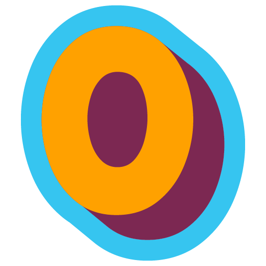 <kbd>:alphabet-yellow-o:</kbd></td>
</tr>
<tr>
<td style='width: 20%'>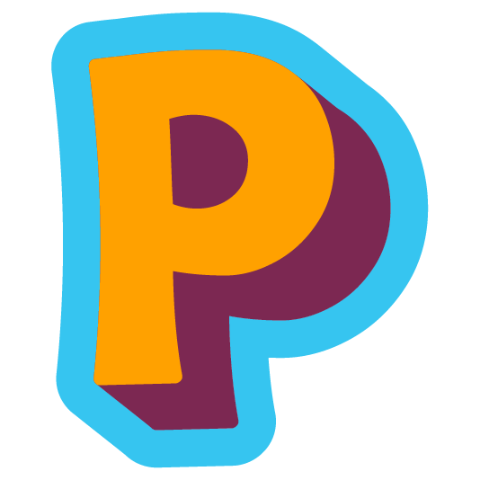 <kbd>:alphabet-yellow-p:</kbd></td>
<td style='width: 20%'>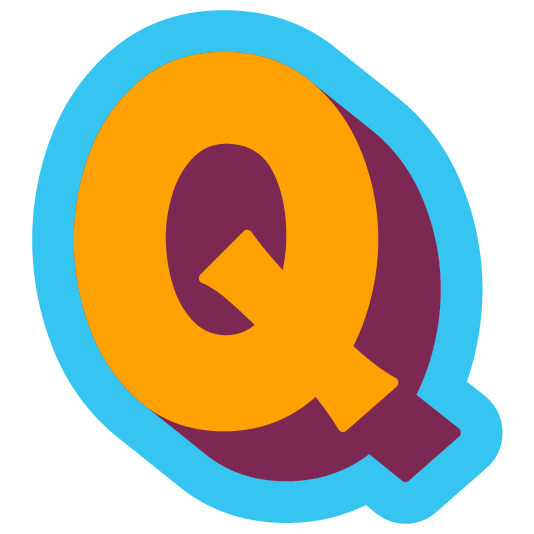 <kbd>:alphabet-yellow-q:</kbd></td>
<td style='width: 20%'> <kbd>:alphabet-yellow-question:</kbd></td>
<td style='width: 20%'>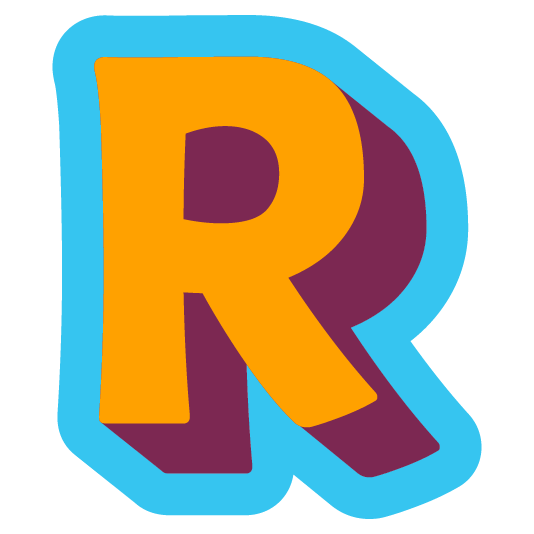 <kbd>:alphabet-yellow-r:</kbd></td>
<td style='width: 20%'> <kbd>:alphabet-yellow-s:</kbd></td>
</tr>
<tr>
<td style='width: 20%'> <kbd>:alphabet-yellow-t:</kbd></td>
<td style='width: 20%'> <kbd>:alphabet-yellow-u:</kbd></td>
<td style='width: 20%'> <kbd>:alphabet-yellow-v:</kbd></td>
<td style='width: 20%'> <kbd>:alphabet-yellow-w:</kbd></td>
<td style='width: 20%'> <kbd>:alphabet-yellow-x:</kbd></td>
</tr>
<tr>
<td style='width: 20%'> <kbd>:alphabet-yellow-y:</kbd></td>
<td style='width: 20%'> <kbd>:alphabet-yellow-z:</kbd></td>
<td style='width: 20%'> <kbd>:amaze:</kbd></td>
<td style='width: 20%'> <kbd>:amiga-ball:</kbd></td>
<td style='width: 20%'> <kbd>:amiga-check:</kbd></td>
</tr>
<tr>
<td style='width: 20%'> <kbd>:amongus1:</kbd></td>
<td style='width: 20%'> <kbd>:amongus2:</kbd></td>
<td style='width: 20%'> <kbd>:amongus3:</kbd></td>
<td style='width: 20%'> <kbd>:ampari:</kbd></td>
<td style='width: 20%'> <kbd>:amzn:</kbd></td>
</tr>
<tr>
<td style='width: 20%'> <kbd>:anarchy:</kbd></td>
<td style='width: 20%'> <kbd>:android:</kbd></td>
<td style='width: 20%'> <kbd>:angelparrot:</kbd></td>
<td style='width: 20%'> <kbd>:angery:</kbd></td>
<td style='width: 20%'> <kbd>:angewy:</kbd></td>
</tr>
<tr>
<td style='width: 20%'> <kbd>:angry-donald:</kbd></td>
<td style='width: 20%'> <kbd>:angry-skeletor:</kbd></td>
<td style='width: 20%'> <kbd>:angry-unicorn:</kbd></td>
<td style='width: 20%'> <kbd>:angry_partying:</kbd></td>
<td style='width: 20%'> <kbd>:angular:</kbd></td>
</tr>
<tr>
<td style='width: 20%'> <kbd>:anssiauttaa:</kbd></td>
<td style='width: 20%'> <kbd>:anti-torille:</kbd></td>
<td style='width: 20%'> <kbd>:anti-z:</kbd></td>
<td style='width: 20%'> <kbd>:antikuula:</kbd></td>
<td style='width: 20%'> <kbd>:anttiauttaa:</kbd></td>
</tr>
<tr>
<td style='width: 20%'> <kbd>:anttirinne:</kbd></td>
<td style='width: 20%'> <kbd>:apple-rainbow:</kbd></td>
<td style='width: 20%'> <kbd>:apple_inc:</kbd></td>
<td style='width: 20%'> <kbd>:apple_m1:</kbd></td>
<td style='width: 20%'> <kbd>:apple_m2:</kbd></td>
</tr>
<tr>
<td style='width: 20%'> <kbd>:appletvplus:</kbd></td>
<td style='width: 20%'> <kbd>:appletvplusright:</kbd></td>
<td style='width: 20%'> <kbd>:apua:</kbd></td>
<td style='width: 20%'> <kbd>:ar:</kbd></td>
<td style='width: 20%'> <kbd>:arado:</kbd></td>
</tr>
<tr>
<td style='width: 20%'> <kbd>:arousesme:</kbd></td>
<td style='width: 20%'> <kbd>:arreps:</kbd></td>
<td style='width: 20%'> <kbd>:arvilind:</kbd></td>
<td style='width: 20%'> <kbd>:asburger:</kbd></td>
<td style='width: 20%'> <kbd>:asia_kunnossa:</kbd></td>
</tr>
<tr>
<td style='width: 20%'> <kbd>:asiakunnossa:</kbd></td>
<td style='width: 20%'> <kbd>:atk-ajokortti:</kbd></td>
<td style='width: 20%'> <kbd>:atk:</kbd></td>
<td style='width: 20%'> <kbd>:atoz:</kbd></td>
<td style='width: 20%'> <kbd>:atwork:</kbd></td>
</tr>
<tr>
<td style='width: 20%'> <kbd>:audi:</kbd></td>
<td style='width: 20%'> <kbd>:aurajuusto:</kbd></td>
<td style='width: 20%'> <kbd>:aussiecongaparrot:</kbd></td>
<td style='width: 20%'> <kbd>:aussieparrot:</kbd></td>
<td style='width: 20%'> <kbd>:avainlippu:</kbd></td>
</tr>
<tr>
<td style='width: 20%'> <kbd>:avpn:</kbd></td>
<td style='width: 20%'> <kbd>:awakebutatwhatcost:</kbd></td>
<td style='width: 20%'> <kbd>:away:</kbd></td>
<td style='width: 20%'> <kbd>:awbear:</kbd></td>
<td style='width: 20%'> <kbd>:awesome:</kbd></td>
</tr>
<tr>
<td style='width: 20%'> <kbd>:awkward:</kbd></td>
<td style='width: 20%'> <kbd>:awkward:</kbd></td>
<td style='width: 20%'> <kbd>:aws:</kbd></td>
<td style='width: 20%'> <kbd>:aws2:</kbd></td>
<td style='width: 20%'> <kbd>:awyeah:</kbd></td>
</tr>
<tr>
<td style='width: 20%'> <kbd>:awyeah1:</kbd></td>
<td style='width: 20%'> <kbd>:aye-aye:</kbd></td>
<td style='width: 20%'> <kbd>:azure:</kbd></td>
</tr>
</table>

## b

<table style="text-align: center;width: 100%">
<tr>
<td style='width: 20%'> <kbd>:babyparrot:</kbd></td>
<td style='width: 20%'> <kbd>:back-to-the-future:</kbd></td>
<td style='width: 20%'> <kbd>:backtofuture:</kbd></td>
<td style='width: 20%'> <kbd>:badger-dance:</kbd></td>
<td style='width: 20%'> <kbd>:badgest:</kbd></td>
</tr>
<tr>
<td style='width: 20%'> <kbd>:badpun:</kbd></td>
<td style='width: 20%'> <kbd>:badumtish:</kbd></td>
<td style='width: 20%'> <kbd>:badumts:</kbd></td>
<td style='width: 20%'> <kbd>:badumtsh:</kbd></td>
<td style='width: 20%'> <kbd>:bagholder:</kbd></td>
</tr>
<tr>
<td style='width: 20%'> <kbd>:bagpipes:</kbd></td>
<td style='width: 20%'> <kbd>:baguette_bonk_doge:</kbd></td>
<td style='width: 20%'> <kbd>:balance:</kbd></td>
<td style='width: 20%'> <kbd>:bananahammock:</kbd></td>
<td style='width: 20%'> <kbd>:bananas:</kbd></td>
</tr>
<tr>
<td style='width: 20%'> <kbd>:bass:</kbd></td>
<td style='width: 20%'> <kbd>:batman:</kbd></td>
<td style='width: 20%'> <kbd>:batman:</kbd></td>
<td style='width: 20%'> <kbd>:batterydrink:</kbd></td>
<td style='width: 20%'> <kbd>:bayraktar:</kbd></td>
</tr>
<tr>
<td style='width: 20%'> <kbd>:bb8:</kbd></td>
<td style='width: 20%'> <kbd>:beachball:</kbd></td>
<td style='width: 20%'> <kbd>:beast:</kbd></td>
<td style='width: 20%'> <kbd>:beavis:</kbd></td>
<td style='width: 20%'> <kbd>:beerparrot:</kbd></td>
</tr>
<tr>
<td style='width: 20%'> <kbd>:beers-intense:</kbd></td>
<td style='width: 20%'> <kbd>:behringer:</kbd></td>
<td style='width: 20%'> <kbd>:bellissimo:</kbd></td>
<td style='width: 20%'> <kbd>:bender:</kbd></td>
<td style='width: 20%'> <kbd>:berliininmunkki:</kbd></td>
</tr>
<tr>
<td style='width: 20%'> <kbd>:bernie:</kbd></td>
<td style='width: 20%'> <kbd>:beryl:</kbd></td>
<td style='width: 20%'> <kbd>:bestpizza:</kbd></td>
<td style='width: 20%'> <kbd>:betterthanexpected:</kbd></td>
<td style='width: 20%'> <kbd>:bezos:</kbd></td>
</tr>
<tr>
<td style='width: 20%'> <kbd>:bezosheart:</kbd></td>
<td style='width: 20%'> <kbd>:bge:</kbd></td>
<td style='width: 20%'> <kbd>:biden:</kbd></td>
<td style='width: 20%'> <kbd>:bigthink:</kbd></td>
<td style='width: 20%'> <kbd>:bikerparrot:</kbd></td>
</tr>
<tr>
<td style='width: 20%'> <kbd>:bikeshed:</kbd></td>
<td style='width: 20%'> <kbd>:birthdaypartyparrot:</kbd></td>
<td style='width: 20%'> <kbd>:bitcoin:</kbd></td>
<td style='width: 20%'> <kbd>:bittium:</kbd></td>
<td style='width: 20%'> <kbd>:blackbananas:</kbd></td>
</tr>
<tr>
<td style='width: 20%'> <kbd>:blank:</kbd></td>
<td style='width: 20%'> <kbd>:bless:</kbd></td>
<td style='width: 20%'> <kbd>:blinking:</kbd></td>
<td style='width: 20%'> <kbd>:blobhaj:</kbd></td>
<td style='width: 20%'> <kbd>:bluetooth:</kbd></td>
</tr>
<tr>
<td style='width: 20%'> <kbd>:bmw:</kbd></td>
<td style='width: 20%'> <kbd>:bob:</kbd></td>
<td style='width: 20%'> <kbd>:bobafett:</kbd></td>
<td style='width: 20%'> <kbd>:bobber:</kbd></td>
<td style='width: 20%'> <kbd>:boksi:</kbd></td>
</tr>
<tr>
<td style='width: 20%'> <kbd>:bondage:</kbd></td>
<td style='width: 20%'> <kbd>:bongot:</kbd></td>
<td style='width: 20%'> <kbd>:bonk-doge:</kbd></td>
<td style='width: 20%'> <kbd>:boom-2:</kbd></td>
<td style='width: 20%'> <kbd>:boomkah:</kbd></td>
</tr>
<tr>
<td style='width: 20%'> <kbd>:borat:</kbd></td>
<td style='width: 20%'> <kbd>:boredparrot:</kbd></td>
<td style='width: 20%'> <kbd>:borg-parrot:</kbd></td>
<td style='width: 20%'> <kbd>:borg:</kbd></td>
<td style='width: 20%'> <kbd>:bosch:</kbd></td>
</tr>
<tr>
<td style='width: 20%'> <kbd>:bouncingparrot:</kbd></td>
<td style='width: 20%'> <kbd>:bounty:</kbd></td>
<td style='width: 20%'> <kbd>:boxing:</kbd></td>
<td style='width: 20%'> <kbd>:brain_full_of_fuck:</kbd></td>
<td style='width: 20%'> <kbd>:braz:</kbd></td>
</tr>
<tr>
<td style='width: 20%'> <kbd>:brazilianplayerparrot:</kbd></td>
<td style='width: 20%'> <kbd>:brb:</kbd></td>
<td style='width: 20%'> <kbd>:breast:</kbd></td>
<td style='width: 20%'> <kbd>:brella:</kbd></td>
<td style='width: 20%'> <kbd>:broether:</kbd></td>
</tr>
<tr>
<td style='width: 20%'> <kbd>:broken:</kbd></td>
<td style='width: 20%'> <kbd>:brrr:</kbd></td>
<td style='width: 20%'> <kbd>:bruins:</kbd></td>
<td style='width: 20%'> <kbd>:bubblebobble:</kbd></td>
<td style='width: 20%'> <kbd>:bueno:</kbd></td>
</tr>
<tr>
<td style='width: 20%'> <kbd>:buffgarfield:</kbd></td>
<td style='width: 20%'> <kbd>:bull:</kbd></td>
<td style='width: 20%'> <kbd>:bull_mentula:</kbd></td>
<td style='width: 20%'> <kbd>:bunny-slippers:</kbd></td>
<td style='width: 20%'> <kbd>:bunnyparrot:</kbd></td>
</tr>
<tr>
<td style='width: 20%'> <kbd>:burn:</kbd></td>
<td style='width: 20%'> <kbd>:business_haha:</kbd></td>
</tr>
</table>

## c

<table style="text-align: center;width: 100%">
<tr>
<td style='width: 20%'> <kbd>:c:</kbd></td>
<td style='width: 20%'> <kbd>:c64:</kbd></td>
<td style='width: 20%'> <kbd>:cadillac:</kbd></td>
<td style='width: 20%'> <kbd>:cakeparrot:</kbd></td>
<td style='width: 20%'> <kbd>:calvinist_parrot:</kbd></td>
</tr>
<tr>
<td style='width: 20%'> <kbd>:cannon:</kbd></td>
<td style='width: 20%'> <kbd>:capitalist:</kbd></td>
<td style='width: 20%'> <kbd>:capsparrot:</kbd></td>
<td style='width: 20%'> <kbd>:captainphasma:</kbd></td>
<td style='width: 20%'> <kbd>:care:</kbd></td>
</tr>
<tr>
<td style='width: 20%'> <kbd>:carebear:</kbd></td>
<td style='width: 20%'> <kbd>:carebear_cloud:</kbd></td>
<td style='width: 20%'> <kbd>:carlton:</kbd></td>
<td style='width: 20%'> <kbd>:carpet_pinkmouse:</kbd></td>
<td style='width: 20%'> <kbd>:cast:</kbd></td>
</tr>
<tr>
<td style='width: 20%'> <kbd>:cat-bread-appear:</kbd></td>
<td style='width: 20%'> <kbd>:cat-bread-disappear:</kbd></td>
<td style='width: 20%'> <kbd>:cat-goggles:</kbd></td>
<td style='width: 20%'> <kbd>:cat-on-keyboard:</kbd></td>
<td style='width: 20%'> <kbd>:cat-vibe:</kbd></td>
</tr>
<tr>
<td style='width: 20%'> <kbd>:cat-with-hat:</kbd></td>
<td style='width: 20%'> <kbd>:catbeer:</kbd></td>
<td style='width: 20%'> <kbd>:catblob:</kbd></td>
<td style='width: 20%'> <kbd>:catblobgrin:</kbd></td>
<td style='width: 20%'> <kbd>:catblobwhat:</kbd></td>
</tr>
<tr>
<td style='width: 20%'> <kbd>:catbusiness:</kbd></td>
<td style='width: 20%'> <kbd>:catcake:</kbd></td>
<td style='width: 20%'> <kbd>:catchampagne:</kbd></td>
<td style='width: 20%'> <kbd>:catchemist:</kbd></td>
<td style='width: 20%'> <kbd>:catcoffee:</kbd></td>
</tr>
<tr>
<td style='width: 20%'> <kbd>:catcomfy:</kbd></td>
<td style='width: 20%'> <kbd>:catdead:</kbd></td>
<td style='width: 20%'> <kbd>:catfingerguns:</kbd></td>
<td style='width: 20%'> <kbd>:catgive:</kbd></td>
<td style='width: 20%'> <kbd>:catgiveattention:</kbd></td>
</tr>
<tr>
<td style='width: 20%'> <kbd>:catglare:</kbd></td>
<td style='width: 20%'> <kbd>:catglarethinking:</kbd></td>
<td style='width: 20%'> <kbd>:catheart:</kbd></td>
<td style='width: 20%'> <kbd>:cathyperpanic:</kbd></td>
<td style='width: 20%'> <kbd>:catjam:</kbd></td>
</tr>
<tr>
<td style='width: 20%'> <kbd>:catlul:</kbd></td>
<td style='width: 20%'> <kbd>:catmelt:</kbd></td>
<td style='width: 20%'> <kbd>:catmorning:</kbd></td>
<td style='width: 20%'> <kbd>:catnervous:</kbd></td>
<td style='width: 20%'> <kbd>:catok:</kbd></td>
</tr>
<tr>
<td style='width: 20%'> <kbd>:catpanicpopcorn:</kbd></td>
<td style='width: 20%'> <kbd>:catparty:</kbd></td>
<td style='width: 20%'> <kbd>:catpopcorn:</kbd></td>
<td style='width: 20%'> <kbd>:catread:</kbd></td>
<td style='width: 20%'> <kbd>:catremote:</kbd></td>
</tr>
<tr>
<td style='width: 20%'> <kbd>:catsad:</kbd></td>
<td style='width: 20%'> <kbd>:catshy:</kbd></td>
<td style='width: 20%'> <kbd>:catsip:</kbd></td>
<td style='width: 20%'> <kbd>:catsleepy:</kbd></td>
<td style='width: 20%'> <kbd>:catsmart:</kbd></td>
</tr>
<tr>
<td style='width: 20%'> <kbd>:catsmug:</kbd></td>
<td style='width: 20%'> <kbd>:catstopsign:</kbd></td>
<td style='width: 20%'> <kbd>:cattoot:</kbd></td>
<td style='width: 20%'> <kbd>:cattunk:</kbd></td>
<td style='width: 20%'> <kbd>:celeryman:</kbd></td>
</tr>
<tr>
<td style='width: 20%'> <kbd>:certified:</kbd></td>
<td style='width: 20%'> <kbd>:chad:</kbd></td>
<td style='width: 20%'> <kbd>:cheems:</kbd></td>
<td style='width: 20%'> <kbd>:chef-brb:</kbd></td>
<td style='width: 20%'> <kbd>:chefkiss:</kbd></td>
</tr>
<tr>
<td style='width: 20%'> <kbd>:chewbacca:</kbd></td>
<td style='width: 20%'> <kbd>:chick_aww:</kbd></td>
<td style='width: 20%'> <kbd>:chick_blush:</kbd></td>
<td style='width: 20%'> <kbd>:chick_coffee:</kbd></td>
<td style='width: 20%'> <kbd>:chick_content:</kbd></td>
</tr>
<tr>
<td style='width: 20%'> <kbd>:chick_idea:</kbd></td>
<td style='width: 20%'> <kbd>:chick_in_love:</kbd></td>
<td style='width: 20%'> <kbd>:chick_injured:</kbd></td>
<td style='width: 20%'> <kbd>:chick_laptop:</kbd></td>
<td style='width: 20%'> <kbd>:chick_love_blush:</kbd></td>
</tr>
<tr>
<td style='width: 20%'> <kbd>:chick_magic:</kbd></td>
<td style='width: 20%'> <kbd>:chick_mischief:</kbd></td>
<td style='width: 20%'> <kbd>:chick_party:</kbd></td>
<td style='width: 20%'> <kbd>:chick_sad:</kbd></td>
<td style='width: 20%'> <kbd>:chick_scientist:</kbd></td>
</tr>
<tr>
<td style='width: 20%'> <kbd>:chick_shades:</kbd></td>
<td style='width: 20%'> <kbd>:chick_smile:</kbd></td>
<td style='width: 20%'> <kbd>:chick_snuggle:</kbd></td>
<td style='width: 20%'> <kbd>:chick_surprised:</kbd></td>
<td style='width: 20%'> <kbd>:chick_sweat_smile:</kbd></td>
</tr>
<tr>
<td style='width: 20%'> <kbd>:chick_tea:</kbd></td>
<td style='width: 20%'> <kbd>:chick_thinking:</kbd></td>
<td style='width: 20%'> <kbd>:chick_unicorn:</kbd></td>
<td style='width: 20%'> <kbd>:chick_what:</kbd></td>
<td style='width: 20%'> <kbd>:chick_wink:</kbd></td>
</tr>
<tr>
<td style='width: 20%'> <kbd>:chick_wizard:</kbd></td>
<td style='width: 20%'> <kbd>:chick_worried:</kbd></td>
<td style='width: 20%'> <kbd>:chick_xd:</kbd></td>
<td style='width: 20%'> <kbd>:chick_zzz:</kbd></td>
<td style='width: 20%'> <kbd>:chicoparrot:</kbd></td>
</tr>
<tr>
<td style='width: 20%'> <kbd>:chili:</kbd></td>
<td style='width: 20%'> <kbd>:chilicorn:</kbd></td>
<td style='width: 20%'> <kbd>:chill:</kbd></td>
<td style='width: 20%'> <kbd>:chilli:</kbd></td>
<td style='width: 20%'> <kbd>:chirpchirp:</kbd></td>
</tr>
<tr>
<td style='width: 20%'> <kbd>:choffice:</kbd></td>
<td style='width: 20%'> <kbd>:christmascat:</kbd></td>
<td style='width: 20%'> <kbd>:christmasparrot:</kbd></td>
<td style='width: 20%'> <kbd>:chrome:</kbd></td>
<td style='width: 20%'> <kbd>:chuck_norris:</kbd></td>
</tr>
<tr>
<td style='width: 20%'> <kbd>:cider:</kbd></td>
<td style='width: 20%'> <kbd>:cirit:</kbd></td>
<td style='width: 20%'> <kbd>:citation_needed:</kbd></td>
<td style='width: 20%'> <kbd>:cl-trophy:</kbd></td>
<td style='width: 20%'> <kbd>:classic:</kbd></td>
</tr>
<tr>
<td style='width: 20%'> <kbd>:climber:</kbd></td>
<td style='width: 20%'> <kbd>:clippy:</kbd></td>
<td style='width: 20%'> <kbd>:clj:</kbd></td>
<td style='width: 20%'> <kbd>:clojure:</kbd></td>
<td style='width: 20%'> <kbd>:clojurescript:</kbd></td>
</tr>
<tr>
<td style='width: 20%'> <kbd>:cloud2:</kbd></td>
<td style='width: 20%'> <kbd>:cloudflare:</kbd></td>
<td style='width: 20%'> <kbd>:cloudia:</kbd></td>
<td style='width: 20%'> <kbd>:coc:</kbd></td>
<td style='width: 20%'> <kbd>:cocoapods:</kbd></td>
</tr>
<tr>
<td style='width: 20%'> <kbd>:coffee-intense:</kbd></td>
<td style='width: 20%'> <kbd>:coffee-raccoon:</kbd></td>
<td style='width: 20%'> <kbd>:cola:</kbd></td>
<td style='width: 20%'> <kbd>:cold_face_intensified:</kbd></td>
<td style='width: 20%'> <kbd>:commuting:</kbd></td>
</tr>
<tr>
<td style='width: 20%'> <kbd>:complex-smile:</kbd></td>
<td style='width: 20%'> <kbd>:confluence:</kbd></td>
<td style='width: 20%'> <kbd>:confused-parrot:</kbd></td>
<td style='width: 20%'> <kbd>:confused-travolta:</kbd></td>
<td style='width: 20%'> <kbd>:confused_dog:</kbd></td>
</tr>
<tr>
<td style='width: 20%'> <kbd>:congaparrothd:</kbd></td>
<td style='width: 20%'> <kbd>:congrid:</kbd></td>
<td style='width: 20%'> <kbd>:contentful:</kbd></td>
<td style='width: 20%'> <kbd>:cookie-monster:</kbd></td>
<td style='width: 20%'> <kbd>:cool-ie:</kbd></td>
</tr>
<tr>
<td style='width: 20%'> <kbd>:cool_cowboy:</kbd></td>
<td style='width: 20%'> <kbd>:copparrot:</kbd></td>
<td style='width: 20%'> <kbd>:corgi:</kbd></td>
<td style='width: 20%'> <kbd>:corgi_dance:</kbd></td>
<td style='width: 20%'> <kbd>:cornholio:</kbd></td>
</tr>
<tr>
<td style='width: 20%'> <kbd>:corona-poop:</kbd></td>
<td style='width: 20%'> <kbd>:corona-with-lime:</kbd></td>
<td style='width: 20%'> <kbd>:corona_beer:</kbd></td>
<td style='width: 20%'> <kbd>:cough:</kbd></td>
<td style='width: 20%'> <kbd>:cpp:</kbd></td>
</tr>
<tr>
<td style='width: 20%'> <kbd>:cr:</kbd></td>
<td style='width: 20%'> <kbd>:crabby:</kbd></td>
<td style='width: 20%'> <kbd>:cramer:</kbd></td>
<td style='width: 20%'> <kbd>:crazy-cat-lady:</kbd></td>
<td style='width: 20%'> <kbd>:creeper:</kbd></td>
</tr>
<tr>
<td style='width: 20%'> <kbd>:critical:</kbd></td>
<td style='width: 20%'> <kbd>:crying_blood:</kbd></td>
<td style='width: 20%'> <kbd>:crypoo:</kbd></td>
<td style='width: 20%'> <kbd>:crypts:</kbd></td>
<td style='width: 20%'> <kbd>:csgo:</kbd></td>
</tr>
<tr>
<td style='width: 20%'> <kbd>:csslove:</kbd></td>
<td style='width: 20%'> <kbd>:cthulhu:</kbd></td>
<td style='width: 20%'> <kbd>:cursedparrot:</kbd></td>
<td style='width: 20%'> <kbd>:cursor:</kbd></td>
</tr>
</table>

## d

<table style="text-align: center;width: 100%">
<tr>
<td style='width: 20%'> <kbd>:dadparrot:</kbd></td>
<td style='width: 20%'> <kbd>:dailyparrot:</kbd></td>
<td style='width: 20%'> <kbd>:damagers:</kbd></td>
<td style='width: 20%'> <kbd>:dance-hotdog:</kbd></td>
<td style='width: 20%'> <kbd>:dancing-disco:</kbd></td>
</tr>
<tr>
<td style='width: 20%'> <kbd>:dancingbanana:</kbd></td>
<td style='width: 20%'> <kbd>:dancingbutt:</kbd></td>
<td style='width: 20%'> <kbd>:dancingcupcake:</kbd></td>
<td style='width: 20%'> <kbd>:dancingmonkey:</kbd></td>
<td style='width: 20%'> <kbd>:dancingowl:</kbd></td>
</tr>
<tr>
<td style='width: 20%'> <kbd>:dancingpanda:</kbd></td>
<td style='width: 20%'> <kbd>:dancingpanu:</kbd></td>
<td style='width: 20%'> <kbd>:dancingpenguin:</kbd></td>
<td style='width: 20%'> <kbd>:dancingsquirrel:</kbd></td>
<td style='width: 20%'> <kbd>:dangerous:</kbd></td>
</tr>
<tr>
<td style='width: 20%'> <kbd>:dangerzone:</kbd></td>
<td style='width: 20%'> <kbd>:darklord:</kbd></td>
<td style='width: 20%'> <kbd>:darkmodeparrot:</kbd></td>
<td style='width: 20%'> <kbd>:darthvader:</kbd></td>
<td style='width: 20%'> <kbd>:darude:</kbd></td>
</tr>
<tr>
<td style='width: 20%'> <kbd>:data-analyytikko:</kbd></td>
<td style='width: 20%'> <kbd>:deadinside:</kbd></td>
<td style='width: 20%'> <kbd>:deadpool:</kbd></td>
<td style='width: 20%'> <kbd>:deadpool_logo:</kbd></td>
<td style='width: 20%'> <kbd>:deadpool_love:</kbd></td>
</tr>
<tr>
<td style='width: 20%'> <kbd>:deadpool_pls:</kbd></td>
<td style='width: 20%'> <kbd>:deadpool_shock:</kbd></td>
<td style='width: 20%'> <kbd>:deal-with-it:</kbd></td>
<td style='width: 20%'> <kbd>:dealwithcat:</kbd></td>
<td style='width: 20%'> <kbd>:dealwithitnowparrot:</kbd></td>
</tr>
<tr>
<td style='width: 20%'> <kbd>:dealwithitparrot:</kbd></td>
<td style='width: 20%'> <kbd>:deathstar:</kbd></td>
<td style='width: 20%'> <kbd>:decent:</kbd></td>
<td style='width: 20%'> <kbd>:decepticon:</kbd></td>
<td style='width: 20%'> <kbd>:delete:</kbd></td>
</tr>
<tr>
<td style='width: 20%'> <kbd>:deleted:</kbd></td>
<td style='width: 20%'> <kbd>:derpthink:</kbd></td>
<td style='width: 20%'> <kbd>:desertdog:</kbd></td>
<td style='width: 20%'> <kbd>:deskflip:</kbd></td>
<td style='width: 20%'> <kbd>:deviam:</kbd></td>
</tr>
<tr>
<td style='width: 20%'> <kbd>:devopshyrra:</kbd></td>
<td style='width: 20%'> <kbd>:dewalt:</kbd></td>
<td style='width: 20%'> <kbd>:dickbutt:</kbd></td>
<td style='width: 20%'> <kbd>:dickbutt:</kbd></td>
<td style='width: 20%'> <kbd>:digitalist:</kbd></td>
</tr>
<tr>
<td style='width: 20%'> <kbd>:digitalocean:</kbd></td>
<td style='width: 20%'> <kbd>:ding-dong-2:</kbd></td>
<td style='width: 20%'> <kbd>:ding-dong-3:</kbd></td>
<td style='width: 20%'> <kbd>:ding-dong-4:</kbd></td>
<td style='width: 20%'> <kbd>:ding-dong-404:</kbd></td>
</tr>
<tr>
<td style='width: 20%'> <kbd>:ding-dong-5:</kbd></td>
<td style='width: 20%'> <kbd>:ding-dong:</kbd></td>
<td style='width: 20%'> <kbd>:dingdongteams:</kbd></td>
<td style='width: 20%'> <kbd>:dingdongteamswtf:</kbd></td>
<td style='width: 20%'> <kbd>:discoball:</kbd></td>
</tr>
<tr>
<td style='width: 20%'> <kbd>:discoparrot:</kbd></td>
<td style='width: 20%'> <kbd>:docker:</kbd></td>
<td style='width: 20%'> <kbd>:docker_capsized:</kbd></td>
<td style='width: 20%'> <kbd>:doctorevil:</kbd></td>
<td style='width: 20%'> <kbd>:dog-police:</kbd></td>
</tr>
<tr>
<td style='width: 20%'> <kbd>:dog3:</kbd></td>
<td style='width: 20%'> <kbd>:doge-holiday:</kbd></td>
<td style='width: 20%'> <kbd>:doge:</kbd></td>
<td style='width: 20%'> <kbd>:doge:</kbd></td>
<td style='width: 20%'> <kbd>:dogecoin:</kbd></td>
</tr>
<tr>
<td style='width: 20%'> <kbd>:doggo:</kbd></td>
<td style='width: 20%'> <kbd>:dolan:</kbd></td>
<td style='width: 20%'> <kbd>:done:</kbd></td>
<td style='width: 20%'> <kbd>:doner:</kbd></td>
<td style='width: 20%'> <kbd>:donetski:</kbd></td>
</tr>
<tr>
<td style='width: 20%'> <kbd>:donutparrot:</kbd></td>
<td style='width: 20%'> <kbd>:doom-look:</kbd></td>
<td style='width: 20%'> <kbd>:doomguydies:</kbd></td>
<td style='width: 20%'> <kbd>:double-facepalm:</kbd></td>
<td style='width: 20%'> <kbd>:doubt:</kbd></td>
</tr>
<tr>
<td style='width: 20%'> <kbd>:doubtful-donald:</kbd></td>
<td style='width: 20%'> <kbd>:dragon_jam:</kbd></td>
<td style='width: 20%'> <kbd>:drake-no:</kbd></td>
<td style='width: 20%'> <kbd>:drake-yes:</kbd></td>
<td style='width: 20%'> <kbd>:drevil:</kbd></td>
</tr>
<tr>
<td style='width: 20%'> <kbd>:drinkbeer:</kbd></td>
<td style='width: 20%'> <kbd>:drive:</kbd></td>
<td style='width: 20%'> <kbd>:drooling_thinking_frustrated_weary_face_with_wavy_mouth:</kbd></td>
<td style='width: 20%'> <kbd>:drum:</kbd></td>
<td style='width: 20%'> <kbd>:drummachine:</kbd></td>
</tr>
<tr>
<td style='width: 20%'> <kbd>:drunk:</kbd></td>
<td style='width: 20%'> <kbd>:dukenukem:</kbd></td>
<td style='width: 20%'> <kbd>:dummkopf:</kbd></td>
<td style='width: 20%'> <kbd>:dumpster-fire:</kbd></td>
<td style='width: 20%'> <kbd>:dumpsterfire:</kbd></td>
</tr>
<tr>
<td style='width: 20%'> <kbd>:dwight:</kbd></td>
</tr>
</table>

## e

<table style="text-align: center;width: 100%">
<tr>
<td style='width: 20%'> <kbd>:eagles:</kbd></td>
<td style='width: 20%'> <kbd>:ed:</kbd></td>
<td style='width: 20%'> <kbd>:edited:</kbd></td>
<td style='width: 20%'> <kbd>:effnope:</kbd></td>
<td style='width: 20%'> <kbd>:eh:</kbd></td>
</tr>
<tr>
<td style='width: 20%'> <kbd>:ehnimittäin:</kbd></td>
<td style='width: 20%'> <kbd>:ei-ei-wanha:</kbd></td>
<td style='width: 20%'> <kbd>:ei-wanha:</kbd></td>
<td style='width: 20%'> <kbd>:ei_leikata:</kbd></td>
<td style='width: 20%'> <kbd>:ei_tietoa:</kbd></td>
</tr>
<tr>
<td style='width: 20%'> <kbd>:eieiei:</kbd></td>
<td style='width: 20%'> <kbd>:eihuoh:</kbd></td>
<td style='width: 20%'> <kbd>:eihuono:</kbd></td>
<td style='width: 20%'> <kbd>:einatoon:</kbd></td>
<td style='width: 20%'> <kbd>:einstein:</kbd></td>
</tr>
<tr>
<td style='width: 20%'> <kbd>:eipysty:</kbd></td>
<td style='width: 20%'> <kbd>:eisitten:</kbd></td>
<td style='width: 20%'> <kbd>:eisss:</kbd></td>
<td style='width: 20%'> <kbd>:eivittu:</kbd></td>
<td style='width: 20%'> <kbd>:ela:</kbd></td>
</tr>
<tr>
<td style='width: 20%'> <kbd>:elias:</kbd></td>
<td style='width: 20%'> <kbd>:eliasfani:</kbd></td>
<td style='width: 20%'> <kbd>:elisa-logo:</kbd></td>
<td style='width: 20%'> <kbd>:elisa:</kbd></td>
<td style='width: 20%'> <kbd>:elisafani:</kbd></td>
</tr>
<tr>
<td style='width: 20%'> <kbd>:elixir:</kbd></td>
<td style='width: 20%'> <kbd>:elnygren:</kbd></td>
<td style='width: 20%'> <kbd>:elon_kek:</kbd></td>
<td style='width: 20%'> <kbd>:elon_weed:</kbd></td>
<td style='width: 20%'> <kbd>:elpo:</kbd></td>
</tr>
<tr>
<td style='width: 20%'> <kbd>:emacs:</kbd></td>
<td style='width: 20%'> <kbd>:ember:</kbd></td>
<td style='width: 20%'> <kbd>:emo-maija:</kbd></td>
<td style='width: 20%'> <kbd>:empatia:</kbd></td>
<td style='width: 20%'> <kbd>:ence:</kbd></td>
</tr>
<tr>
<td style='width: 20%'> <kbd>:energydrink:</kbd></td>
<td style='width: 20%'> <kbd>:enough:</kbd></td>
<td style='width: 20%'> <kbd>:enough_coffee:</kbd></td>
<td style='width: 20%'> <kbd>:enterprise:</kbd></td>
<td style='width: 20%'> <kbd>:envy:</kbd></td>
</tr>
<tr>
<td style='width: 20%'> <kbd>:epic:</kbd></td>
<td style='width: 20%'> <kbd>:epic:</kbd></td>
<td style='width: 20%'> <kbd>:epic_handshake:</kbd></td>
<td style='width: 20%'> <kbd>:epic_win:</kbd></td>
<td style='width: 20%'> <kbd>:er:</kbd></td>
</tr>
<tr>
<td style='width: 20%'> <kbd>:espoo:</kbd></td>
<td style='width: 20%'> <kbd>:espoo:</kbd></td>
<td style='width: 20%'> <kbd>:etana:</kbd></td>
<td style='width: 20%'> <kbd>:everythings-fine:</kbd></td>
<td style='width: 20%'> <kbd>:everythings_fine_parrot:</kbd></td>
</tr>
<tr>
<td style='width: 20%'> <kbd>:everythingsfineparrot:</kbd></td>
<td style='width: 20%'> <kbd>:evilparrot:</kbd></td>
<td style='width: 20%'> <kbd>:excellent:</kbd></td>
<td style='width: 20%'> <kbd>:excited-donald:</kbd></td>
<td style='width: 20%'> <kbd>:excuseme:</kbd></td>
</tr>
<tr>
<td style='width: 20%'> <kbd>:exit:</kbd></td>
<td style='width: 20%'> <kbd>:exove:</kbd></td>
<td style='width: 20%'> <kbd>:explodingfist:</kbd></td>
<td style='width: 20%'> <kbd>:eyes-shifty:</kbd></td>
<td style='width: 20%'> <kbd>:eyes_on_fire:</kbd></td>
</tr>
<tr>
<td style='width: 20%'> <kbd>:eyes_wandering:</kbd></td>
</tr>
</table>

## f

<table style="text-align: center;width: 100%">
<tr>
<td style='width: 20%'> <kbd>:f-secure:</kbd></td>
<td style='width: 20%'> <kbd>:face:</kbd></td>
<td style='width: 20%'> <kbd>:face_with_rolling_eyes_anim:</kbd></td>
<td style='width: 20%'> <kbd>:facebook:</kbd></td>
<td style='width: 20%'> <kbd>:facepalm-bleeding:</kbd></td>
</tr>
<tr>
<td style='width: 20%'> <kbd>:facepalm:</kbd></td>
<td style='width: 20%'> <kbd>:facepalm:</kbd></td>
<td style='width: 20%'> <kbd>:facepalm2:</kbd></td>
<td style='width: 20%'> <kbd>:facepalm_alt:</kbd></td>
<td style='width: 20%'> <kbd>:fail:</kbd></td>
</tr>
<tr>
<td style='width: 20%'> <kbd>:fail2:</kbd></td>
<td style='width: 20%'> <kbd>:fake-news:</kbd></td>
<td style='width: 20%'> <kbd>:fall_on_your_face_laughing:</kbd></td>
<td style='width: 20%'> <kbd>:falloutapprove:</kbd></td>
<td style='width: 20%'> <kbd>:fart:</kbd></td>
</tr>
<tr>
<td style='width: 20%'> <kbd>:fastems:</kbd></td>
<td style='width: 20%'> <kbd>:fcb:</kbd></td>
<td style='width: 20%'> <kbd>:feelsbadman:</kbd></td>
<td style='width: 20%'> <kbd>:feelsgood:</kbd></td>
<td style='width: 20%'> <kbd>:feelsgoodman:</kbd></td>
</tr>
<tr>
<td style='width: 20%'> <kbd>:ferret:</kbd></td>
<td style='width: 20%'> <kbd>:ferret_blob:</kbd></td>
<td style='width: 20%'> <kbd>:fetal:</kbd></td>
<td style='width: 20%'> <kbd>:fetal_position:</kbd></td>
<td style='width: 20%'> <kbd>:fffuuu:</kbd></td>
</tr>
<tr>
<td style='width: 20%'> <kbd>:ffuu:</kbd></td>
<td style='width: 20%'> <kbd>:fidget:</kbd></td>
<td style='width: 20%'> <kbd>:fidgetspinner:</kbd></td>
<td style='width: 20%'> <kbd>:fiestaparrot:</kbd></td>
<td style='width: 20%'> <kbd>:figma:</kbd></td>
</tr>
<tr>
<td style='width: 20%'> <kbd>:filatakki:</kbd></td>
<td style='width: 20%'> <kbd>:fin-bear:</kbd></td>
<td style='width: 20%'> <kbd>:fin-christmasparty:</kbd></td>
<td style='width: 20%'> <kbd>:fin-cupofcoffee:</kbd></td>
<td style='width: 20%'> <kbd>:fin-finnishlove:</kbd></td>
</tr>
<tr>
<td style='width: 20%'> <kbd>:fin-flag:</kbd></td>
<td style='width: 20%'> <kbd>:fin-forest:</kbd></td>
<td style='width: 20%'> <kbd>:fin-girlpower:</kbd></td>
<td style='width: 20%'> <kbd>:fin-handshake:</kbd></td>
<td style='width: 20%'> <kbd>:fin-happiness:</kbd></td>
</tr>
<tr>
<td style='width: 20%'> <kbd>:fin-headbanger:</kbd></td>
<td style='width: 20%'> <kbd>:fin-iceman:</kbd></td>
<td style='width: 20%'> <kbd>:fin-joulutorttu:</kbd></td>
<td style='width: 20%'> <kbd>:fin-kaamos:</kbd></td>
<td style='width: 20%'> <kbd>:fin-kalsarikannit-f:</kbd></td>
</tr>
<tr>
<td style='width: 20%'> <kbd>:fin-kalsarikannit-m:</kbd></td>
<td style='width: 20%'> <kbd>:fin-karjalanpiirakka:</kbd></td>
<td style='width: 20%'> <kbd>:fin-losthopes-f:</kbd></td>
<td style='width: 20%'> <kbd>:fin-losthopes-m:</kbd></td>
<td style='width: 20%'> <kbd>:fin-meanwhileinfinland:</kbd></td>
</tr>
<tr>
<td style='width: 20%'> <kbd>:fin-moominmamma:</kbd></td>
<td style='width: 20%'> <kbd>:fin-norppa:</kbd></td>
<td style='width: 20%'> <kbd>:fin-ooo:</kbd></td>
<td style='width: 20%'> <kbd>:fin-perkele:</kbd></td>
<td style='width: 20%'> <kbd>:fin-reindeer:</kbd></td>
</tr>
<tr>
<td style='width: 20%'> <kbd>:fin-sauna-f:</kbd></td>
<td style='width: 20%'> <kbd>:fin-sauna-m:</kbd></td>
<td style='width: 20%'> <kbd>:fin-sisu:</kbd></td>
<td style='width: 20%'> <kbd>:fin-stuck:</kbd></td>
<td style='width: 20%'> <kbd>:fin-unbreakable:</kbd></td>
</tr>
<tr>
<td style='width: 20%'> <kbd>:fin-woollysocks:</kbd></td>
<td style='width: 20%'> <kbd>:finder:</kbd></td>
<td style='width: 20%'> <kbd>:fine:</kbd></td>
<td style='width: 20%'> <kbd>:finger-wagging:</kbd></td>
<td style='width: 20%'> <kbd>:fingerpori:</kbd></td>
</tr>
<tr>
<td style='width: 20%'> <kbd>:finn-dance:</kbd></td>
<td style='width: 20%'> <kbd>:finnadie:</kbd></td>
<td style='width: 20%'> <kbd>:finnair:</kbd></td>
<td style='width: 20%'> <kbd>:finnair2:</kbd></td>
<td style='width: 20%'> <kbd>:finnpark:</kbd></td>
</tr>
<tr>
<td style='width: 20%'> <kbd>:firefox:</kbd></td>
<td style='width: 20%'> <kbd>:firstbeat:</kbd></td>
<td style='width: 20%'> <kbd>:fish-lul:</kbd></td>
<td style='width: 20%'> <kbd>:fiskars:</kbd></td>
<td style='width: 20%'> <kbd>:fist-bump:</kbd></td>
</tr>
<tr>
<td style='width: 20%'> <kbd>:fix-it-felix:</kbd></td>
<td style='width: 20%'> <kbd>:fixed:</kbd></td>
<td style='width: 20%'> <kbd>:fixparrot:</kbd></td>
<td style='width: 20%'> <kbd>:flag-fs:</kbd></td>
<td style='width: 20%'> <kbd>:flag-pori:</kbd></td>
</tr>
<tr>
<td style='width: 20%'> <kbd>:flag-pride:</kbd></td>
<td style='width: 20%'> <kbd>:flag-su:</kbd></td>
<td style='width: 20%'> <kbd>:flockler:</kbd></td>
<td style='width: 20%'> <kbd>:florida-panthers:</kbd></td>
<td style='width: 20%'> <kbd>:floss:</kbd></td>
</tr>
<tr>
<td style='width: 20%'> <kbd>:flowerparrot:</kbd></td>
<td style='width: 20%'> <kbd>:flushed-donald:</kbd></td>
<td style='width: 20%'> <kbd>:flyers:</kbd></td>
<td style='width: 20%'> <kbd>:flying_money_parrot:</kbd></td>
<td style='width: 20%'> <kbd>:flying_squirrel:</kbd></td>
</tr>
<tr>
<td style='width: 20%'> <kbd>:flyingmoneyparrot:</kbd></td>
<td style='width: 20%'> <kbd>:fobba:</kbd></td>
<td style='width: 20%'> <kbd>:foilhat:</kbd></td>
<td style='width: 20%'> <kbd>:folding_ruler:</kbd></td>
<td style='width: 20%'> <kbd>:fomo:</kbd></td>
</tr>
<tr>
<td style='width: 20%'> <kbd>:foppa:</kbd></td>
<td style='width: 20%'> <kbd>:foreveralone:</kbd></td>
<td style='width: 20%'> <kbd>:fortum:</kbd></td>
<td style='width: 20%'> <kbd>:foxcoffee:</kbd></td>
<td style='width: 20%'> <kbd>:fraktio:</kbd></td>
</tr>
<tr>
<td style='width: 20%'> <kbd>:framery:</kbd></td>
<td style='width: 20%'> <kbd>:frantic:</kbd></td>
<td style='width: 20%'> <kbd>:french-guy-parrot:</kbd></td>
<td style='width: 20%'> <kbd>:freud:</kbd></td>
<td style='width: 20%'> <kbd>:freud:</kbd></td>
</tr>
<tr>
<td style='width: 20%'> <kbd>:friday:</kbd></td>
<td style='width: 20%'> <kbd>:frustrated-donald:</kbd></td>
<td style='width: 20%'> <kbd>:fu:</kbd></td>
<td style='width: 20%'> <kbd>:fug:</kbd></td>
<td style='width: 20%'> <kbd>:fullstack:</kbd></td>
</tr>
<tr>
<td style='width: 20%'> <kbd>:funny:</kbd></td>
<td style='width: 20%'> <kbd>:funny2:</kbd></td>
<td style='width: 20%'> <kbd>:furious-donald:</kbd></td>
<td style='width: 20%'> <kbd>:futurama-amy:</kbd></td>
<td style='width: 20%'> <kbd>:futurama-bender:</kbd></td>
</tr>
<tr>
<td style='width: 20%'> <kbd>:futurama-farnsworth:</kbd></td>
<td style='width: 20%'> <kbd>:futurama-fry:</kbd></td>
<td style='width: 20%'> <kbd>:futurama-hermes:</kbd></td>
<td style='width: 20%'> <kbd>:futurama-hypnotoad:</kbd></td>
<td style='width: 20%'> <kbd>:futurama-kif:</kbd></td>
</tr>
<tr>
<td style='width: 20%'> <kbd>:futurama-leela:</kbd></td>
<td style='width: 20%'> <kbd>:futurama-zapp:</kbd></td>
<td style='width: 20%'> <kbd>:futurama-zoidberg:</kbd></td>
<td style='width: 20%'> <kbd>:futurice:</kbd></td>
<td style='width: 20%'> <kbd>:fuuu:</kbd></td>
</tr>
</table>

## g

<table style="text-align: center;width: 100%">
<tr>
<td style='width: 20%'> <kbd>:g-coin:</kbd></td>
<td style='width: 20%'> <kbd>:ga:</kbd></td>
<td style='width: 20%'> <kbd>:gandalf-wizard:</kbd></td>
<td style='width: 20%'> <kbd>:gandalf:</kbd></td>
<td style='width: 20%'> <kbd>:garfieldwow:</kbd></td>
</tr>
<tr>
<td style='width: 20%'> <kbd>:gavel:</kbd></td>
<td style='width: 20%'> <kbd>:gcp:</kbd></td>
<td style='width: 20%'> <kbd>:gcp_app_engine:</kbd></td>
<td style='width: 20%'> <kbd>:gcp_cloud_run:</kbd></td>
<td style='width: 20%'> <kbd>:gcp_cloud_storage:</kbd></td>
</tr>
<tr>
<td style='width: 20%'> <kbd>:gcp_compute_engine:</kbd></td>
<td style='width: 20%'> <kbd>:gdpr:</kbd></td>
<td style='width: 20%'> <kbd>:genelec:</kbd></td>
<td style='width: 20%'> <kbd>:genelecc:</kbd></td>
<td style='width: 20%'> <kbd>:geniem:</kbd></td>
</tr>
<tr>
<td style='width: 20%'> <kbd>:geniem2:</kbd></td>
<td style='width: 20%'> <kbd>:geniemkissa:</kbd></td>
<td style='width: 20%'> <kbd>:genius:</kbd></td>
<td style='width: 20%'> <kbd>:gentleman-parrot:</kbd></td>
<td style='width: 20%'> <kbd>:gentlemanparrot:</kbd></td>
</tr>
<tr>
<td style='width: 20%'> <kbd>:ghostboogie:</kbd></td>
<td style='width: 20%'> <kbd>:ghostcheer:</kbd></td>
<td style='width: 20%'> <kbd>:ghostclap:</kbd></td>
<td style='width: 20%'> <kbd>:ghostrage:</kbd></td>
<td style='width: 20%'> <kbd>:ghostworry:</kbd></td>
</tr>
<tr>
<td style='width: 20%'> <kbd>:giggle:</kbd></td>
<td style='width: 20%'> <kbd>:giggles-donald:</kbd></td>
<td style='width: 20%'> <kbd>:gitcat:</kbd></td>
<td style='width: 20%'> <kbd>:github-fail:</kbd></td>
<td style='width: 20%'> <kbd>:github:</kbd></td>
</tr>
<tr>
<td style='width: 20%'> <kbd>:githubactions:</kbd></td>
<td style='width: 20%'> <kbd>:githubparrot:</kbd></td>
<td style='width: 20%'> <kbd>:gitpro:</kbd></td>
<td style='width: 20%'> <kbd>:glimpseparrot:</kbd></td>
<td style='width: 20%'> <kbd>:glitter_bomb:</kbd></td>
</tr>
<tr>
<td style='width: 20%'> <kbd>:gme:</kbd></td>
<td style='width: 20%'> <kbd>:gnatzi:</kbd></td>
<td style='width: 20%'> <kbd>:go:</kbd></td>
<td style='width: 20%'> <kbd>:goberserk:</kbd></td>
<td style='width: 20%'> <kbd>:godmode:</kbd></td>
</tr>
<tr>
<td style='width: 20%'> <kbd>:gofore:</kbd></td>
<td style='width: 20%'> <kbd>:golang:</kbd></td>
<td style='width: 20%'> <kbd>:golden-handshake:</kbd></td>
<td style='width: 20%'> <kbd>:golden-shield:</kbd></td>
<td style='width: 20%'> <kbd>:gona:</kbd></td>
</tr>
<tr>
<td style='width: 20%'> <kbd>:gooby:</kbd></td>
<td style='width: 20%'> <kbd>:goodgood:</kbd></td>
<td style='width: 20%'> <kbd>:goodnews:</kbd></td>
<td style='width: 20%'> <kbd>:goofy:</kbd></td>
<td style='width: 20%'> <kbd>:google-drive:</kbd></td>
</tr>
<tr>
<td style='width: 20%'> <kbd>:google-home:</kbd></td>
<td style='width: 20%'> <kbd>:google-slide:</kbd></td>
<td style='width: 20%'> <kbd>:google:</kbd></td>
<td style='width: 20%'> <kbd>:google2:</kbd></td>
<td style='width: 20%'> <kbd>:google_calendar:</kbd></td>
</tr>
<tr>
<td style='width: 20%'> <kbd>:google_docs:</kbd></td>
<td style='width: 20%'> <kbd>:google_forms:</kbd></td>
<td style='width: 20%'> <kbd>:google_mail:</kbd></td>
<td style='width: 20%'> <kbd>:google_meet:</kbd></td>
<td style='width: 20%'> <kbd>:google_play:</kbd></td>
</tr>
<tr>
<td style='width: 20%'> <kbd>:google_sheets:</kbd></td>
<td style='width: 20%'> <kbd>:goose-ping:</kbd></td>
<td style='width: 20%'> <kbd>:gopher:</kbd></td>
<td style='width: 20%'> <kbd>:gothparrot:</kbd></td>
<td style='width: 20%'> <kbd>:gottago:</kbd></td>
</tr>
<tr>
<td style='width: 20%'> <kbd>:gpark:</kbd></td>
<td style='width: 20%'> <kbd>:gr8:</kbd></td>
<td style='width: 20%'> <kbd>:gran:</kbd></td>
<td style='width: 20%'> <kbd>:grandma:</kbd></td>
<td style='width: 20%'> <kbd>:grankulla:</kbd></td>
</tr>
<tr>
<td style='width: 20%'> <kbd>:gratitude-arigatou-gozaimasu:</kbd></td>
<td style='width: 20%'> <kbd>:gratitude-asl:</kbd></td>
<td style='width: 20%'> <kbd>:gratitude-danke:</kbd></td>
<td style='width: 20%'> <kbd>:gratitude-gamsahamnida:</kbd></td>
<td style='width: 20%'> <kbd>:gratitude-gracias:</kbd></td>
</tr>
<tr>
<td style='width: 20%'> <kbd>:gratitude-grazie:</kbd></td>
<td style='width: 20%'> <kbd>:gratitude-merci:</kbd></td>
<td style='width: 20%'> <kbd>:gratitude-obrigada:</kbd></td>
<td style='width: 20%'> <kbd>:gratitude-obrigado:</kbd></td>
<td style='width: 20%'> <kbd>:gratitude-spasibo:</kbd></td>
</tr>
<tr>
<td style='width: 20%'> <kbd>:gratitude-thank-you:</kbd></td>
<td style='width: 20%'> <kbd>:gratitude-xiexie:</kbd></td>
<td style='width: 20%'> <kbd>:gratitude-xiexieni:</kbd></td>
<td style='width: 20%'> <kbd>:great:</kbd></td>
<td style='width: 20%'> <kbd>:green-pipe:</kbd></td>
</tr>
<tr>
<td style='width: 20%'> <kbd>:grimacing_sweat:</kbd></td>
<td style='width: 20%'> <kbd>:grin2:</kbd></td>
<td style='width: 20%'> <kbd>:gritty:</kbd></td>
<td style='width: 20%'> <kbd>:grouchoparrot:</kbd></td>
<td style='width: 20%'> <kbd>:groundhog:</kbd></td>
</tr>
<tr>
<td style='width: 20%'> <kbd>:grumpy-donald:</kbd></td>
<td style='width: 20%'> <kbd>:grumpycat:</kbd></td>
<td style='width: 20%'> <kbd>:gryffindor:</kbd></td>
<td style='width: 20%'> <kbd>:gsuite:</kbd></td>
<td style='width: 20%'> <kbd>:gucci:</kbd></td>
</tr>
<tr>
<td style='width: 20%'> <kbd>:guillotine:</kbd></td>
<td style='width: 20%'> <kbd>:guillotine2:</kbd></td>
<td style='width: 20%'> <kbd>:guinness:</kbd></td>
<td style='width: 20%'> <kbd>:gulag:</kbd></td>
<td style='width: 20%'> <kbd>:gull-scream:</kbd></td>
</tr>
<tr>
<td style='width: 20%'> <kbd>:guru:</kbd></td>
<td style='width: 20%'> <kbd>:gutenbeer:</kbd></td>
</tr>
</table>

## h

<table style="text-align: center;width: 100%">
<tr>
<td style='width: 20%'> <kbd>:hacker:</kbd></td>
<td style='width: 20%'> <kbd>:hackerman:</kbd></td>
<td style='width: 20%'> <kbd>:haha-business:</kbd></td>
<td style='width: 20%'> <kbd>:haha:</kbd></td>
<td style='width: 20%'> <kbd>:halalparrot:</kbd></td>
</tr>
<tr>
<td style='width: 20%'> <kbd>:halva:</kbd></td>
<td style='width: 20%'> <kbd>:hammentava-case:</kbd></td>
<td style='width: 20%'> <kbd>:hammer_and_sickle:</kbd></td>
<td style='width: 20%'> <kbd>:hammertime:</kbd></td>
<td style='width: 20%'> <kbd>:hammock:</kbd></td>
</tr>
<tr>
<td style='width: 20%'> <kbd>:hanamiparrot:</kbd></td>
<td style='width: 20%'> <kbd>:handwrestler:</kbd></td>
<td style='width: 20%'> <kbd>:hangry:</kbd></td>
<td style='width: 20%'> <kbd>:hangry2:</kbd></td>
<td style='width: 20%'> <kbd>:hankkija:</kbd></td>
</tr>
<tr>
<td style='width: 20%'> <kbd>:happ:</kbd></td>
<td style='width: 20%'> <kbd>:happopingi:</kbd></td>
<td style='width: 20%'> <kbd>:happy-clippy:</kbd></td>
<td style='width: 20%'> <kbd>:happy-unicorn:</kbd></td>
<td style='width: 20%'> <kbd>:happyfrasier:</kbd></td>
</tr>
<tr>
<td style='width: 20%'> <kbd>:happyhour:</kbd></td>
<td style='width: 20%'> <kbd>:happyrick:</kbd></td>
<td style='width: 20%'> <kbd>:hardhatparrot:</kbd></td>
<td style='width: 20%'> <kbd>:harold:</kbd></td>
<td style='width: 20%'> <kbd>:harold2:</kbd></td>
</tr>
<tr>
<td style='width: 20%'> <kbd>:harry-harkimo:</kbd></td>
<td style='width: 20%'> <kbd>:haskell:</kbd></td>
<td style='width: 20%'> <kbd>:hasselhoff:</kbd></td>
<td style='width: 20%'> <kbd>:hauki:</kbd></td>
<td style='width: 20%'> <kbd>:haulitorni:</kbd></td>
</tr>
<tr>
<td style='width: 20%'> <kbd>:have_you_tried_turning_it_off_and_on_again:</kbd></td>
<td style='width: 20%'> <kbd>:havu:</kbd></td>
<td style='width: 20%'> <kbd>:hbo-max-simple:</kbd></td>
<td style='width: 20%'> <kbd>:hbomaxpurple:</kbd></td>
<td style='width: 20%'> <kbd>:he-man:</kbd></td>
</tr>
<tr>
<td style='width: 20%'> <kbd>:headbang:</kbd></td>
<td style='width: 20%'> <kbd>:headbanger:</kbd></td>
<td style='width: 20%'> <kbd>:headbanging_parrot:</kbd></td>
<td style='width: 20%'> <kbd>:headdesk:</kbd></td>
<td style='width: 20%'> <kbd>:headingparrot:</kbd></td>
</tr>
<tr>
<td style='width: 20%'> <kbd>:heads-down:</kbd></td>
<td style='width: 20%'> <kbd>:headwall:</kbd></td>
<td style='width: 20%'> <kbd>:heart-intense:</kbd></td>
<td style='width: 20%'> <kbd>:heart_eyes_3:</kbd></td>
<td style='width: 20%'> <kbd>:heart_eyes_dog:</kbd></td>
</tr>
<tr>
<td style='width: 20%'> <kbd>:heavy:</kbd></td>
<td style='width: 20%'> <kbd>:heavybreathing:</kbd></td>
<td style='width: 20%'> <kbd>:hefe:</kbd></td>
<td style='width: 20%'> <kbd>:hehehe:</kbd></td>
<td style='width: 20%'> <kbd>:heisenberg:</kbd></td>
</tr>
<tr>
<td style='width: 20%'> <kbd>:helen:</kbd></td>
<td style='width: 20%'> <kbd>:hellojoe:</kbd></td>
<td style='width: 20%'> <kbd>:hellomike:</kbd></td>
<td style='width: 20%'> <kbd>:hellorobert:</kbd></td>
<td style='width: 20%'> <kbd>:help:</kbd></td>
</tr>
<tr>
<td style='width: 20%'> <kbd>:helsinki:</kbd></td>
<td style='width: 20%'> <kbd>:here:</kbd></td>
<td style='width: 20%'> <kbd>:herewegoagain:</kbd></td>
<td style='width: 20%'> <kbd>:hesburger:</kbd></td>
<td style='width: 20%'> <kbd>:hetenho:</kbd></td>
</tr>
<tr>
<td style='width: 20%'> <kbd>:hey:</kbd></td>
<td style='width: 20%'> <kbd>:heybaby:</kbd></td>
<td style='width: 20%'> <kbd>:hide:</kbd></td>
<td style='width: 20%'> <kbd>:hifk:</kbd></td>
<td style='width: 20%'> <kbd>:high5:</kbd></td>
</tr>
<tr>
<td style='width: 20%'> <kbd>:hiilineutraaliakoodia:</kbd></td>
<td style='width: 20%'> <kbd>:hillo:</kbd></td>
<td style='width: 20%'> <kbd>:hilma:</kbd></td>
<td style='width: 20%'> <kbd>:himosmirk:</kbd></td>
<td style='width: 20%'> <kbd>:hipster:</kbd></td>
</tr>
<tr>
<td style='width: 20%'> <kbd>:hipster2:</kbd></td>
<td style='width: 20%'> <kbd>:hirvi:</kbd></td>
<td style='width: 20%'> <kbd>:hitler:</kbd></td>
<td style='width: 20%'> <kbd>:hjallis:</kbd></td>
<td style='width: 20%'> <kbd>:hmmparrot:</kbd></td>
</tr>
<tr>
<td style='width: 20%'> <kbd>:hnnghh:</kbd></td>
<td style='width: 20%'> <kbd>:hnnngh:</kbd></td>
<td style='width: 20%'> <kbd>:hochi:</kbd></td>
<td style='width: 20%'> <kbd>:hodor:</kbd></td>
<td style='width: 20%'> <kbd>:hoegaarden:</kbd></td>
</tr>
<tr>
<td style='width: 20%'> <kbd>:hoff-pose:</kbd></td>
<td style='width: 20%'> <kbd>:hoff:</kbd></td>
<td style='width: 20%'> <kbd>:hollola:</kbd></td>
<td style='width: 20%'> <kbd>:home-assistant:</kbd></td>
<td style='width: 20%'> <kbd>:homer_simpson_bush:</kbd></td>
</tr>
<tr>
<td style='width: 20%'> <kbd>:homerdrool:</kbd></td>
<td style='width: 20%'> <kbd>:honda:</kbd></td>
<td style='width: 20%'> <kbd>:honk:</kbd></td>
<td style='width: 20%'> <kbd>:horrorpoop:</kbd></td>
<td style='width: 20%'> <kbd>:horsehead:</kbd></td>
</tr>
<tr>
<td style='width: 20%'> <kbd>:hot-desking:</kbd></td>
<td style='width: 20%'> <kbd>:hotline_bling:</kbd></td>
<td style='width: 20%'> <kbd>:how-it-goes:</kbd></td>
<td style='width: 20%'> <kbd>:hoxhunt:</kbd></td>
<td style='width: 20%'> <kbd>:hpk:</kbd></td>
</tr>
<tr>
<td style='width: 20%'> <kbd>:hr-alert:</kbd></td>
<td style='width: 20%'> <kbd>:hs-turku:</kbd></td>
<td style='width: 20%'> <kbd>:hsl-beachball:</kbd></td>
<td style='width: 20%'> <kbd>:hsl-logo:</kbd></td>
<td style='width: 20%'> <kbd>:hslbanana:</kbd></td>
</tr>
<tr>
<td style='width: 20%'> <kbd>:hug:</kbd></td>
<td style='width: 20%'> <kbd>:hug_muumi:</kbd></td>
<td style='width: 20%'> <kbd>:hungry:</kbd></td>
<td style='width: 20%'> <kbd>:huom:</kbd></td>
<td style='width: 20%'> <kbd>:hups:</kbd></td>
</tr>
<tr>
<td style='width: 20%'> <kbd>:hupu:</kbd></td>
<td style='width: 20%'> <kbd>:hurrdurr:</kbd></td>
<td style='width: 20%'> <kbd>:hurtrealbad:</kbd></td>
<td style='width: 20%'> <kbd>:huutokaupat:</kbd></td>
<td style='width: 20%'> <kbd>:hymyä:</kbd></td>
</tr>
<tr>
<td style='width: 20%'> <kbd>:hynkky-ja-hyvin-pyyhkii:</kbd></td>
<td style='width: 20%'> <kbd>:hynkky:</kbd></td>
<td style='width: 20%'> <kbd>:hypnoparrot:</kbd></td>
<td style='width: 20%'> <kbd>:hypnoparrotlight:</kbd></td>
<td style='width: 20%'> <kbd>:hypnotoad:</kbd></td>
</tr>
<tr>
<td style='width: 20%'> <kbd>:hyrsk:</kbd></td>
<td style='width: 20%'> <kbd>:hyundai:</kbd></td>
<td style='width: 20%'> <kbd>:hyväävettä:</kbd></td>
<td style='width: 20%'> <kbd>:hämeenlinna:</kbd></td>
<td style='width: 20%'> <kbd>:höh:</kbd></td>
</tr>
<tr>
<td style='width: 20%'> <kbd>:höpsistävatkain:</kbd></td>
<td style='width: 20%'> <kbd>:höpö:</kbd></td>
<td style='width: 20%'> <kbd>:hööbödag:</kbd></td>
</tr>
</table>

## i

<table style="text-align: center;width: 100%">
<tr>
<td style='width: 20%'> <kbd>:iao-seal:</kbd></td>
<td style='width: 20%'> <kbd>:icanhaz:</kbd></td>
<td style='width: 20%'> <kbd>:icecreamparrot:</kbd></td>
<td style='width: 20%'> <kbd>:iceman:</kbd></td>
<td style='width: 20%'> <kbd>:icetea:</kbd></td>
</tr>
<tr>
<td style='width: 20%'> <kbd>:identio:</kbd></td>
<td style='width: 20%'> <kbd>:idid:</kbd></td>
<td style='width: 20%'> <kbd>:ie:</kbd></td>
<td style='width: 20%'> <kbd>:ie11:</kbd></td>
<td style='width: 20%'> <kbd>:ihanvitunjepa:</kbd></td>
</tr>
<tr>
<td style='width: 20%'> <kbd>:ihaokmut:</kbd></td>
<td style='width: 20%'> <kbd>:iinetäde:</kbd></td>
<td style='width: 20%'> <kbd>:iivo:</kbd></td>
<td style='width: 20%'> <kbd>:ikea:</kbd></td>
<td style='width: 20%'> <kbd>:illuminati:</kbd></td>
</tr>
<tr>
<td style='width: 20%'> <kbd>:iltametsuri:</kbd></td>
<td style='width: 20%'> <kbd>:ilves:</kbd></td>
<td style='width: 20%'> <kbd>:impossibru:</kbd></td>
<td style='width: 20%'> <kbd>:impostor:</kbd></td>
<td style='width: 20%'> <kbd>:indifferent:</kbd></td>
</tr>
<tr>
<td style='width: 20%'> <kbd>:initech:</kbd></td>
<td style='width: 20%'> <kbd>:insane_rage:</kbd></td>
<td style='width: 20%'> <kbd>:instagram:</kbd></td>
<td style='width: 20%'> <kbd>:intense-donald:</kbd></td>
<td style='width: 20%'> <kbd>:intense:</kbd></td>
</tr>
<tr>
<td style='width: 20%'> <kbd>:intensecare:</kbd></td>
<td style='width: 20%'> <kbd>:intenseghost:</kbd></td>
<td style='width: 20%'> <kbd>:intensepoop:</kbd></td>
<td style='width: 20%'> <kbd>:internal_server_error:</kbd></td>
<td style='width: 20%'> <kbd>:internet-problems:</kbd></td>
</tr>
<tr>
<td style='width: 20%'> <kbd>:inverseparrot:</kbd></td>
<td style='width: 20%'> <kbd>:invisibleparrot:</kbd></td>
<td style='width: 20%'> <kbd>:ipa:</kbd></td>
<td style='width: 20%'> <kbd>:iseewhatyoudidthere:</kbd></td>
<td style='width: 20%'> <kbd>:isnice:</kbd></td>
</tr>
<tr>
<td style='width: 20%'> <kbd>:iso-g:</kbd></td>
<td style='width: 20%'> <kbd>:isukit:</kbd></td>
<td style='width: 20%'> <kbd>:itkevähobitti:</kbd></td>
<td style='width: 20%'> <kbd>:itsjustcontent:</kbd></td>
<td style='width: 20%'> <kbd>:itssomething:</kbd></td>
</tr>
<tr>
<td style='width: 20%'> <kbd>:ittetehty:</kbd></td>
</tr>
</table>

## j

<table style="text-align: center;width: 100%">
<tr>
<td style='width: 20%'> <kbd>:jagdstolz:</kbd></td>
<td style='width: 20%'> <kbd>:jahas:</kbd></td>
<td style='width: 20%'> <kbd>:jallu:</kbd></td>
<td style='width: 20%'> <kbd>:jaloviina:</kbd></td>
<td style='width: 20%'> <kbd>:jamboard:</kbd></td>
</tr>
<tr>
<td style='width: 20%'> <kbd>:java:</kbd></td>
<td style='width: 20%'> <kbd>:java:</kbd></td>
<td style='width: 20%'> <kbd>:javascript:</kbd></td>
<td style='width: 20%'> <kbd>:jawa:</kbd></td>
<td style='width: 20%'> <kbd>:jaxuhali:</kbd></td>
</tr>
<tr>
<td style='width: 20%'> <kbd>:jediparrot:</kbd></td>
<td style='width: 20%'> <kbd>:jee-sus:</kbd></td>
<td style='width: 20%'> <kbd>:jee:</kbd></td>
<td style='width: 20%'> <kbd>:jep:</kbd></td>
<td style='width: 20%'> <kbd>:jep:</kbd></td>
</tr>
<tr>
<td style='width: 20%'> <kbd>:jepa:</kbd></td>
<td style='width: 20%'> <kbd>:jesustoast:</kbd></td>
<td style='width: 20%'> <kbd>:jethro:</kbd></td>
<td style='width: 20%'> <kbd>:jeti:</kbd></td>
<td style='width: 20%'> <kbd>:jira:</kbd></td>
</tr>
<tr>
<td style='width: 20%'> <kbd>:jjj-laugh:</kbd></td>
<td style='width: 20%'> <kbd>:jkarjalainen:</kbd></td>
<td style='width: 20%'> <kbd>:johtotahti:</kbd></td>
<td style='width: 20%'> <kbd>:jonne:</kbd></td>
<td style='width: 20%'> <kbd>:jouluradio:</kbd></td>
</tr>
<tr>
<td style='width: 20%'> <kbd>:joulutorttu:</kbd></td>
<td style='width: 20%'> <kbd>:jpeg:</kbd></td>
<td style='width: 20%'> <kbd>:jquery:</kbd></td>
<td style='width: 20%'> <kbd>:judgedredd:</kbd></td>
<td style='width: 20%'> <kbd>:juku:</kbd></td>
</tr>
<tr>
<td style='width: 20%'> <kbd>:julkkaricrud:</kbd></td>
<td style='width: 20%'> <kbd>:jumalauta:</kbd></td>
<td style='width: 20%'> <kbd>:jump:</kbd></td>
<td style='width: 20%'> <kbd>:jumping-rapu:</kbd></td>
<td style='width: 20%'> <kbd>:jungner:</kbd></td>
</tr>
<tr>
<td style='width: 20%'> <kbd>:jussipaita:</kbd></td>
<td style='width: 20%'> <kbd>:just:</kbd></td>
<td style='width: 20%'> <kbd>:justnii:</kbd></td>
<td style='width: 20%'> <kbd>:juti:</kbd></td>
<td style='width: 20%'> <kbd>:juu:</kbd></td>
</tr>
<tr>
<td style='width: 20%'> <kbd>:juzzi:</kbd></td>
<td style='width: 20%'> <kbd>:jyvaskyla:</kbd></td>
<td style='width: 20%'> <kbd>:jämsänäijä:</kbd></td>
<td style='width: 20%'> <kbd>:jätteripervinen:</kbd></td>
</tr>
</table>

## k

<table style="text-align: center;width: 100%">
<tr>
<td style='width: 20%'> <kbd>:k:</kbd></td>
<td style='width: 20%'> <kbd>:k8s:</kbd></td>
<td style='width: 20%'> <kbd>:kaapo:</kbd></td>
<td style='width: 20%'> <kbd>:kafka:</kbd></td>
<td style='width: 20%'> <kbd>:kahvi:</kbd></td>
</tr>
<tr>
<td style='width: 20%'> <kbd>:kaikkionihanperseestä:</kbd></td>
<td style='width: 20%'> <kbd>:kaliaa:</kbd></td>
<td style='width: 20%'> <kbd>:kalm:</kbd></td>
<td style='width: 20%'> <kbd>:kalsarikännit-mies:</kbd></td>
<td style='width: 20%'> <kbd>:kalsarikännit-nainen:</kbd></td>
</tr>
<tr>
<td style='width: 20%'> <kbd>:kampaviineri:</kbd></td>
<td style='width: 20%'> <kbd>:kamu:</kbd></td>
<td style='width: 20%'> <kbd>:kappa:</kbd></td>
<td style='width: 20%'> <kbd>:karhu:</kbd></td>
<td style='width: 20%'> <kbd>:karhueyes:</kbd></td>
</tr>
<tr>
<td style='width: 20%'> <kbd>:karhuko:</kbd></td>
<td style='width: 20%'> <kbd>:karpalogin:</kbd></td>
<td style='width: 20%'> <kbd>:karpat:</kbd></td>
<td style='width: 20%'> <kbd>:karpo:</kbd></td>
<td style='width: 20%'> <kbd>:karppa:</kbd></td>
</tr>
<tr>
<td style='width: 20%'> <kbd>:kartasto:</kbd></td>
<td style='width: 20%'> <kbd>:karvalakki:</kbd></td>
<td style='width: 20%'> <kbd>:käärijä:</kbd></td>
<td style='width: 20%'> <kbd>:kärnä:</kbd></td>
<td style='width: 20%'> <kbd>:kebaba:</kbd></td>
</tr>
<tr>
<td style='width: 20%'> <kbd>:kek:</kbd></td>
<td style='width: 20%'> <kbd>:kekkonen:</kbd></td>
<td style='width: 20%'> <kbd>:kekkonen:</kbd></td>
<td style='width: 20%'> <kbd>:keltainenkuula:</kbd></td>
<td style='width: 20%'> <kbd>:kemira:</kbd></td>
</tr>
<tr>
<td style='width: 20%'> <kbd>:kepu:</kbd></td>
<td style='width: 20%'> <kbd>:kerho:</kbd></td>
<td style='width: 20%'> <kbd>:kermitflail:</kbd></td>
<td style='width: 20%'> <kbd>:kesa-norppa:</kbd></td>
<td style='width: 20%'> <kbd>:keskisarja:</kbd></td>
</tr>
<tr>
<td style='width: 20%'> <kbd>:kesko:</kbd></td>
<td style='width: 20%'> <kbd>:kesähessu:</kbd></td>
<td style='width: 20%'> <kbd>:kettukarkki:</kbd></td>
<td style='width: 20%'> <kbd>:keycloak:</kbd></td>
<td style='width: 20%'> <kbd>:khyl:</kbd></td>
</tr>
<tr>
<td style='width: 20%'> <kbd>:kickericon:</kbd></td>
<td style='width: 20%'> <kbd>:kid-drop-off:</kbd></td>
<td style='width: 20%'> <kbd>:kids:</kbd></td>
<td style='width: 20%'> <kbd>:kiikarit:</kbd></td>
<td style='width: 20%'> <kbd>:kikkihiiri:</kbd></td>
</tr>
<tr>
<td style='width: 20%'> <kbd>:kikkihiiri:</kbd></td>
<td style='width: 20%'> <kbd>:kim-jong-un:</kbd></td>
<td style='width: 20%'> <kbd>:kinder:</kbd></td>
<td style='width: 20%'> <kbd>:king:</kbd></td>
<td style='width: 20%'> <kbd>:kippis:</kbd></td>
</tr>
<tr>
<td style='width: 20%'> <kbd>:kipukoukku:</kbd></td>
<td style='width: 20%'> <kbd>:kirkkonummi:</kbd></td>
<td style='width: 20%'> <kbd>:kissing_thinking_face_with_open_eye_and_rolling_eye:</kbd></td>
<td style='width: 20%'> <kbd>:kittyler:</kbd></td>
<td style='width: 20%'> <kbd>:kloriitti:</kbd></td>
</tr>
<tr>
<td style='width: 20%'> <kbd>:knownothing:</kbd></td>
<td style='width: 20%'> <kbd>:koff:</kbd></td>
<td style='width: 20%'> <kbd>:koho:</kbd></td>
<td style='width: 20%'> <kbd>:kokkari:</kbd></td>
<td style='width: 20%'> <kbd>:kokoomus:</kbd></td>
</tr>
<tr>
<td style='width: 20%'> <kbd>:kone:</kbd></td>
<td style='width: 20%'> <kbd>:kongsberg:</kbd></td>
<td style='width: 20%'> <kbd>:koodia-pinnan-alla:</kbd></td>
<td style='width: 20%'> <kbd>:koodiasuomesta:</kbd></td>
<td style='width: 20%'> <kbd>:koodiklinikka-birthday:</kbd></td>
</tr>
<tr>
<td style='width: 20%'> <kbd>:koodiklinikka-dark:</kbd></td>
<td style='width: 20%'> <kbd>:koodiklinikka-pride:</kbd></td>
<td style='width: 20%'> <kbd>:koodiklinikka-ukraine:</kbd></td>
<td style='width: 20%'> <kbd>:koodiklinikka-verified:</kbd></td>
<td style='width: 20%'> <kbd>:koodiklinikka:</kbd></td>
</tr>
<tr>
<td style='width: 20%'> <kbd>:koodiklinikka2019:</kbd></td>
<td style='width: 20%'> <kbd>:kopteri:</kbd></td>
<td style='width: 20%'> <kbd>:korona-kurkkii:</kbd></td>
<td style='width: 20%'> <kbd>:korona:</kbd></td>
<td style='width: 20%'> <kbd>:korvapuusti:</kbd></td>
</tr>
<tr>
<td style='width: 20%'> <kbd>:koskenkorva:</kbd></td>
<td style='width: 20%'> <kbd>:kotka:</kbd></td>
<td style='width: 20%'> <kbd>:kotlin:</kbd></td>
<td style='width: 20%'> <kbd>:kouvola:</kbd></td>
<td style='width: 20%'> <kbd>:kramer:</kbd></td>
</tr>
<tr>
<td style='width: 20%'> <kbd>:krauta:</kbd></td>
<td style='width: 20%'> <kbd>:kristo:</kbd></td>
<td style='width: 20%'> <kbd>:krtek:</kbd></td>
<td style='width: 20%'> <kbd>:kubegopher:</kbd></td>
<td style='width: 20%'> <kbd>:kubernetes:</kbd></td>
</tr>
<tr>
<td style='width: 20%'> <kbd>:kuha:</kbd></td>
<td style='width: 20%'> <kbd>:kukaan:</kbd></td>
<td style='width: 20%'> <kbd>:kumiankka:</kbd></td>
<td style='width: 20%'> <kbd>:kunnas:</kbd></td>
<td style='width: 20%'> <kbd>:kurkkumopo-deal-with-it:</kbd></td>
</tr>
<tr>
<td style='width: 20%'> <kbd>:kurkkumopo-keulii:</kbd></td>
<td style='width: 20%'> <kbd>:kurkkumopo-pet:</kbd></td>
<td style='width: 20%'> <kbd>:kurkkumopo-salut:</kbd></td>
<td style='width: 20%'> <kbd>:kurkkumopo-scroll:</kbd></td>
<td style='width: 20%'> <kbd>:kurkkumopo-tapina:</kbd></td>
</tr>
<tr>
<td style='width: 20%'> <kbd>:kuronen:</kbd></td>
<td style='width: 20%'> <kbd>:kusitolppa:</kbd></td>
<td style='width: 20%'> <kbd>:kuumottaako:</kbd></td>
<td style='width: 20%'> <kbd>:kuumotus:</kbd></td>
<td style='width: 20%'> <kbd>:kyber:</kbd></td>
</tr>
<tr>
<td style='width: 20%'> <kbd>:kyloren:</kbd></td>
<td style='width: 20%'> <kbd>:kyyla:</kbd></td>
<td style='width: 20%'> <kbd>:kääk-juttu:</kbd></td>
</tr>
</table>

## l

<table style="text-align: center;width: 100%">
<tr>
<td style='width: 20%'> <kbd>:lahti:</kbd></td>
<td style='width: 20%'> <kbd>:lahti2:</kbd></td>
<td style='width: 20%'> <kbd>:lakkoja:</kbd></td>
<td style='width: 20%'> <kbd>:lalala:</kbd></td>
<td style='width: 20%'> <kbd>:lambda:</kbd></td>
</tr>
<tr>
<td style='width: 20%'> <kbd>:lansiauto:</kbd></td>
<td style='width: 20%'> <kbd>:lantinen:</kbd></td>
<td style='width: 20%'> <kbd>:lappi:</kbd></td>
<td style='width: 20%'> <kbd>:laravel:</kbd></td>
<td style='width: 20%'> <kbd>:larry:</kbd></td>
</tr>
<tr>
<td style='width: 20%'> <kbd>:larrydavid:</kbd></td>
<td style='width: 20%'> <kbd>:las-vegas-golden-knights:</kbd></td>
<td style='width: 20%'> <kbd>:laser:</kbd></td>
<td style='width: 20%'> <kbd>:laskiaisbull:</kbd></td>
<td style='width: 20%'> <kbd>:laskiaispulla:</kbd></td>
</tr>
<tr>
<td style='width: 20%'> <kbd>:lassoo:</kbd></td>
<td style='width: 20%'> <kbd>:laugh-cry:</kbd></td>
<td style='width: 20%'> <kbd>:laugh-intense:</kbd></td>
<td style='width: 20%'> <kbd>:laugh:</kbd></td>
<td style='width: 20%'> <kbd>:laughcry:</kbd></td>
</tr>
<tr>
<td style='width: 20%'> <kbd>:laughing-donald:</kbd></td>
<td style='width: 20%'> <kbd>:lauri:</kbd></td>
<td style='width: 20%'> <kbd>:lechuck:</kbd></td>
<td style='width: 20%'> <kbd>:leftshark:</kbd></td>
<td style='width: 20%'> <kbd>:legacy-koodia:</kbd></td>
</tr>
<tr>
<td style='width: 20%'> <kbd>:legit:</kbd></td>
<td style='width: 20%'> <kbd>:lego:</kbd></td>
<td style='width: 20%'> <kbd>:lemongrab:</kbd></td>
<td style='width: 20%'> <kbd>:leonidas:</kbd></td>
<td style='width: 20%'> <kbd>:lepo:</kbd></td>
</tr>
<tr>
<td style='width: 20%'> <kbd>:leprechaun:</kbd></td>
<td style='width: 20%'> <kbd>:lfc:</kbd></td>
<td style='width: 20%'> <kbd>:lg:</kbd></td>
<td style='width: 20%'> <kbd>:lidl:</kbd></td>
<td style='width: 20%'> <kbd>:liferay:</kbd></td>
</tr>
<tr>
<td style='width: 20%'> <kbd>:lightsaber:</kbd></td>
<td style='width: 20%'> <kbd>:lihamuki:</kbd></td>
<td style='width: 20%'> <kbd>:linkedin:</kbd></td>
<td style='width: 20%'> <kbd>:linus:</kbd></td>
<td style='width: 20%'> <kbd>:linux:</kbd></td>
</tr>
<tr>
<td style='width: 20%'> <kbd>:lips_bite:</kbd></td>
<td style='width: 20%'> <kbd>:liteinpeukku:</kbd></td>
<td style='width: 20%'> <kbd>:litti:</kbd></td>
<td style='width: 20%'> <kbd>:littipeukku:</kbd></td>
<td style='width: 20%'> <kbd>:littipeukku1:</kbd></td>
</tr>
<tr>
<td style='width: 20%'> <kbd>:littipeukkutimi:</kbd></td>
<td style='width: 20%'> <kbd>:loading:</kbd></td>
<td style='width: 20%'> <kbd>:loimu:</kbd></td>
<td style='width: 20%'> <kbd>:lokki:</kbd></td>
<td style='width: 20%'> <kbd>:lol-2:</kbd></td>
</tr>
<tr>
<td style='width: 20%'> <kbd>:lol:</kbd></td>
<td style='width: 20%'> <kbd>:lolcrazy:</kbd></td>
<td style='width: 20%'> <kbd>:lolling:</kbd></td>
<td style='width: 20%'> <kbd>:lolpeace:</kbd></td>
<td style='width: 20%'> <kbd>:lonkero:</kbd></td>
</tr>
<tr>
<td style='width: 20%'> <kbd>:look-but-dont:</kbd></td>
<td style='width: 20%'> <kbd>:lookup:</kbd></td>
<td style='width: 20%'> <kbd>:loremipsum:</kbd></td>
<td style='width: 20%'> <kbd>:lotto:</kbd></td>
<td style='width: 20%'> <kbd>:love_parrot:</kbd></td>
</tr>
<tr>
<td style='width: 20%'> <kbd>:loveparrot:</kbd></td>
<td style='width: 20%'> <kbd>:luckyparrot:</kbd></td>
<td style='width: 20%'> <kbd>:lupu:</kbd></td>
<td style='width: 20%'> <kbd>:lörtsy:</kbd></td>
</tr>
</table>

## m

<table style="text-align: center;width: 100%">
<tr>
<td style='width: 20%'> <kbd>:m1:</kbd></td>
<td style='width: 20%'> <kbd>:maakunnat:</kbd></td>
<td style='width: 20%'> <kbd>:macos_big_sur:</kbd></td>
<td style='width: 20%'> <kbd>:mad:</kbd></td>
<td style='width: 20%'> <kbd>:magento:</kbd></td>
</tr>
<tr>
<td style='width: 20%'> <kbd>:magnets:</kbd></td>
<td style='width: 20%'> <kbd>:mahdollisuus:</kbd></td>
<td style='width: 20%'> <kbd>:maidanille:</kbd></td>
<td style='width: 20%'> <kbd>:makesmeflaccid:</kbd></td>
<td style='width: 20%'> <kbd>:makita:</kbd></td>
</tr>
<tr>
<td style='width: 20%'> <kbd>:makkara:</kbd></td>
<td style='width: 20%'> <kbd>:maksumuuri:</kbd></td>
<td style='width: 20%'> <kbd>:mallow-käärijä:</kbd></td>
<td style='width: 20%'> <kbd>:mallow:</kbd></td>
<td style='width: 20%'> <kbd>:manatee:</kbd></td>
</tr>
<tr>
<td style='width: 20%'> <kbd>:mandalorian:</kbd></td>
<td style='width: 20%'> <kbd>:maneki-neko:</kbd></td>
<td style='width: 20%'> <kbd>:mangalitza:</kbd></td>
<td style='width: 20%'> <kbd>:manutd:</kbd></td>
<td style='width: 20%'> <kbd>:mapbox:</kbd></td>
</tr>
<tr>
<td style='width: 20%'> <kbd>:maralammas:</kbd></td>
<td style='width: 20%'> <kbd>:mardigrasparrot:</kbd></td>
<td style='width: 20%'> <kbd>:margaritaparrot:</kbd></td>
<td style='width: 20%'> <kbd>:marianne:</kbd></td>
<td style='width: 20%'> <kbd>:mario:</kbd></td>
</tr>
<tr>
<td style='width: 20%'> <kbd>:mario_luigi_dance:</kbd></td>
<td style='width: 20%'> <kbd>:mariocoin:</kbd></td>
<td style='width: 20%'> <kbd>:marioluigidancing:</kbd></td>
<td style='width: 20%'> <kbd>:mariorun:</kbd></td>
<td style='width: 20%'> <kbd>:mariosleeping:</kbd></td>
</tr>
<tr>
<td style='width: 20%'> <kbd>:market_crash:</kbd></td>
<td style='width: 20%'> <kbd>:marketingcloud:</kbd></td>
<td style='width: 20%'> <kbd>:marko:</kbd></td>
<td style='width: 20%'> <kbd>:marshmallowparrot:</kbd></td>
<td style='width: 20%'> <kbd>:martat:</kbd></td>
</tr>
<tr>
<td style='width: 20%'> <kbd>:martyr:</kbd></td>
<td style='width: 20%'> <kbd>:marvellogo:</kbd></td>
<td style='width: 20%'> <kbd>:marx:</kbd></td>
<td style='width: 20%'> <kbd>:masae-bot:</kbd></td>
<td style='width: 20%'> <kbd>:masae:</kbd></td>
</tr>
<tr>
<td style='width: 20%'> <kbd>:massipaallikko:</kbd></td>
<td style='width: 20%'> <kbd>:math:</kbd></td>
<td style='width: 20%'> <kbd>:matiasmäkynen:</kbd></td>
<td style='width: 20%'> <kbd>:matrixparrot:</kbd></td>
<td style='width: 20%'> <kbd>:matti:</kbd></td>
</tr>
<tr>
<td style='width: 20%'> <kbd>:matula:</kbd></td>
<td style='width: 20%'> <kbd>:maxi:</kbd></td>
<td style='width: 20%'> <kbd>:may:</kbd></td>
<td style='width: 20%'> <kbd>:maybe:</kbd></td>
<td style='width: 20%'> <kbd>:mayhem:</kbd></td>
</tr>
<tr>
<td style='width: 20%'> <kbd>:mazda:</kbd></td>
<td style='width: 20%'> <kbd>:mb:</kbd></td>
<td style='width: 20%'> <kbd>:mbappe:</kbd></td>
<td style='width: 20%'> <kbd>:mcdonalds:</kbd></td>
<td style='width: 20%'> <kbd>:medium:</kbd></td>
</tr>
<tr>
<td style='width: 20%'> <kbd>:medium_new:</kbd></td>
<td style='width: 20%'> <kbd>:medkit:</kbd></td>
<td style='width: 20%'> <kbd>:meeminuudeli:</kbd></td>
<td style='width: 20%'> <kbd>:meeple:</kbd></td>
<td style='width: 20%'> <kbd>:meet:</kbd></td>
</tr>
<tr>
<td style='width: 20%'> <kbd>:meetwursti:</kbd></td>
<td style='width: 20%'> <kbd>:meevattalles:</kbd></td>
<td style='width: 20%'> <kbd>:megalol:</kbd></td>
<td style='width: 20%'> <kbd>:megalove:</kbd></td>
<td style='width: 20%'> <kbd>:megaman:</kbd></td>
</tr>
<tr>
<td style='width: 20%'> <kbd>:megaman:</kbd></td>
<td style='width: 20%'> <kbd>:megarip:</kbd></td>
<td style='width: 20%'> <kbd>:megarun:</kbd></td>
<td style='width: 20%'> <kbd>:megasos:</kbd></td>
<td style='width: 20%'> <kbd>:megasos1:</kbd></td>
</tr>
<tr>
<td style='width: 20%'> <kbd>:megusta:</kbd></td>
<td style='width: 20%'> <kbd>:megusta:</kbd></td>
<td style='width: 20%'> <kbd>:meh:</kbd></td>
<td style='width: 20%'> <kbd>:mehilainen:</kbd></td>
<td style='width: 20%'> <kbd>:meisseli:</kbd></td>
</tr>
<tr>
<td style='width: 20%'> <kbd>:mennään-eteenpäin:</kbd></td>
<td style='width: 20%'> <kbd>:mentula:</kbd></td>
<td style='width: 20%'> <kbd>:meow_party:</kbd></td>
<td style='width: 20%'> <kbd>:meowth:</kbd></td>
<td style='width: 20%'> <kbd>:mercedes:</kbd></td>
</tr>
<tr>
<td style='width: 20%'> <kbd>:mercury:</kbd></td>
<td style='width: 20%'> <kbd>:merge:</kbd></td>
<td style='width: 20%'> <kbd>:mergedparrot:</kbd></td>
<td style='width: 20%'> <kbd>:mersu:</kbd></td>
<td style='width: 20%'> <kbd>:mertaranta:</kbd></td>
</tr>
<tr>
<td style='width: 20%'> <kbd>:mertsi:</kbd></td>
<td style='width: 20%'> <kbd>:message:</kbd></td>
<td style='width: 20%'> <kbd>:messenger:</kbd></td>
<td style='width: 20%'> <kbd>:metal:</kbd></td>
<td style='width: 20%'> <kbd>:metalparrot:</kbd></td>
</tr>
<tr>
<td style='width: 20%'> <kbd>:metosin:</kbd></td>
<td style='width: 20%'> <kbd>:miau:</kbd></td>
<td style='width: 20%'> <kbd>:mic-drop:</kbd></td>
<td style='width: 20%'> <kbd>:mic:</kbd></td>
<td style='width: 20%'> <kbd>:micdrop:</kbd></td>
</tr>
<tr>
<td style='width: 20%'> <kbd>:michaeljacksonparrot:</kbd></td>
<td style='width: 20%'> <kbd>:michelin_star:</kbd></td>
<td style='width: 20%'> <kbd>:middlefinger:</kbd></td>
<td style='width: 20%'> <kbd>:middleparrot:</kbd></td>
<td style='width: 20%'> <kbd>:mietaa:</kbd></td>
</tr>
<tr>
<td style='width: 20%'> <kbd>:mietaa:</kbd></td>
<td style='width: 20%'> <kbd>:mieto:</kbd></td>
<td style='width: 20%'> <kbd>:mikko-mutruilee:</kbd></td>
<td style='width: 20%'> <kbd>:mild-panic-intensifies:</kbd></td>
<td style='width: 20%'> <kbd>:mild_panic:</kbd></td>
</tr>
<tr>
<td style='width: 20%'> <kbd>:mildpanic:</kbd></td>
<td style='width: 20%'> <kbd>:miljoona:</kbd></td>
<td style='width: 20%'> <kbd>:million:</kbd></td>
<td style='width: 20%'> <kbd>:milwaukee:</kbd></td>
<td style='width: 20%'> <kbd>:mindblown:</kbd></td>
</tr>
<tr>
<td style='width: 20%'> <kbd>:mindblown:</kbd></td>
<td style='width: 20%'> <kbd>:minecraft:</kbd></td>
<td style='width: 20%'> <kbd>:minigolf:</kbd></td>
<td style='width: 20%'> <kbd>:minions-alert:</kbd></td>
<td style='width: 20%'> <kbd>:minions-golf:</kbd></td>
</tr>
<tr>
<td style='width: 20%'> <kbd>:minions-guns:</kbd></td>
<td style='width: 20%'> <kbd>:minions-happy-group:</kbd></td>
<td style='width: 20%'> <kbd>:minions-happy:</kbd></td>
<td style='width: 20%'> <kbd>:minions-have-a-banana:</kbd></td>
<td style='width: 20%'> <kbd>:minions-idea:</kbd></td>
</tr>
<tr>
<td style='width: 20%'> <kbd>:minions-if-you-know-what-i-mean:</kbd></td>
<td style='width: 20%'> <kbd>:minions-maid:</kbd></td>
<td style='width: 20%'> <kbd>:minions-meh:</kbd></td>
<td style='width: 20%'> <kbd>:minions-omg:</kbd></td>
<td style='width: 20%'> <kbd>:minions-proud:</kbd></td>
</tr>
<tr>
<td style='width: 20%'> <kbd>:minions-shocked:</kbd></td>
<td style='width: 20%'> <kbd>:minions-thumbs-up:</kbd></td>
<td style='width: 20%'> <kbd>:minions-up:</kbd></td>
<td style='width: 20%'> <kbd>:minions-what:</kbd></td>
<td style='width: 20%'> <kbd>:minkki:</kbd></td>
</tr>
<tr>
<td style='width: 20%'> <kbd>:mirantis:</kbd></td>
<td style='width: 20%'> <kbd>:mirc:</kbd></td>
<td style='width: 20%'> <kbd>:miro:</kbd></td>
<td style='width: 20%'> <kbd>:mirum:</kbd></td>
<td style='width: 20%'> <kbd>:mjahas:</kbd></td>
</tr>
<tr>
<td style='width: 20%'> <kbd>:mmm:</kbd></td>
<td style='width: 20%'> <kbd>:modeo:</kbd></td>
<td style='width: 20%'> <kbd>:modernagile:</kbd></td>
<td style='width: 20%'> <kbd>:moerkoe:</kbd></td>
<td style='width: 20%'> <kbd>:mongo:</kbd></td>
</tr>
<tr>
<td style='width: 20%'> <kbd>:monies:</kbd></td>
<td style='width: 20%'> <kbd>:monkas:</kbd></td>
<td style='width: 20%'> <kbd>:monocle:</kbd></td>
<td style='width: 20%'> <kbd>:monsier:</kbd></td>
<td style='width: 20%'> <kbd>:moonwalkingparrot:</kbd></td>
</tr>
<tr>
<td style='width: 20%'> <kbd>:moovy:</kbd></td>
<td style='width: 20%'> <kbd>:moro:</kbd></td>
<td style='width: 20%'> <kbd>:morty:</kbd></td>
<td style='width: 20%'> <kbd>:mortyflop:</kbd></td>
<td style='width: 20%'> <kbd>:moth:</kbd></td>
</tr>
<tr>
<td style='width: 20%'> <kbd>:motherofgod:</kbd></td>
<td style='width: 20%'> <kbd>:motley:</kbd></td>
<td style='width: 20%'> <kbd>:mouhijärvi:</kbd></td>
<td style='width: 20%'> <kbd>:moukari:</kbd></td>
<td style='width: 20%'> <kbd>:mow:</kbd></td>
</tr>
<tr>
<td style='width: 20%'> <kbd>:mtv-red:</kbd></td>
<td style='width: 20%'> <kbd>:mtv:</kbd></td>
<td style='width: 20%'> <kbd>:mukavapingi:</kbd></td>
<td style='width: 20%'> <kbd>:mummotunneli:</kbd></td>
<td style='width: 20%'> <kbd>:munamies:</kbd></td>
</tr>
<tr>
<td style='width: 20%'> <kbd>:muscle-leg:</kbd></td>
<td style='width: 20%'> <kbd>:muscle2:</kbd></td>
<td style='width: 20%'> <kbd>:mushroom-cloud:</kbd></td>
<td style='width: 20%'> <kbd>:mushroom_yellow:</kbd></td>
<td style='width: 20%'> <kbd>:mustache:</kbd></td>
</tr>
<tr>
<td style='width: 20%'> <kbd>:mustacheparrot:</kbd></td>
<td style='width: 20%'> <kbd>:mustamakkara:</kbd></td>
<td style='width: 20%'> <kbd>:mutteripannu:</kbd></td>
<td style='width: 20%'> <kbd>:muumi:</kbd></td>
<td style='width: 20%'> <kbd>:mve:</kbd></td>
</tr>
<tr>
<td style='width: 20%'> <kbd>:myonnansen:</kbd></td>
<td style='width: 20%'> <kbd>:mypa:</kbd></td>
<td style='width: 20%'> <kbd>:myy:</kbd></td>
<td style='width: 20%'> <kbd>:myyra-lapio:</kbd></td>
<td style='width: 20%'> <kbd>:mökkivirne:</kbd></td>
</tr>
<tr>
<td style='width: 20%'> <kbd>:mököce:</kbd></td>
<td style='width: 20%'> <kbd>:mökömököpuu:</kbd></td>
<td style='width: 20%'> <kbd>:mörkö:</kbd></td>
<td style='width: 20%'> <kbd>:mörkö:</kbd></td>
<td style='width: 20%'> <kbd>:mörköö:</kbd></td>
</tr>
</table>

## n

<table style="text-align: center;width: 100%">
<tr>
<td style='width: 20%'> <kbd>:n1ko:</kbd></td>
<td style='width: 20%'> <kbd>:n8n:</kbd></td>
<td style='width: 20%'> <kbd>:naamari:</kbd></td>
<td style='width: 20%'> <kbd>:nacho:</kbd></td>
<td style='width: 20%'> <kbd>:nacholibre:</kbd></td>
</tr>
<tr>
<td style='width: 20%'> <kbd>:nafo:</kbd></td>
<td style='width: 20%'> <kbd>:nakedfriday:</kbd></td>
<td style='width: 20%'> <kbd>:nakki:</kbd></td>
<td style='width: 20%'> <kbd>:nakkidrop:</kbd></td>
<td style='width: 20%'> <kbd>:nakkipiilo:</kbd></td>
</tr>
<tr>
<td style='width: 20%'> <kbd>:nalle:</kbd></td>
<td style='width: 20%'> <kbd>:nato:</kbd></td>
<td style='width: 20%'> <kbd>:natokiima:</kbd></td>
<td style='width: 20%'> <kbd>:natoon:</kbd></td>
<td style='width: 20%'> <kbd>:natsikortti:</kbd></td>
</tr>
<tr>
<td style='width: 20%'> <kbd>:nautings:</kbd></td>
<td style='width: 20%'> <kbd>:navi:</kbd></td>
<td style='width: 20%'> <kbd>:nebula:</kbd></td>
<td style='width: 20%'> <kbd>:neckbeard:</kbd></td>
<td style='width: 20%'> <kbd>:negative_square_cross_red:</kbd></td>
</tr>
<tr>
<td style='width: 20%'> <kbd>:neste-drop-light-green:</kbd></td>
<td style='width: 20%'> <kbd>:neste-drop:</kbd></td>
<td style='width: 20%'> <kbd>:neste:</kbd></td>
<td style='width: 20%'> <kbd>:netflix:</kbd></td>
<td style='width: 20%'> <kbd>:netscape:</kbd></td>
</tr>
<tr>
<td style='width: 20%'> <kbd>:nextjs:</kbd></td>
<td style='width: 20%'> <kbd>:nice:</kbd></td>
<td style='width: 20%'> <kbd>:nicolas-cage-party:</kbd></td>
<td style='width: 20%'> <kbd>:nicolas_cage:</kbd></td>
<td style='width: 20%'> <kbd>:nicolas_cage_party:</kbd></td>
</tr>
<tr>
<td style='width: 20%'> <kbd>:nigel:</kbd></td>
<td style='width: 20%'> <kbd>:nih:</kbd></td>
<td style='width: 20%'> <kbd>:nimipapruun:</kbd></td>
<td style='width: 20%'> <kbd>:ninja-anim:</kbd></td>
<td style='width: 20%'> <kbd>:ninja2:</kbd></td>
</tr>
<tr>
<td style='width: 20%'> <kbd>:nintendo:</kbd></td>
<td style='width: 20%'> <kbd>:nissan:</kbd></td>
<td style='width: 20%'> <kbd>:no-muscle:</kbd></td>
<td style='width: 20%'> <kbd>:no-pukki-no-party:</kbd></td>
<td style='width: 20%'> <kbd>:no_problem:</kbd></td>
</tr>
<tr>
<td style='width: 20%'> <kbd>:noc:</kbd></td>
<td style='width: 20%'> <kbd>:nod-left:</kbd></td>
<td style='width: 20%'> <kbd>:nod:</kbd></td>
<td style='width: 20%'> <kbd>:nodejs:</kbd></td>
<td style='width: 20%'> <kbd>:nohate:</kbd></td>
</tr>
<tr>
<td style='width: 20%'> <kbd>:noi:</kbd></td>
<td style='width: 20%'> <kbd>:noice:</kbd></td>
<td style='width: 20%'> <kbd>:nokia:</kbd></td>
<td style='width: 20%'> <kbd>:nokoset:</kbd></td>
<td style='width: 20%'> <kbd>:nolla:</kbd></td>
</tr>
<tr>
<td style='width: 20%'> <kbd>:none_of_my_business:</kbd></td>
<td style='width: 20%'> <kbd>:nootnoot:</kbd></td>
<td style='width: 20%'> <kbd>:nope:</kbd></td>
<td style='width: 20%'> <kbd>:nopeepingi:</kbd></td>
<td style='width: 20%'> <kbd>:nordea:</kbd></td>
</tr>
<tr>
<td style='width: 20%'> <kbd>:normipäivä:</kbd></td>
<td style='width: 20%'> <kbd>:norppa:</kbd></td>
<td style='width: 20%'> <kbd>:norppa2:</kbd></td>
<td style='width: 20%'> <kbd>:norwegian-blue-parrot:</kbd></td>
<td style='width: 20%'> <kbd>:norwegian:</kbd></td>
</tr>
<tr>
<td style='width: 20%'> <kbd>:nostonks:</kbd></td>
<td style='width: 20%'> <kbd>:not-stonks:</kbd></td>
<td style='width: 20%'> <kbd>:notamused:</kbd></td>
<td style='width: 20%'> <kbd>:notamusedfrasier:</kbd></td>
<td style='width: 20%'> <kbd>:notlikethis:</kbd></td>
</tr>
<tr>
<td style='width: 20%'> <kbd>:notsure:</kbd></td>
<td style='width: 20%'> <kbd>:notsureif:</kbd></td>
<td style='width: 20%'> <kbd>:npm:</kbd></td>
<td style='width: 20%'> <kbd>:nsfw:</kbd></td>
<td style='width: 20%'> <kbd>:nuclear:</kbd></td>
</tr>
<tr>
<td style='width: 20%'> <kbd>:nui:</kbd></td>
<td style='width: 20%'> <kbd>:nuija:</kbd></td>
<td style='width: 20%'> <kbd>:nuke:</kbd></td>
<td style='width: 20%'> <kbd>:nulli:</kbd></td>
<td style='width: 20%'> <kbd>:nupu:</kbd></td>
</tr>
<tr>
<td style='width: 20%'> <kbd>:nursebuddy:</kbd></td>
<td style='width: 20%'> <kbd>:nuudeli:</kbd></td>
<td style='width: 20%'> <kbd>:nvidia-huang:</kbd></td>
<td style='width: 20%'> <kbd>:nyancat:</kbd></td>
<td style='width: 20%'> <kbd>:nyancat1:</kbd></td>
</tr>
<tr>
<td style='width: 20%'> <kbd>:nyancat2:</kbd></td>
<td style='width: 20%'> <kbd>:nyancat3:</kbd></td>
<td style='width: 20%'> <kbd>:nyanparrot:</kbd></td>
<td style='width: 20%'> <kbd>:nyeh:</kbd></td>
<td style='width: 20%'> <kbd>:näi-2:</kbd></td>
</tr>
<tr>
<td style='width: 20%'> <kbd>:näi:</kbd></td>
<td style='width: 20%'> <kbd>:nääs:</kbd></td>
</tr>
</table>

## o

<table style="text-align: center;width: 100%">
<tr>
<td style='width: 20%'> <kbd>:obiwan-spirit:</kbd></td>
<td style='width: 20%'> <kbd>:oc:</kbd></td>
<td style='width: 20%'> <kbd>:octocat:</kbd></td>
<td style='width: 20%'> <kbd>:ohgod:</kbd></td>
<td style='width: 20%'> <kbd>:ohno:</kbd></td>
</tr>
<tr>
<td style='width: 20%'> <kbd>:ohnoooooo:</kbd></td>
<td style='width: 20%'> <kbd>:ohrana:</kbd></td>
<td style='width: 20%'> <kbd>:ohwow:</kbd></td>
<td style='width: 20%'> <kbd>:ohyou:</kbd></td>
<td style='width: 20%'> <kbd>:oispa:</kbd></td>
</tr>
<tr>
<td style='width: 20%'> <kbd>:oispa_es:</kbd></td>
<td style='width: 20%'> <kbd>:oispakaljaa:</kbd></td>
<td style='width: 20%'> <kbd>:oivahymy:</kbd></td>
<td style='width: 20%'> <kbd>:ok_boomer:</kbd></td>
<td style='width: 20%'> <kbd>:okay:</kbd></td>
</tr>
<tr>
<td style='width: 20%'> <kbd>:okei:</kbd></td>
<td style='width: 20%'> <kbd>:old-accordion:</kbd></td>
<td style='width: 20%'> <kbd>:old-man-yells-at-aws:</kbd></td>
<td style='width: 20%'> <kbd>:old-man-yells-at-azure:</kbd></td>
<td style='width: 20%'> <kbd>:old-man-yells-at-gcp:</kbd></td>
</tr>
<tr>
<td style='width: 20%'> <kbd>:old-man-yells-at-old-man-anim:</kbd></td>
<td style='width: 20%'> <kbd>:old-man-yells-at-old-man:</kbd></td>
<td style='width: 20%'> <kbd>:old_man_yells_at_cloud:</kbd></td>
<td style='width: 20%'> <kbd>:old_man_yells_at_cloud:</kbd></td>
<td style='width: 20%'> <kbd>:oldtimeyparrot:</kbd></td>
</tr>
<tr>
<td style='width: 20%'> <kbd>:oltermanni:</kbd></td>
<td style='width: 20%'> <kbd>:omamoka:</kbd></td>
<td style='width: 20%'> <kbd>:omg:</kbd></td>
<td style='width: 20%'> <kbd>:on-reversed:</kbd></td>
<td style='width: 20%'> <kbd>:on_fire:</kbd></td>
</tr>
<tr>
<td style='width: 20%'> <kbd>:one-sec-cooking:</kbd></td>
<td style='width: 20%'> <kbd>:ongpw:</kbd></td>
<td style='width: 20%'> <kbd>:ononon:</kbd></td>
<td style='width: 20%'> <kbd>:oof:</kbd></td>
<td style='width: 20%'> <kbd>:ooni:</kbd></td>
</tr>
<tr>
<td style='width: 20%'> <kbd>:ooni2:</kbd></td>
<td style='width: 20%'> <kbd>:ooo:</kbd></td>
<td style='width: 20%'> <kbd>:oooooooauughh:</kbd></td>
<td style='width: 20%'> <kbd>:oops:</kbd></td>
<td style='width: 20%'> <kbd>:op-logo:</kbd></td>
</tr>
<tr>
<td style='width: 20%'> <kbd>:op:</kbd></td>
<td style='width: 20%'> <kbd>:opera:</kbd></td>
<td style='width: 20%'> <kbd>:oracle:</kbd></td>
<td style='width: 20%'> <kbd>:orangit:</kbd></td>
<td style='width: 20%'> <kbd>:oranssikuula:</kbd></td>
</tr>
<tr>
<td style='width: 20%'> <kbd>:orava:</kbd></td>
<td style='width: 20%'> <kbd>:orclamps:</kbd></td>
<td style='width: 20%'> <kbd>:oriolesparrot:</kbd></td>
<td style='width: 20%'> <kbd>:orly:</kbd></td>
<td style='width: 20%'> <kbd>:orpo:</kbd></td>
</tr>
<tr>
<td style='width: 20%'> <kbd>:orpo2:</kbd></td>
<td style='width: 20%'> <kbd>:orthex:</kbd></td>
<td style='width: 20%'> <kbd>:otonpeukku:</kbd></td>
<td style='width: 20%'> <kbd>:otter-dance:</kbd></td>
<td style='width: 20%'> <kbd>:otto:</kbd></td>
</tr>
<tr>
<td style='width: 20%'> <kbd>:ottoman:</kbd></td>
<td style='width: 20%'> <kbd>:oukkidoukki:</kbd></td>
<td style='width: 20%'> <kbd>:overheat:</kbd></td>
<td style='width: 20%'> <kbd>:overwatch:</kbd></td>
</tr>
</table>

## p

<table style="text-align: center;width: 100%">
<tr>
<td style='width: 20%'> <kbd>:paavo:</kbd></td>
<td style='width: 20%'> <kbd>:pacman:</kbd></td>
<td style='width: 20%'> <kbd>:padelmaffe:</kbd></td>
<td style='width: 20%'> <kbd>:paivi:</kbd></td>
<td style='width: 20%'> <kbd>:pancho-villa:</kbd></td>
</tr>
<tr>
<td style='width: 20%'> <kbd>:panic:</kbd></td>
<td style='width: 20%'> <kbd>:panic:</kbd></td>
<td style='width: 20%'> <kbd>:panic_button:</kbd></td>
<td style='width: 20%'> <kbd>:panik:</kbd></td>
<td style='width: 20%'> <kbd>:papalparrot:</kbd></td>
</tr>
<tr>
<td style='width: 20%'> <kbd>:papukaijamerkki:</kbd></td>
<td style='width: 20%'> <kbd>:parental-advisory:</kbd></td>
<td style='width: 20%'> <kbd>:parkside:</kbd></td>
<td style='width: 20%'> <kbd>:parrot-roll:</kbd></td>
<td style='width: 20%'> <kbd>:parrot-xmas:</kbd></td>
</tr>
<tr>
<td style='width: 20%'> <kbd>:parrot_cop:</kbd></td>
<td style='width: 20%'> <kbd>:parrot_portal_blue:</kbd></td>
<td style='width: 20%'> <kbd>:parrot_portal_orange:</kbd></td>
<td style='width: 20%'> <kbd>:parrothd:</kbd></td>
<td style='width: 20%'> <kbd>:parrotnotfound:</kbd></td>
</tr>
<tr>
<td style='width: 20%'> <kbd>:parrotpoop:</kbd></td>
<td style='width: 20%'> <kbd>:parrottears:</kbd></td>
<td style='width: 20%'> <kbd>:party-nakki:</kbd></td>
<td style='width: 20%'> <kbd>:party-nyan:</kbd></td>
<td style='width: 20%'> <kbd>:party-parrots:</kbd></td>
</tr>
<tr>
<td style='width: 20%'> <kbd>:party-wizard:</kbd></td>
<td style='width: 20%'> <kbd>:party_parrot_right:</kbd></td>
<td style='width: 20%'> <kbd>:partyannoyedbird:</kbd></td>
<td style='width: 20%'> <kbd>:partyblob:</kbd></td>
<td style='width: 20%'> <kbd>:partyblobcat:</kbd></td>
</tr>
<tr>
<td style='width: 20%'> <kbd>:partycage:</kbd></td>
<td style='width: 20%'> <kbd>:partydove:</kbd></td>
<td style='width: 20%'> <kbd>:partyfieri:</kbd></td>
<td style='width: 20%'> <kbd>:partygeeko:</kbd></td>
<td style='width: 20%'> <kbd>:partygopher:</kbd></td>
</tr>
<tr>
<td style='width: 20%'> <kbd>:partygritty:</kbd></td>
<td style='width: 20%'> <kbd>:partykeanu:</kbd></td>
<td style='width: 20%'> <kbd>:partyowl:</kbd></td>
<td style='width: 20%'> <kbd>:partypanda:</kbd></td>
<td style='width: 20%'> <kbd>:partyparrot:</kbd></td>
</tr>
<tr>
<td style='width: 20%'> <kbd>:partysloth:</kbd></td>
<td style='width: 20%'> <kbd>:partywumpus:</kbd></td>
<td style='width: 20%'> <kbd>:passimaallikko:</kbd></td>
<td style='width: 20%'> <kbd>:passive_rage:</kbd></td>
<td style='width: 20%'> <kbd>:patagonia:</kbd></td>
</tr>
<tr>
<td style='width: 20%'> <kbd>:patagucci:</kbd></td>
<td style='width: 20%'> <kbd>:paywall:</kbd></td>
<td style='width: 20%'> <kbd>:pb-america:</kbd></td>
<td style='width: 20%'> <kbd>:pb-canada:</kbd></td>
<td style='width: 20%'> <kbd>:pb-finland:</kbd></td>
</tr>
<tr>
<td style='width: 20%'> <kbd>:pb-germany:</kbd></td>
<td style='width: 20%'> <kbd>:pb-sweden:</kbd></td>
<td style='width: 20%'> <kbd>:pdf:</kbd></td>
<td style='width: 20%'> <kbd>:pdfpls:</kbd></td>
<td style='width: 20%'> <kbd>:peace:</kbd></td>
</tr>
<tr>
<td style='width: 20%'> <kbd>:peanut_butter_jelly_time:</kbd></td>
<td style='width: 20%'> <kbd>:pear-parrots:</kbd></td>
<td style='width: 20%'> <kbd>:pedobear:</kbd></td>
<td style='width: 20%'> <kbd>:pegasos:</kbd></td>
<td style='width: 20%'> <kbd>:pekka:</kbd></td>
</tr>
<tr>
<td style='width: 20%'> <kbd>:pelicans:</kbd></td>
<td style='width: 20%'> <kbd>:pellekenkä:</kbd></td>
<td style='width: 20%'> <kbd>:penguin-dap:</kbd></td>
<td style='width: 20%'> <kbd>:penguin-love:</kbd></td>
<td style='width: 20%'> <kbd>:penguin-tip:</kbd></td>
</tr>
<tr>
<td style='width: 20%'> <kbd>:penguin_dance:</kbd></td>
<td style='width: 20%'> <kbd>:penttikoyri:</kbd></td>
<td style='width: 20%'> <kbd>:pepe-cry:</kbd></td>
<td style='width: 20%'> <kbd>:pepe-goose-love:</kbd></td>
<td style='width: 20%'> <kbd>:pepe-no-sign:</kbd></td>
</tr>
<tr>
<td style='width: 20%'> <kbd>:pepe-sweat:</kbd></td>
<td style='width: 20%'> <kbd>:pepe-war:</kbd></td>
<td style='width: 20%'> <kbd>:pepe-yes-sign:</kbd></td>
<td style='width: 20%'> <kbd>:pepecozy:</kbd></td>
<td style='width: 20%'> <kbd>:perfect:</kbd></td>
</tr>
<tr>
<td style='width: 20%'> <kbd>:perjantaideploy:</kbd></td>
<td style='width: 20%'> <kbd>:perjantaipingi:</kbd></td>
<td style='width: 20%'> <kbd>:persujenlaari:</kbd></td>
<td style='width: 20%'> <kbd>:perus:</kbd></td>
<td style='width: 20%'> <kbd>:pesis:</kbd></td>
</tr>
<tr>
<td style='width: 20%'> <kbd>:pesonen:</kbd></td>
<td style='width: 20%'> <kbd>:pesullejanukkumaan:</kbd></td>
<td style='width: 20%'> <kbd>:pesullejanukkumaan2:</kbd></td>
<td style='width: 20%'> <kbd>:petterijarvinen:</kbd></td>
<td style='width: 20%'> <kbd>:petteriorpo:</kbd></td>
</tr>
<tr>
<td style='width: 20%'> <kbd>:php:</kbd></td>
<td style='width: 20%'> <kbd>:phparrot:</kbd></td>
<td style='width: 20%'> <kbd>:pi:</kbd></td>
<td style='width: 20%'> <kbd>:pian:</kbd></td>
<td style='width: 20%'> <kbd>:picard:</kbd></td>
</tr>
<tr>
<td style='width: 20%'> <kbd>:picklerick:</kbd></td>
<td style='width: 20%'> <kbd>:piedpiper:</kbd></td>
<td style='width: 20%'> <kbd>:pihlis:</kbd></td>
<td style='width: 20%'> <kbd>:piispanmunkki:</kbd></td>
<td style='width: 20%'> <kbd>:piispis:</kbd></td>
</tr>
<tr>
<td style='width: 20%'> <kbd>:pikachu:</kbd></td>
<td style='width: 20%'> <kbd>:pikachu:</kbd></td>
<td style='width: 20%'> <kbd>:pikagasp:</kbd></td>
<td style='width: 20%'> <kbd>:pikagasp_alt:</kbd></td>
<td style='width: 20%'> <kbd>:pikagaspgif:</kbd></td>
</tr>
<tr>
<td style='width: 20%'> <kbd>:pike:</kbd></td>
<td style='width: 20%'> <kbd>:pilalla:</kbd></td>
<td style='width: 20%'> <kbd>:pillow:</kbd></td>
<td style='width: 20%'> <kbd>:pingpongparrot:</kbd></td>
<td style='width: 20%'> <kbd>:pink-kitten:</kbd></td>
</tr>
<tr>
<td style='width: 20%'> <kbd>:pipari:</kbd></td>
<td style='width: 20%'> <kbd>:pipboy:</kbd></td>
<td style='width: 20%'> <kbd>:pipedrive:</kbd></td>
<td style='width: 20%'> <kbd>:pipeline:</kbd></td>
<td style='width: 20%'> <kbd>:pipsa-possu:</kbd></td>
</tr>
<tr>
<td style='width: 20%'> <kbd>:pirate-flag:</kbd></td>
<td style='width: 20%'> <kbd>:pirate-parrot:</kbd></td>
<td style='width: 20%'> <kbd>:pirate:</kbd></td>
<td style='width: 20%'> <kbd>:pirate:</kbd></td>
<td style='width: 20%'> <kbd>:pirateparrot:</kbd></td>
</tr>
<tr>
<td style='width: 20%'> <kbd>:pirkka:</kbd></td>
<td style='width: 20%'> <kbd>:pirkka10v:</kbd></td>
<td style='width: 20%'> <kbd>:pitbull:</kbd></td>
<td style='width: 20%'> <kbd>:pitchfork:</kbd></td>
<td style='width: 20%'> <kbd>:pitkatavara:</kbd></td>
</tr>
<tr>
<td style='width: 20%'> <kbd>:pizzaparrot:</kbd></td>
<td style='width: 20%'> <kbd>:plank:</kbd></td>
<td style='width: 20%'> <kbd>:planking:</kbd></td>
<td style='width: 20%'> <kbd>:playcatchrightparrot:</kbd></td>
<td style='width: 20%'> <kbd>:playstation:</kbd></td>
</tr>
<tr>
<td style='width: 20%'> <kbd>:plex:</kbd></td>
<td style='width: 20%'> <kbd>:plus:</kbd></td>
<td style='width: 20%'> <kbd>:pointy-haired-boss:</kbd></td>
<td style='width: 20%'> <kbd>:pokeball:</kbd></td>
<td style='width: 20%'> <kbd>:pokerface:</kbd></td>
</tr>
<tr>
<td style='width: 20%'> <kbd>:polarsquad:</kbd></td>
<td style='width: 20%'> <kbd>:police:</kbd></td>
<td style='width: 20%'> <kbd>:poliisiasia:</kbd></td>
<td style='width: 20%'> <kbd>:polymath:</kbd></td>
<td style='width: 20%'> <kbd>:poolparty:</kbd></td>
</tr>
<tr>
<td style='width: 20%'> <kbd>:poop-in-love:</kbd></td>
<td style='width: 20%'> <kbd>:poop2:</kbd></td>
<td style='width: 20%'> <kbd>:poop3d:</kbd></td>
<td style='width: 20%'> <kbd>:poopcat:</kbd></td>
<td style='width: 20%'> <kbd>:poopoo:</kbd></td>
</tr>
<tr>
<td style='width: 20%'> <kbd>:popcorn2:</kbd></td>
<td style='width: 20%'> <kbd>:pora:</kbd></td>
<td style='width: 20%'> <kbd>:porsche:</kbd></td>
<td style='width: 20%'> <kbd>:portalparrot:</kbd></td>
<td style='width: 20%'> <kbd>:portkey:</kbd></td>
</tr>
<tr>
<td style='width: 20%'> <kbd>:porvarin-kyynel:</kbd></td>
<td style='width: 20%'> <kbd>:possumies:</kbd></td>
<td style='width: 20%'> <kbd>:postgresql:</kbd></td>
<td style='width: 20%'> <kbd>:posti:</kbd></td>
<td style='width: 20%'> <kbd>:potoo:</kbd></td>
</tr>
<tr>
<td style='width: 20%'> <kbd>:powerup:</kbd></td>
<td style='width: 20%'> <kbd>:praisethesun:</kbd></td>
<td style='width: 20%'> <kbd>:precishar:</kbd></td>
<td style='width: 20%'> <kbd>:preetjusticeparrot:</kbd></td>
<td style='width: 20%'> <kbd>:pregnantman:</kbd></td>
</tr>
<tr>
<td style='width: 20%'> <kbd>:primeisland:</kbd></td>
<td style='width: 20%'> <kbd>:pringles:</kbd></td>
<td style='width: 20%'> <kbd>:prisma:</kbd></td>
<td style='width: 20%'> <kbd>:pro-tip:</kbd></td>
<td style='width: 20%'> <kbd>:pro:</kbd></td>
</tr>
<tr>
<td style='width: 20%'> <kbd>:prometheus:</kbd></td>
<td style='width: 20%'> <kbd>:propertwat:</kbd></td>
<td style='width: 20%'> <kbd>:proxygen:</kbd></td>
<td style='width: 20%'> <kbd>:ps:</kbd></td>
<td style='width: 20%'> <kbd>:pto:</kbd></td>
</tr>
<tr>
<td style='width: 20%'> <kbd>:pukki:</kbd></td>
<td style='width: 20%'> <kbd>:puliban:</kbd></td>
<td style='width: 20%'> <kbd>:pulkka:</kbd></td>
<td style='width: 20%'> <kbd>:pulla:</kbd></td>
<td style='width: 20%'> <kbd>:pulling-hair-out:</kbd></td>
</tr>
<tr>
<td style='width: 20%'> <kbd>:pulumi:</kbd></td>
<td style='width: 20%'> <kbd>:punainenkuula:</kbd></td>
<td style='width: 20%'> <kbd>:punaviherkupla:</kbd></td>
<td style='width: 20%'> <kbd>:pundog:</kbd></td>
<td style='width: 20%'> <kbd>:putin:</kbd></td>
</tr>
<tr>
<td style='width: 20%'> <kbd>:putte:</kbd></td>
<td style='width: 20%'> <kbd>:puuhp:</kbd></td>
<td style='width: 20%'> <kbd>:puujalka:</kbd></td>
<td style='width: 20%'> <kbd>:pyramideye:</kbd></td>
<td style='width: 20%'> <kbd>:python-explode:</kbd></td>
</tr>
<tr>
<td style='width: 20%'> <kbd>:python-stomp:</kbd></td>
<td style='width: 20%'> <kbd>:python:</kbd></td>
<td style='width: 20%'> <kbd>:pähkäilen:</kbd></td>
<td style='width: 20%'> <kbd>:pätkis:</kbd></td>
<td style='width: 20%'> <kbd>:pörssikurssit:</kbd></td>
</tr>
</table>

## q

<table style="text-align: center;width: 100%">
<tr>
<td style='width: 20%'> <kbd>:qa:</kbd></td>
<td style='width: 20%'> <kbd>:qt:</kbd></td>
<td style='width: 20%'> <kbd>:quake:</kbd></td>
<td style='width: 20%'> <kbd>:quavo:</kbd></td>
<td style='width: 20%'> <kbd>:question_block:</kbd></td>
</tr>
</table>

## r

<table style="text-align: center;width: 100%">
<tr>
<td style='width: 20%'> <kbd>:r:</kbd></td>
<td style='width: 20%'> <kbd>:r2d2-2:</kbd></td>
<td style='width: 20%'> <kbd>:r2d2:</kbd></td>
<td style='width: 20%'> <kbd>:rage-no:</kbd></td>
<td style='width: 20%'> <kbd>:rage-poop:</kbd></td>
</tr>
<tr>
<td style='width: 20%'> <kbd>:rage1:</kbd></td>
<td style='width: 20%'> <kbd>:rage2:</kbd></td>
<td style='width: 20%'> <kbd>:rage3:</kbd></td>
<td style='width: 20%'> <kbd>:rage4:</kbd></td>
<td style='width: 20%'> <kbd>:rageajk:</kbd></td>
</tr>
<tr>
<td style='width: 20%'> <kbd>:ragejk:</kbd></td>
<td style='width: 20%'> <kbd>:ragingajk:</kbd></td>
<td style='width: 20%'> <kbd>:rahaa-tulee:</kbd></td>
<td style='width: 20%'> <kbd>:rahka:</kbd></td>
<td style='width: 20%'> <kbd>:rainbow-drool:</kbd></td>
</tr>
<tr>
<td style='width: 20%'> <kbd>:rainbowpuke:</kbd></td>
<td style='width: 20%'> <kbd>:ramirent:</kbd></td>
<td style='width: 20%'> <kbd>:ranger:</kbd></td>
<td style='width: 20%'> <kbd>:rantapallo:</kbd></td>
<td style='width: 20%'> <kbd>:rapidhearts:</kbd></td>
</tr>
<tr>
<td style='width: 20%'> <kbd>:rare_agency:</kbd></td>
<td style='width: 20%'> <kbd>:react:</kbd></td>
<td style='width: 20%'> <kbd>:read-the-thread:</kbd></td>
<td style='width: 20%'> <kbd>:readysalted:</kbd></td>
<td style='width: 20%'> <kbd>:reaktor:</kbd></td>
</tr>
<tr>
<td style='width: 20%'> <kbd>:realistic-parrot:</kbd></td>
<td style='width: 20%'> <kbd>:really:</kbd></td>
<td style='width: 20%'> <kbd>:reaper:</kbd></td>
<td style='width: 20%'> <kbd>:reasonml:</kbd></td>
<td style='width: 20%'> <kbd>:red-screwdriver:</kbd></td>
</tr>
<tr>
<td style='width: 20%'> <kbd>:red-stapler:</kbd></td>
<td style='width: 20%'> <kbd>:red_panda:</kbd></td>
<td style='width: 20%'> <kbd>:red_panda_dab:</kbd></td>
<td style='width: 20%'> <kbd>:redhatparrot:</kbd></td>
<td style='width: 20%'> <kbd>:redom:</kbd></td>
</tr>
<tr>
<td style='width: 20%'> <kbd>:reiska:</kbd></td>
<td style='width: 20%'> <kbd>:relieved2:</kbd></td>
<td style='width: 20%'> <kbd>:remedy:</kbd></td>
<td style='width: 20%'> <kbd>:reminder:</kbd></td>
<td style='width: 20%'> <kbd>:remix:</kbd></td>
</tr>
<tr>
<td style='width: 20%'> <kbd>:renault:</kbd></td>
<td style='width: 20%'> <kbd>:reversecongaparrot:</kbd></td>
<td style='width: 20%'> <kbd>:reverseparrot:</kbd></td>
<td style='width: 20%'> <kbd>:revertitparrot:</kbd></td>
<td style='width: 20%'> <kbd>:revolutionparrot:</kbd></td>
</tr>
<tr>
<td style='width: 20%'> <kbd>:revonte:</kbd></td>
<td style='width: 20%'> <kbd>:rhubarb:</kbd></td>
<td style='width: 20%'> <kbd>:rick:</kbd></td>
<td style='width: 20%'> <kbd>:rickroll:</kbd></td>
<td style='width: 20%'> <kbd>:rightparrot:</kbd></td>
</tr>
<tr>
<td style='width: 20%'> <kbd>:riihimaki:</kbd></td>
<td style='width: 20%'> <kbd>:riikkapurra:</kbd></td>
<td style='width: 20%'> <kbd>:riksu:</kbd></td>
<td style='width: 20%'> <kbd>:riku:</kbd></td>
<td style='width: 20%'> <kbd>:rimshot:</kbd></td>
</tr>
<tr>
<td style='width: 20%'> <kbd>:rip:</kbd></td>
<td style='width: 20%'> <kbd>:rip:</kbd></td>
<td style='width: 20%'> <kbd>:ripparrot:</kbd></td>
<td style='width: 20%'> <kbd>:rippienrip:</kbd></td>
<td style='width: 20%'> <kbd>:rivoriitta:</kbd></td>
</tr>
<tr>
<td style='width: 20%'> <kbd>:rlang:</kbd></td>
<td style='width: 20%'> <kbd>:rms:</kbd></td>
<td style='width: 20%'> <kbd>:robertburns:</kbd></td>
<td style='width: 20%'> <kbd>:robertburns2:</kbd></td>
<td style='width: 20%'> <kbd>:robinhood:</kbd></td>
</tr>
<tr>
<td style='width: 20%'> <kbd>:robotti-imuri:</kbd></td>
<td style='width: 20%'> <kbd>:rocketdown:</kbd></td>
<td style='width: 20%'> <kbd>:rocketship:</kbd></td>
<td style='width: 20%'> <kbd>:rocky:</kbd></td>
<td style='width: 20%'> <kbd>:rockyourday:</kbd></td>
</tr>
<tr>
<td style='width: 20%'> <kbd>:roger:</kbd></td>
<td style='width: 20%'> <kbd>:rollator:</kbd></td>
<td style='width: 20%'> <kbd>:rollsafe:</kbd></td>
<td style='width: 20%'> <kbd>:rommikeiju:</kbd></td>
<td style='width: 20%'> <kbd>:rommikeiu:</kbd></td>
</tr>
<tr>
<td style='width: 20%'> <kbd>:rommikeiu:</kbd></td>
<td style='width: 20%'> <kbd>:ronswanson:</kbd></td>
<td style='width: 20%'> <kbd>:roope:</kbd></td>
<td style='width: 20%'> <kbd>:roopesedo:</kbd></td>
<td style='width: 20%'> <kbd>:roosakuula:</kbd></td>
</tr>
<tr>
<td style='width: 20%'> <kbd>:root-root:</kbd></td>
<td style='width: 20%'> <kbd>:rosvo:</kbd></td>
<td style='width: 20%'> <kbd>:rotatingparrot:</kbd></td>
<td style='width: 20%'> <kbd>:rpg_victory:</kbd></td>
<td style='width: 20%'> <kbd>:rubber-duck:</kbd></td>
</tr>
<tr>
<td style='width: 20%'> <kbd>:rube:</kbd></td>
<td style='width: 20%'> <kbd>:ruby-on-rails:</kbd></td>
<td style='width: 20%'> <kbd>:ruby:</kbd></td>
<td style='width: 20%'> <kbd>:rubyparrot:</kbd></td>
<td style='width: 20%'> <kbd>:ruiskukka:</kbd></td>
</tr>
<tr>
<td style='width: 20%'> <kbd>:rullakebab:</kbd></td>
<td style='width: 20%'> <kbd>:rullavarpaat:</kbd></td>
<td style='width: 20%'> <kbd>:runebergintorttu:</kbd></td>
<td style='width: 20%'> <kbd>:rust:</kbd></td>
<td style='width: 20%'> <kbd>:ryangoslingparrot:</kbd></td>
</tr>
<tr>
<td style='width: 20%'> <kbd>:ryobi:</kbd></td>
<td style='width: 20%'> <kbd>:ryyniolut:</kbd></td>
<td style='width: 20%'> <kbd>:rätti:</kbd></td>
</tr>
</table>

## s

<table style="text-align: center;width: 100%">
<tr>
<td style='width: 20%'> <kbd>:s-kaupat:</kbd></td>
<td style='width: 20%'> <kbd>:s1mple:</kbd></td>
<td style='width: 20%'> <kbd>:saatanan:</kbd></td>
<td style='width: 20%'> <kbd>:saber-kyloren:</kbd></td>
<td style='width: 20%'> <kbd>:sad-king:</kbd></td>
</tr>
<tr>
<td style='width: 20%'> <kbd>:sad-parrot:</kbd></td>
<td style='width: 20%'> <kbd>:sad:</kbd></td>
<td style='width: 20%'> <kbd>:sad_panda:</kbd></td>
<td style='width: 20%'> <kbd>:sad_party_panda:</kbd></td>
<td style='width: 20%'> <kbd>:sadcat:</kbd></td>
</tr>
<tr>
<td style='width: 20%'> <kbd>:sadge:</kbd></td>
<td style='width: 20%'> <kbd>:sadpanda:</kbd></td>
<td style='width: 20%'> <kbd>:sadpoo:</kbd></td>
<td style='width: 20%'> <kbd>:sadtroll:</kbd></td>
<td style='width: 20%'> <kbd>:safari:</kbd></td>
</tr>
<tr>
<td style='width: 20%'> <kbd>:saipa:</kbd></td>
<td style='width: 20%'> <kbd>:salad:</kbd></td>
<td style='width: 20%'> <kbd>:sale:</kbd></td>
<td style='width: 20%'> <kbd>:saltandvinegar:</kbd></td>
<td style='width: 20%'> <kbd>:saludo:</kbd></td>
</tr>
<tr>
<td style='width: 20%'> <kbd>:salut:</kbd></td>
<td style='width: 20%'> <kbd>:salute-animated:</kbd></td>
<td style='width: 20%'> <kbd>:salute:</kbd></td>
<td style='width: 20%'> <kbd>:salute2:</kbd></td>
<td style='width: 20%'> <kbd>:sama:</kbd></td>
</tr>
<tr>
<td style='width: 20%'> <kbd>:same:</kbd></td>
<td style='width: 20%'> <kbd>:samesame:</kbd></td>
<td style='width: 20%'> <kbd>:samesamesame:</kbd></td>
<td style='width: 20%'> <kbd>:samihoff:</kbd></td>
<td style='width: 20%'> <kbd>:samppanja-sosialismi:</kbd></td>
</tr>
<tr>
<td style='width: 20%'> <kbd>:samsome:</kbd></td>
<td style='width: 20%'> <kbd>:sanna-love:</kbd></td>
<td style='width: 20%'> <kbd>:sanna-rage:</kbd></td>
<td style='width: 20%'> <kbd>:sannamarin:</kbd></td>
<td style='width: 20%'> <kbd>:sans:</kbd></td>
</tr>
<tr>
<td style='width: 20%'> <kbd>:santaparrot:</kbd></td>
<td style='width: 20%'> <kbd>:sap:</kbd></td>
<td style='width: 20%'> <kbd>:sarcastic:</kbd></td>
<td style='width: 20%'> <kbd>:sarjakuristaja:</kbd></td>
<td style='width: 20%'> <kbd>:sarvi:</kbd></td>
</tr>
<tr>
<td style='width: 20%'> <kbd>:sassy-parrot:</kbd></td>
<td style='width: 20%'> <kbd>:sassy:</kbd></td>
<td style='width: 20%'> <kbd>:sassyparrot:</kbd></td>
<td style='width: 20%'> <kbd>:satan:</kbd></td>
<td style='width: 20%'> <kbd>:sauli-wtf:</kbd></td>
</tr>
<tr>
<td style='width: 20%'> <kbd>:sauna-female:</kbd></td>
<td style='width: 20%'> <kbd>:sauna-male:</kbd></td>
<td style='width: 20%'> <kbd>:saunaklonkku:</kbd></td>
<td style='width: 20%'> <kbd>:savitaipale:</kbd></td>
<td style='width: 20%'> <kbd>:scala-aurinko:</kbd></td>
</tr>
<tr>
<td style='width: 20%'> <kbd>:scala:</kbd></td>
<td style='width: 20%'> <kbd>:scalajs:</kbd></td>
<td style='width: 20%'> <kbd>:scheems:</kbd></td>
<td style='width: 20%'> <kbd>:schnitzelparrot:</kbd></td>
<td style='width: 20%'> <kbd>:scienceparrot:</kbd></td>
</tr>
<tr>
<td style='width: 20%'> <kbd>:scrooge:</kbd></td>
<td style='width: 20%'> <kbd>:sdp:</kbd></td>
<td style='width: 20%'> <kbd>:se:</kbd></td>
<td style='width: 20%'> <kbd>:seagal:</kbd></td>
<td style='width: 20%'> <kbd>:seal_of_approval:</kbd></td>
</tr>
<tr>
<td style='width: 20%'> <kbd>:sealion_of_neutrality:</kbd></td>
<td style='width: 20%'> <kbd>:seeal:</kbd></td>
<td style='width: 20%'> <kbd>:seethegood:</kbd></td>
<td style='width: 20%'> <kbd>:seiska:</kbd></td>
<td style='width: 20%'> <kbd>:seiska:</kbd></td>
</tr>
<tr>
<td style='width: 20%'> <kbd>:selevä:</kbd></td>
<td style='width: 20%'> <kbd>:selevä1:</kbd></td>
<td style='width: 20%'> <kbd>:self-care:</kbd></td>
<td style='width: 20%'> <kbd>:selfhighfive:</kbd></td>
<td style='width: 20%'> <kbd>:selva-kyy:</kbd></td>
</tr>
<tr>
<td style='width: 20%'> <kbd>:seo:</kbd></td>
<td style='width: 20%'> <kbd>:seojustnai:</kbd></td>
<td style='width: 20%'> <kbd>:seppo:</kbd></td>
<td style='width: 20%'> <kbd>:sepporäty:</kbd></td>
<td style='width: 20%'> <kbd>:server-error:</kbd></td>
</tr>
<tr>
<td style='width: 20%'> <kbd>:seteli:</kbd></td>
<td style='width: 20%'> <kbd>:setämies:</kbd></td>
<td style='width: 20%'> <kbd>:severa:</kbd></td>
<td style='width: 20%'> <kbd>:sexual_harassment_panda:</kbd></td>
<td style='width: 20%'> <kbd>:sfw:</kbd></td>
</tr>
<tr>
<td style='width: 20%'> <kbd>:shalom:</kbd></td>
<td style='width: 20%'> <kbd>:shame-why:</kbd></td>
<td style='width: 20%'> <kbd>:shame:</kbd></td>
<td style='width: 20%'> <kbd>:shark-dance:</kbd></td>
<td style='width: 20%'> <kbd>:sheepy:</kbd></td>
</tr>
<tr>
<td style='width: 20%'> <kbd>:sheriff:</kbd></td>
<td style='width: 20%'> <kbd>:sherwood:</kbd></td>
<td style='width: 20%'> <kbd>:shh:</kbd></td>
<td style='width: 20%'> <kbd>:shia:</kbd></td>
<td style='width: 20%'> <kbd>:shibuli:</kbd></td>
</tr>
<tr>
<td style='width: 20%'> <kbd>:shifty:</kbd></td>
<td style='width: 20%'> <kbd>:shipit-parrot:</kbd></td>
<td style='width: 20%'> <kbd>:shipitparrot:</kbd></td>
<td style='width: 20%'> <kbd>:shitcoin:</kbd></td>
<td style='width: 20%'> <kbd>:shittyfan:</kbd></td>
</tr>
<tr>
<td style='width: 20%'> <kbd>:shivering:</kbd></td>
<td style='width: 20%'> <kbd>:shoot-me:</kbd></td>
<td style='width: 20%'> <kbd>:shortparrot:</kbd></td>
<td style='width: 20%'> <kbd>:shout:</kbd></td>
<td style='width: 20%'> <kbd>:shovel:</kbd></td>
</tr>
<tr>
<td style='width: 20%'> <kbd>:shovel_run:</kbd></td>
<td style='width: 20%'> <kbd>:shufflefurtherparrot:</kbd></td>
<td style='width: 20%'> <kbd>:shuffleparrot:</kbd></td>
<td style='width: 20%'> <kbd>:shufflepartyparrot:</kbd></td>
<td style='width: 20%'> <kbd>:sick-bear:</kbd></td>
</tr>
<tr>
<td style='width: 20%'> <kbd>:siili:</kbd></td>
<td style='width: 20%'> <kbd>:siipi:</kbd></td>
<td style='width: 20%'> <kbd>:siiwet:</kbd></td>
<td style='width: 20%'> <kbd>:silence-baby:</kbd></td>
<td style='width: 20%'> <kbd>:simofrangen:</kbd></td>
</tr>
<tr>
<td style='width: 20%'> <kbd>:sininen_tulevaisuus:</kbd></td>
<td style='width: 20%'> <kbd>:sink:</kbd></td>
<td style='width: 20%'> <kbd>:siren2:</kbd></td>
<td style='width: 20%'> <kbd>:sjk:</kbd></td>
<td style='width: 20%'> <kbd>:skeletal:</kbd></td>
</tr>
<tr>
<td style='width: 20%'> <kbd>:skeletor:</kbd></td>
<td style='width: 20%'> <kbd>:skeletor:</kbd></td>
<td style='width: 20%'> <kbd>:sketch:</kbd></td>
<td style='width: 20%'> <kbd>:ski_parrot:</kbd></td>
<td style='width: 20%'> <kbd>:skip:</kbd></td>
</tr>
<tr>
<td style='width: 20%'> <kbd>:skiparrot:</kbd></td>
<td style='width: 20%'> <kbd>:skoda:</kbd></td>
<td style='width: 20%'> <kbd>:sledgehammer:</kbd></td>
<td style='width: 20%'> <kbd>:sleepyparrot:</kbd></td>
<td style='width: 20%'> <kbd>:slomoparrot:</kbd></td>
</tr>
<tr>
<td style='width: 20%'> <kbd>:slowpoke:</kbd></td>
<td style='width: 20%'> <kbd>:slowpoke:</kbd></td>
<td style='width: 20%'> <kbd>:smartly:</kbd></td>
<td style='width: 20%'> <kbd>:smartlyio:</kbd></td>
<td style='width: 20%'> <kbd>:smash:</kbd></td>
</tr>
<tr>
<td style='width: 20%'> <kbd>:smirk-donald:</kbd></td>
<td style='width: 20%'> <kbd>:smoke:</kbd></td>
<td style='width: 20%'> <kbd>:smugdog:</kbd></td>
<td style='width: 20%'> <kbd>:smuli-thumbs-up:</kbd></td>
<td style='width: 20%'> <kbd>:snailing:</kbd></td>
</tr>
<tr>
<td style='width: 20%'> <kbd>:snoop-doggy-dog:</kbd></td>
<td style='width: 20%'> <kbd>:snus:</kbd></td>
<td style='width: 20%'> <kbd>:sobblood:</kbd></td>
<td style='width: 20%'> <kbd>:softico:</kbd></td>
<td style='width: 20%'> <kbd>:sohvaperuna:</kbd></td>
</tr>
<tr>
<td style='width: 20%'> <kbd>:sokeripappa:</kbd></td>
<td style='width: 20%'> <kbd>:sokeripulla:</kbd></td>
<td style='width: 20%'> <kbd>:solita:</kbd></td>
<td style='width: 20%'> <kbd>:sophisticated_koala:</kbd></td>
<td style='width: 20%'> <kbd>:sopimus:</kbd></td>
</tr>
<tr>
<td style='width: 20%'> <kbd>:sorvi:</kbd></td>
<td style='width: 20%'> <kbd>:sotakuumotus:</kbd></td>
<td style='width: 20%'> <kbd>:sotka-4:</kbd></td>
<td style='width: 20%'> <kbd>:sotka-thumbs-up:</kbd></td>
<td style='width: 20%'> <kbd>:sotrue:</kbd></td>
</tr>
<tr>
<td style='width: 20%'> <kbd>:sound_out:</kbd></td>
<td style='width: 20%'> <kbd>:soviet:</kbd></td>
<td style='width: 20%'> <kbd>:sovjetparrot:</kbd></td>
<td style='width: 20%'> <kbd>:space:</kbd></td>
<td style='width: 20%'> <kbd>:spaceman:</kbd></td>
</tr>
<tr>
<td style='width: 20%'> <kbd>:spacemarine:</kbd></td>
<td style='width: 20%'> <kbd>:spacex:</kbd></td>
<td style='width: 20%'> <kbd>:spede:</kbd></td>
<td style='width: 20%'> <kbd>:spede:</kbd></td>
<td style='width: 20%'> <kbd>:speed_dance:</kbd></td>
</tr>
<tr>
<td style='width: 20%'> <kbd>:spinningparrot:</kbd></td>
<td style='width: 20%'> <kbd>:spotify:</kbd></td>
<td style='width: 20%'> <kbd>:spurdo-ilo:</kbd></td>
<td style='width: 20%'> <kbd>:spurdo:</kbd></td>
<td style='width: 20%'> <kbd>:spurs:</kbd></td>
</tr>
<tr>
<td style='width: 20%'> <kbd>:spyparrot:</kbd></td>
<td style='width: 20%'> <kbd>:squash:</kbd></td>
<td style='width: 20%'> <kbd>:squirtlesquad:</kbd></td>
<td style='width: 20%'> <kbd>:sriracha:</kbd></td>
<td style='width: 20%'> <kbd>:srsly:</kbd></td>
</tr>
<tr>
<td style='width: 20%'> <kbd>:st-javelin-2:</kbd></td>
<td style='width: 20%'> <kbd>:st-javelin:</kbd></td>
<td style='width: 20%'> <kbd>:stableparrot:</kbd></td>
<td style='width: 20%'> <kbd>:stackoverflow:</kbd></td>
<td style='width: 20%'> <kbd>:stalin:</kbd></td>
</tr>
<tr>
<td style='width: 20%'> <kbd>:stalkerparrot:</kbd></td>
<td style='width: 20%'> <kbd>:stanley:</kbd></td>
<td style='width: 20%'> <kbd>:stapler:</kbd></td>
<td style='width: 20%'> <kbd>:stara:</kbd></td>
<td style='width: 20%'> <kbd>:starbucks:</kbd></td>
</tr>
<tr>
<td style='width: 20%'> <kbd>:starcart:</kbd></td>
<td style='width: 20%'> <kbd>:starepoo:</kbd></td>
<td style='width: 20%'> <kbd>:stayhomeparrot:</kbd></td>
<td style='width: 20%'> <kbd>:stayhomeparrotcloser:</kbd></td>
<td style='width: 20%'> <kbd>:steve-jobs-laughing:</kbd></td>
</tr>
<tr>
<td style='width: 20%'> <kbd>:steve:</kbd></td>
<td style='width: 20%'> <kbd>:steve1989mreinfo:</kbd></td>
<td style='width: 20%'> <kbd>:stig:</kbd></td>
<td style='width: 20%'> <kbd>:stoat:</kbd></td>
<td style='width: 20%'> <kbd>:stobe:</kbd></td>
</tr>
<tr>
<td style='width: 20%'> <kbd>:stock_down:</kbd></td>
<td style='width: 20%'> <kbd>:stock_up:</kbd></td>
<td style='width: 20%'> <kbd>:stonks-down:</kbd></td>
<td style='width: 20%'> <kbd>:stonks-up:</kbd></td>
<td style='width: 20%'> <kbd>:stonks:</kbd></td>
</tr>
<tr>
<td style='width: 20%'> <kbd>:stop-being-poor:</kbd></td>
<td style='width: 20%'> <kbd>:stormtrooper:</kbd></td>
<td style='width: 20%'> <kbd>:stormtrooper2:</kbd></td>
<td style='width: 20%'> <kbd>:stout:</kbd></td>
<td style='width: 20%'> <kbd>:straightoutta:</kbd></td>
</tr>
<tr>
<td style='width: 20%'> <kbd>:strawman:</kbd></td>
<td style='width: 20%'> <kbd>:stubb:</kbd></td>
<td style='width: 20%'> <kbd>:stubparrot:</kbd></td>
<td style='width: 20%'> <kbd>:submarine:</kbd></td>
<td style='width: 20%'> <kbd>:substack:</kbd></td>
</tr>
<tr>
<td style='width: 20%'> <kbd>:success:</kbd></td>
<td style='width: 20%'> <kbd>:success_kid:</kbd></td>
<td style='width: 20%'> <kbd>:successful:</kbd></td>
<td style='width: 20%'> <kbd>:suffeli-laatikko:</kbd></td>
<td style='width: 20%'> <kbd>:sugar:</kbd></td>
</tr>
<tr>
<td style='width: 20%'> <kbd>:suicide-rope:</kbd></td>
<td style='width: 20%'> <kbd>:sun:</kbd></td>
<td style='width: 20%'> <kbd>:suomenparas:</kbd></td>
<td style='width: 20%'> <kbd>:suomionpaskamaa:</kbd></td>
<td style='width: 20%'> <kbd>:superbock:</kbd></td>
</tr>
<tr>
<td style='width: 20%'> <kbd>:supergirl:</kbd></td>
<td style='width: 20%'> <kbd>:superman:</kbd></td>
<td style='width: 20%'> <kbd>:supersoaker:</kbd></td>
<td style='width: 20%'> <kbd>:supis:</kbd></td>
<td style='width: 20%'> <kbd>:surprised-maija:</kbd></td>
</tr>
<tr>
<td style='width: 20%'> <kbd>:sus:</kbd></td>
<td style='width: 20%'> <kbd>:susikoiraroi:</kbd></td>
<td style='width: 20%'> <kbd>:suspect:</kbd></td>
<td style='width: 20%'> <kbd>:svelte:</kbd></td>
<td style='width: 20%'> <kbd>:swamp:</kbd></td>
</tr>
<tr>
<td style='width: 20%'> <kbd>:swappie:</kbd></td>
<td style='width: 20%'> <kbd>:sweat-drool:</kbd></td>
<td style='width: 20%'> <kbd>:sweating:</kbd></td>
<td style='width: 20%'> <kbd>:sweatybutt:</kbd></td>
<td style='width: 20%'> <kbd>:swift:</kbd></td>
</tr>
<tr>
<td style='width: 20%'> <kbd>:swiftui:</kbd></td>
<td style='width: 20%'> <kbd>:swoledoge:</kbd></td>
<td style='width: 20%'> <kbd>:särki:</kbd></td>
</tr>
</table>

## t

<table style="text-align: center;width: 100%">
<tr>
<td style='width: 20%'> <kbd>:taas-mennään:</kbd></td>
<td style='width: 20%'> <kbd>:tab:</kbd></td>
<td style='width: 20%'> <kbd>:tablekeys:</kbd></td>
<td style='width: 20%'> <kbd>:tacoparrot:</kbd></td>
<td style='width: 20%'> <kbd>:taffel-bravo:</kbd></td>
</tr>
<tr>
<td style='width: 20%'> <kbd>:taffel-sips:</kbd></td>
<td style='width: 20%'> <kbd>:taffel:</kbd></td>
<td style='width: 20%'> <kbd>:tahdon:</kbd></td>
<td style='width: 20%'> <kbd>:tailwindcss:</kbd></td>
<td style='width: 20%'> <kbd>:taistelujaska:</kbd></td>
</tr>
<tr>
<td style='width: 20%'> <kbd>:takaisin-torilta:</kbd></td>
<td style='width: 20%'> <kbd>:take-my-money:</kbd></td>
<td style='width: 20%'> <kbd>:takemymoney:</kbd></td>
<td style='width: 20%'> <kbd>:takethis:</kbd></td>
<td style='width: 20%'> <kbd>:takki:</kbd></td>
</tr>
<tr>
<td style='width: 20%'> <kbd>:taleb:</kbd></td>
<td style='width: 20%'> <kbd>:talmobi:</kbd></td>
<td style='width: 20%'> <kbd>:talvi-norppa:</kbd></td>
<td style='width: 20%'> <kbd>:tami:</kbd></td>
<td style='width: 20%'> <kbd>:tammelan-torille:</kbd></td>
</tr>
<tr>
<td style='width: 20%'> <kbd>:tampere:</kbd></td>
<td style='width: 20%'> <kbd>:tamperedevlunch:</kbd></td>
<td style='width: 20%'> <kbd>:tamperejs:</kbd></td>
<td style='width: 20%'> <kbd>:tank:</kbd></td>
<td style='width: 20%'> <kbd>:tappara:</kbd></td>
</tr>
<tr>
<td style='width: 20%'> <kbd>:tardis:</kbd></td>
<td style='width: 20%'> <kbd>:tarjoushaukka:</kbd></td>
<td style='width: 20%'> <kbd>:task-force:</kbd></td>
<td style='width: 20%'> <kbd>:tattista:</kbd></td>
<td style='width: 20%'> <kbd>:teamcoco:</kbd></td>
</tr>
<tr>
<td style='width: 20%'> <kbd>:teams:</kbd></td>
<td style='width: 20%'> <kbd>:teamshappens:</kbd></td>
<td style='width: 20%'> <kbd>:technoparrot:</kbd></td>
<td style='width: 20%'> <kbd>:ted-lasso:</kbd></td>
<td style='width: 20%'> <kbd>:teerenpeli:</kbd></td>
</tr>
<tr>
<td style='width: 20%'> <kbd>:temple:</kbd></td>
<td style='width: 20%'> <kbd>:tennisparrot:</kbd></td>
<td style='width: 20%'> <kbd>:tensorflow:</kbd></td>
<td style='width: 20%'> <kbd>:teppo:</kbd></td>
<td style='width: 20%'> <kbd>:teris:</kbd></td>
</tr>
<tr>
<td style='width: 20%'> <kbd>:terminator-smile:</kbd></td>
<td style='width: 20%'> <kbd>:terminator:</kbd></td>
<td style='width: 20%'> <kbd>:terraform:</kbd></td>
<td style='width: 20%'> <kbd>:tesla:</kbd></td>
<td style='width: 20%'> <kbd>:tetris:</kbd></td>
</tr>
<tr>
<td style='width: 20%'> <kbd>:teva-logo:</kbd></td>
<td style='width: 20%'> <kbd>:texas:</kbd></td>
<td style='width: 20%'> <kbd>:thanks:</kbd></td>
<td style='width: 20%'> <kbd>:thankyou:</kbd></td>
<td style='width: 20%'> <kbd>:thatslit:</kbd></td>
</tr>
<tr>
<td style='width: 20%'> <kbd>:the-office:</kbd></td>
<td style='width: 20%'> <kbd>:the_silence:</kbd></td>
<td style='width: 20%'> <kbd>:the_wut:</kbd></td>
<td style='width: 20%'> <kbd>:thefastestparrot:</kbd></td>
<td style='width: 20%'> <kbd>:thefuck:</kbd></td>
</tr>
<tr>
<td style='width: 20%'> <kbd>:thegrokeparrot:</kbd></td>
<td style='width: 20%'> <kbd>:thindu:</kbd></td>
<td style='width: 20%'> <kbd>:think:</kbd></td>
<td style='width: 20%'> <kbd>:think3d:</kbd></td>
<td style='width: 20%'> <kbd>:thinkaboutit:</kbd></td>
</tr>
<tr>
<td style='width: 20%'> <kbd>:thinkblown:</kbd></td>
<td style='width: 20%'> <kbd>:thinkfish:</kbd></td>
<td style='width: 20%'> <kbd>:thinkies:</kbd></td>
<td style='width: 20%'> <kbd>:thinking-sun-with-face:</kbd></td>
<td style='width: 20%'> <kbd>:thinking:</kbd></td>
</tr>
<tr>
<td style='width: 20%'> <kbd>:thinking_cat:</kbd></td>
<td style='width: 20%'> <kbd>:thinking_explode:</kbd></td>
<td style='width: 20%'> <kbd>:thinking_harder_face:</kbd></td>
<td style='width: 20%'> <kbd>:thinking_spin:</kbd></td>
<td style='width: 20%'> <kbd>:thinking_too_much:</kbd></td>
</tr>
<tr>
<td style='width: 20%'> <kbd>:thinkingfaceglitch:</kbd></td>
<td style='width: 20%'> <kbd>:thinkingkarhu:</kbd></td>
<td style='width: 20%'> <kbd>:thinkzalgo:</kbd></td>
<td style='width: 20%'> <kbd>:this:</kbd></td>
<td style='width: 20%'> <kbd>:thisisfine:</kbd></td>
</tr>
<tr>
<td style='width: 20%'> <kbd>:thisisfine2:</kbd></td>
<td style='width: 20%'> <kbd>:thisisfine3:</kbd></td>
<td style='width: 20%'> <kbd>:thisisfineparrot:</kbd></td>
<td style='width: 20%'> <kbd>:thisisfiner:</kbd></td>
<td style='width: 20%'> <kbd>:thisisfinest:</kbd></td>
</tr>
<tr>
<td style='width: 20%'> <kbd>:thiswasfine:</kbd></td>
<td style='width: 20%'> <kbd>:thl:</kbd></td>
<td style='width: 20%'> <kbd>:thnik:</kbd></td>
<td style='width: 20%'> <kbd>:thonk:</kbd></td>
<td style='width: 20%'> <kbd>:thonking:</kbd></td>
</tr>
<tr>
<td style='width: 20%'> <kbd>:threadparrot:</kbd></td>
<td style='width: 20%'> <kbd>:three-amigos:</kbd></td>
<td style='width: 20%'> <kbd>:threeheadedmonkey:</kbd></td>
<td style='width: 20%'> <kbd>:thriv-some-icon-3-transparent:</kbd></td>
<td style='width: 20%'> <kbd>:thriv:</kbd></td>
</tr>
<tr>
<td style='width: 20%'> <kbd>:throwing-star:</kbd></td>
<td style='width: 20%'> <kbd>:throwupinmouth:</kbd></td>
<td style='width: 20%'> <kbd>:throwupinsomeoneelsesmouth:</kbd></td>
<td style='width: 20%'> <kbd>:thuglife:</kbd></td>
<td style='width: 20%'> <kbd>:thumbs-up-left-3:</kbd></td>
</tr>
<tr>
<td style='width: 20%'> <kbd>:thumbs-up-parrot:</kbd></td>
<td style='width: 20%'> <kbd>:thumbs-up-sami:</kbd></td>
<td style='width: 20%'> <kbd>:thumbsai:</kbd></td>
<td style='width: 20%'> <kbd>:thumbsdown2:</kbd></td>
<td style='width: 20%'> <kbd>:thumbsup-intense:</kbd></td>
</tr>
<tr>
<td style='width: 20%'> <kbd>:thumbsupparrot:</kbd></td>
<td style='width: 20%'> <kbd>:thunderstore:</kbd></td>
<td style='width: 20%'> <kbd>:tieto-pride:</kbd></td>
<td style='width: 20%'> <kbd>:tieto:</kbd></td>
<td style='width: 20%'> <kbd>:tietoevry:</kbd></td>
</tr>
<tr>
<td style='width: 20%'> <kbd>:tikkurila:</kbd></td>
<td style='width: 20%'> <kbd>:til:</kbd></td>
<td style='width: 20%'> <kbd>:tillintallin:</kbd></td>
<td style='width: 20%'> <kbd>:tim-cook-f1:</kbd></td>
<td style='width: 20%'> <kbd>:timapple:</kbd></td>
</tr>
<tr>
<td style='width: 20%'> <kbd>:timapple2:</kbd></td>
<td style='width: 20%'> <kbd>:time-zone-fyi:</kbd></td>
<td style='width: 20%'> <kbd>:tinfoil:</kbd></td>
<td style='width: 20%'> <kbd>:tinfoilhat:</kbd></td>
<td style='width: 20%'> <kbd>:tips-fedora:</kbd></td>
</tr>
<tr>
<td style='width: 20%'> <kbd>:tiristys:</kbd></td>
<td style='width: 20%'> <kbd>:tldr:</kbd></td>
<td style='width: 20%'> <kbd>:toasted-poop:</kbd></td>
<td style='width: 20%'> <kbd>:today-i-learned:</kbd></td>
<td style='width: 20%'> <kbd>:todo:</kbd></td>
</tr>
<tr>
<td style='width: 20%'> <kbd>:todo_cancel:</kbd></td>
<td style='width: 20%'> <kbd>:todo_doing:</kbd></td>
<td style='width: 20%'> <kbd>:todo_done:</kbd></td>
<td style='width: 20%'> <kbd>:todo_pause:</kbd></td>
<td style='width: 20%'> <kbd>:tof-bondage:</kbd></td>
</tr>
<tr>
<td style='width: 20%'> <kbd>:tof-drops:</kbd></td>
<td style='width: 20%'> <kbd>:tof-eggplant:</kbd></td>
<td style='width: 20%'> <kbd>:tof-heart:</kbd></td>
<td style='width: 20%'> <kbd>:tof-kissing_heart:</kbd></td>
<td style='width: 20%'> <kbd>:tof-ok_hand:</kbd></td>
</tr>
<tr>
<td style='width: 20%'> <kbd>:tof-peach:</kbd></td>
<td style='width: 20%'> <kbd>:tof-smile:</kbd></td>
<td style='width: 20%'> <kbd>:tof-sunglasses:</kbd></td>
<td style='width: 20%'> <kbd>:tof-thumbsup:</kbd></td>
<td style='width: 20%'> <kbd>:toi:</kbd></td>
</tr>
<tr>
<td style='width: 20%'> <kbd>:toiletpaper:</kbd></td>
<td style='width: 20%'> <kbd>:tolle:</kbd></td>
<td style='width: 20%'> <kbd>:tomoffin:</kbd></td>
<td style='width: 20%'> <kbd>:tonnin-seteli-50:</kbd></td>
<td style='width: 20%'> <kbd>:tonnin-seteli:</kbd></td>
</tr>
<tr>
<td style='width: 20%'> <kbd>:tonninseteli:</kbd></td>
<td style='width: 20%'> <kbd>:tonninseteli:</kbd></td>
<td style='width: 20%'> <kbd>:tonssedel:</kbd></td>
<td style='width: 20%'> <kbd>:tool:</kbd></td>
<td style='width: 20%'> <kbd>:toottoot:</kbd></td>
</tr>
<tr>
<td style='width: 20%'> <kbd>:topgun:</kbd></td>
<td style='width: 20%'> <kbd>:torille:</kbd></td>
<td style='width: 20%'> <kbd>:torille:</kbd></td>
<td style='width: 20%'> <kbd>:torille2:</kbd></td>
<td style='width: 20%'> <kbd>:torille3:</kbd></td>
</tr>
<tr>
<td style='width: 20%'> <kbd>:toto:</kbd></td>
<td style='width: 20%'> <kbd>:totoro:</kbd></td>
<td style='width: 20%'> <kbd>:totuus_ei_ole:</kbd></td>
<td style='width: 20%'> <kbd>:toveri:</kbd></td>
<td style='width: 20%'> <kbd>:toxic:</kbd></td>
</tr>
<tr>
<td style='width: 20%'> <kbd>:toyota:</kbd></td>
<td style='width: 20%'> <kbd>:tps:</kbd></td>
<td style='width: 20%'> <kbd>:transformer:</kbd></td>
<td style='width: 20%'> <kbd>:transparront:</kbd></td>
<td style='width: 20%'> <kbd>:trello:</kbd></td>
</tr>
<tr>
<td style='width: 20%'> <kbd>:trending:</kbd></td>
<td style='width: 20%'> <kbd>:triforce:</kbd></td>
<td style='width: 20%'> <kbd>:triggered:</kbd></td>
<td style='width: 20%'> <kbd>:triple-facepalm:</kbd></td>
<td style='width: 20%'> <kbd>:tripletsparrot:</kbd></td>
</tr>
<tr>
<td style='width: 20%'> <kbd>:trogdor:</kbd></td>
<td style='width: 20%'> <kbd>:troll-face:</kbd></td>
<td style='width: 20%'> <kbd>:troll-peek:</kbd></td>
<td style='width: 20%'> <kbd>:troll-period:</kbd></td>
<td style='width: 20%'> <kbd>:troll2:</kbd></td>
</tr>
<tr>
<td style='width: 20%'> <kbd>:trolled:</kbd></td>
<td style='width: 20%'> <kbd>:trollface:</kbd></td>
<td style='width: 20%'> <kbd>:trollparrot:</kbd></td>
<td style='width: 20%'> <kbd>:trout:</kbd></td>
<td style='width: 20%'> <kbd>:truedat:</kbd></td>
</tr>
<tr>
<td style='width: 20%'> <kbd>:truestory:</kbd></td>
<td style='width: 20%'> <kbd>:trump-d:</kbd></td>
<td style='width: 20%'> <kbd>:trump:</kbd></td>
<td style='width: 20%'> <kbd>:trump_grin:</kbd></td>
<td style='width: 20%'> <kbd>:try-not-to-cry:</kbd></td>
</tr>
<tr>
<td style='width: 20%'> <kbd>:ts:</kbd></td>
<td style='width: 20%'> <kbd>:tsempatiaa:</kbd></td>
<td style='width: 20%'> <kbd>:tsihi:</kbd></td>
<td style='width: 20%'> <kbd>:tsipilai:</kbd></td>
<td style='width: 20%'> <kbd>:tsot-tsot:</kbd></td>
</tr>
<tr>
<td style='width: 20%'> <kbd>:tuijotus:</kbd></td>
<td style='width: 20%'> <kbd>:tulikana:</kbd></td>
<td style='width: 20%'> <kbd>:tullikoira:</kbd></td>
<td style='width: 20%'> <kbd>:tumbleweed:</kbd></td>
<td style='width: 20%'> <kbd>:tuni:</kbd></td>
</tr>
<tr>
<td style='width: 20%'> <kbd>:tunkki:</kbd></td>
<td style='width: 20%'> <kbd>:tunkki:</kbd></td>
<td style='width: 20%'> <kbd>:tunuk:</kbd></td>
<td style='width: 20%'> <kbd>:tuo:</kbd></td>
<td style='width: 20%'> <kbd>:tuomas:</kbd></td>
</tr>
<tr>
<td style='width: 20%'> <kbd>:tupu:</kbd></td>
<td style='width: 20%'> <kbd>:turbosliders:</kbd></td>
<td style='width: 20%'> <kbd>:turku:</kbd></td>
<td style='width: 20%'> <kbd>:turku1:</kbd></td>
<td style='width: 20%'> <kbd>:turndownforwatchparrot:</kbd></td>
</tr>
<tr>
<td style='width: 20%'> <kbd>:turntable:</kbd></td>
<td style='width: 20%'> <kbd>:turska:</kbd></td>
<td style='width: 20%'> <kbd>:tut:</kbd></td>
<td style='width: 20%'> <kbd>:tuulipuku:</kbd></td>
<td style='width: 20%'> <kbd>:tux:</kbd></td>
</tr>
<tr>
<td style='width: 20%'> <kbd>:tw-blue:</kbd></td>
<td style='width: 20%'> <kbd>:tw:</kbd></td>
<td style='width: 20%'> <kbd>:twig-the-code:</kbd></td>
<td style='width: 20%'> <kbd>:twinsparrot:</kbd></td>
<td style='width: 20%'> <kbd>:twitch:</kbd></td>
</tr>
<tr>
<td style='width: 20%'> <kbd>:twitter:</kbd></td>
<td style='width: 20%'> <kbd>:twothumbsup:</kbd></td>
<td style='width: 20%'> <kbd>:tyoturvallisuuskeskus:</kbd></td>
<td style='width: 20%'> <kbd>:typescript:</kbd></td>
<td style='width: 20%'> <kbd>:typingcat:</kbd></td>
</tr>
<tr>
<td style='width: 20%'> <kbd>:tää:</kbd></td>
<td style='width: 20%'> <kbd>:täämutepäironisesti:</kbd></td>
</tr>
</table>

## u

<table style="text-align: center;width: 100%">
<tr>
<td style='width: 20%'> <kbd>:uglyxmassweater:</kbd></td>
<td style='width: 20%'> <kbd>:uhka:</kbd></td>
<td style='width: 20%'> <kbd>:ukkometso:</kbd></td>
<td style='width: 20%'> <kbd>:ulla:</kbd></td>
<td style='width: 20%'> <kbd>:ultrafastparrot:</kbd></td>
</tr>
<tr>
<td style='width: 20%'> <kbd>:umbra:</kbd></td>
<td style='width: 20%'> <kbd>:unagi:</kbd></td>
<td style='width: 20%'> <kbd>:uncle-roger:</kbd></td>
<td style='width: 20%'> <kbd>:uncleman:</kbd></td>
<td style='width: 20%'> <kbd>:uncleman2:</kbd></td>
</tr>
<tr>
<td style='width: 20%'> <kbd>:unclescrooge:</kbd></td>
<td style='width: 20%'> <kbd>:under_construction:</kbd></td>
<td style='width: 20%'> <kbd>:undertaker:</kbd></td>
<td style='width: 20%'> <kbd>:unicorn-poop:</kbd></td>
<td style='width: 20%'> <kbd>:unicornparrot:</kbd></td>
</tr>
<tr>
<td style='width: 20%'> <kbd>:unifi:</kbd></td>
<td style='width: 20%'> <kbd>:uniikki:</kbd></td>
<td style='width: 20%'> <kbd>:unity:</kbd></td>
<td style='width: 20%'> <kbd>:upcloud:</kbd></td>
<td style='width: 20%'> <kbd>:upside_down_melting_face:</kbd></td>
</tr>
<tr>
<td style='width: 20%'> <kbd>:upvote:</kbd></td>
<td style='width: 20%'> <kbd>:upvoteparrot:</kbd></td>
<td style='width: 20%'> <kbd>:uros:</kbd></td>
<td style='width: 20%'> <kbd>:utepils:</kbd></td>
<td style='width: 20%'> <kbd>:uusi-mulle:</kbd></td>
</tr>
</table>

## v

<table style="text-align: center;width: 100%">
<tr>
<td style='width: 20%'> <kbd>:vaari:</kbd></td>
<td style='width: 20%'> <kbd>:vader-bare:</kbd></td>
<td style='width: 20%'> <kbd>:vader:</kbd></td>
<td style='width: 20%'> <kbd>:vader2:</kbd></td>
<td style='width: 20%'> <kbd>:vakanen:</kbd></td>
</tr>
<tr>
<td style='width: 20%'> <kbd>:valohai:</kbd></td>
<td style='width: 20%'> <kbd>:vanhemmat:</kbd></td>
<td style='width: 20%'> <kbd>:vankilaan:</kbd></td>
<td style='width: 20%'> <kbd>:vantaa:</kbd></td>
<td style='width: 20%'> <kbd>:vantaanenergia:</kbd></td>
</tr>
<tr>
<td style='width: 20%'> <kbd>:vasemmistoliitto:</kbd></td>
<td style='width: 20%'> <kbd>:vaultboy:</kbd></td>
<td style='width: 20%'> <kbd>:vegan:</kbd></td>
<td style='width: 20%'> <kbd>:veikkaus:</kbd></td>
<td style='width: 20%'> <kbd>:velenpojat:</kbd></td>
</tr>
<tr>
<td style='width: 20%'> <kbd>:verified:</kbd></td>
<td style='width: 20%'> <kbd>:verkkis:</kbd></td>
<td style='width: 20%'> <kbd>:verkkokauppacom:</kbd></td>
<td style='width: 20%'> <kbd>:veronilkki:</kbd></td>
<td style='width: 20%'> <kbd>:verottaja:</kbd></td>
</tr>
<tr>
<td style='width: 20%'> <kbd>:verticalparrot:</kbd></td>
<td style='width: 20%'> <kbd>:victory:</kbd></td>
<td style='width: 20%'> <kbd>:vihaa:</kbd></td>
<td style='width: 20%'> <kbd>:vihollinenkuuntelee:</kbd></td>
<td style='width: 20%'> <kbd>:vihreakuula:</kbd></td>
</tr>
<tr>
<td style='width: 20%'> <kbd>:vihreatkuulat:</kbd></td>
<td style='width: 20%'> <kbd>:viisi:</kbd></td>
<td style='width: 20%'> <kbd>:vim-on-fire:</kbd></td>
<td style='width: 20%'> <kbd>:vim:</kbd></td>
<td style='width: 20%'> <kbd>:vim:</kbd></td>
</tr>
<tr>
<td style='width: 20%'> <kbd>:vincit:</kbd></td>
<td style='width: 20%'> <kbd>:virolle:</kbd></td>
<td style='width: 20%'> <kbd>:viroon:</kbd></td>
<td style='width: 20%'> <kbd>:virtual-meeting:</kbd></td>
<td style='width: 20%'> <kbd>:vitunpro-x:</kbd></td>
</tr>
<tr>
<td style='width: 20%'> <kbd>:vitunpro:</kbd></td>
<td style='width: 20%'> <kbd>:vodka:</kbd></td>
<td style='width: 20%'> <kbd>:vohivohi:</kbd></td>
<td style='width: 20%'> <kbd>:voi-saatana:</kbd></td>
<td style='width: 20%'> <kbd>:void:</kbd></td>
</tr>
<tr>
<td style='width: 20%'> <kbd>:voivoi:</kbd></td>
<td style='width: 20%'> <kbd>:volkswagen:</kbd></td>
<td style='width: 20%'> <kbd>:volvo:</kbd></td>
<td style='width: 20%'> <kbd>:vomit:</kbd></td>
<td style='width: 20%'> <kbd>:vp:</kbd></td>
</tr>
<tr>
<td style='width: 20%'> <kbd>:vpn:</kbd></td>
<td style='width: 20%'> <kbd>:vr-cat-with-hat:</kbd></td>
<td style='width: 20%'> <kbd>:vr-logo:</kbd></td>
<td style='width: 20%'> <kbd>:vr:</kbd></td>
<td style='width: 20%'> <kbd>:vrcontroller:</kbd></td>
</tr>
<tr>
<td style='width: 20%'> <kbd>:vscode:</kbd></td>
<td style='width: 20%'> <kbd>:vuejs:</kbd></td>
<td style='width: 20%'> <kbd>:vuohi:</kbd></td>
<td style='width: 20%'> <kbd>:vwo:</kbd></td>
<td style='width: 20%'> <kbd>:väkommen:</kbd></td>
</tr>
<tr>
<td style='width: 20%'> <kbd>:väykkä:</kbd></td>
</tr>
</table>

## w

<table style="text-align: center;width: 100%">
<tr>
<td style='width: 20%'> <kbd>:w:</kbd></td>
<td style='width: 20%'> <kbd>:waitforit:</kbd></td>
<td style='width: 20%'> <kbd>:wakeone:</kbd></td>
<td style='width: 20%'> <kbd>:walking-the-dog:</kbd></td>
<td style='width: 20%'> <kbd>:wallace:</kbd></td>
</tr>
<tr>
<td style='width: 20%'> <kbd>:walle:</kbd></td>
<td style='width: 20%'> <kbd>:wallstreetbets-wobble:</kbd></td>
<td style='width: 20%'> <kbd>:wallstreetbets:</kbd></td>
<td style='width: 20%'> <kbd>:walrus_of_disapproval:</kbd></td>
<td style='width: 20%'> <kbd>:wandofconfusion:</kbd></td>
</tr>
<tr>
<td style='width: 20%'> <kbd>:wanha:</kbd></td>
<td style='width: 20%'> <kbd>:washhands:</kbd></td>
<td style='width: 20%'> <kbd>:wasp:</kbd></td>
<td style='width: 20%'> <kbd>:wat:</kbd></td>
<td style='width: 20%'> <kbd>:wat:</kbd></td>
</tr>
<tr>
<td style='width: 20%'> <kbd>:wave1parrot:</kbd></td>
<td style='width: 20%'> <kbd>:wave2parrot:</kbd></td>
<td style='width: 20%'> <kbd>:wave3parrot:</kbd></td>
<td style='width: 20%'> <kbd>:wave4parrot:</kbd></td>
<td style='width: 20%'> <kbd>:wave5parrot:</kbd></td>
</tr>
<tr>
<td style='width: 20%'> <kbd>:wave6parrot:</kbd></td>
<td style='width: 20%'> <kbd>:wave7parrot:</kbd></td>
<td style='width: 20%'> <kbd>:wave8parrot:</kbd></td>
<td style='width: 20%'> <kbd>:wave9parrot:</kbd></td>
<td style='width: 20%'> <kbd>:waving-from-afar-left:</kbd></td>
</tr>
<tr>
<td style='width: 20%'> <kbd>:waving-from-afar-right:</kbd></td>
<td style='width: 20%'> <kbd>:waytoocool:</kbd></td>
<td style='width: 20%'> <kbd>:weckman-salut:</kbd></td>
<td style='width: 20%'> <kbd>:weed:</kbd></td>
<td style='width: 20%'> <kbd>:wentbetter:</kbd></td>
</tr>
<tr>
<td style='width: 20%'> <kbd>:wera:</kbd></td>
<td style='width: 20%'> <kbd>:weylan-yutani:</kbd></td>
<td style='width: 20%'> <kbd>:what_nao:</kbd></td>
<td style='width: 20%'> <kbd>:whip-simon:</kbd></td>
<td style='width: 20%'> <kbd>:whip:</kbd></td>
</tr>
<tr>
<td style='width: 20%'> <kbd>:whips_chain:</kbd></td>
<td style='width: 20%'> <kbd>:whiteflag:</kbd></td>
<td style='width: 20%'> <kbd>:whitespace:</kbd></td>
<td style='width: 20%'> <kbd>:whitewalkerparrot:</kbd></td>
<td style='width: 20%'> <kbd>:why-you-no:</kbd></td>
</tr>
<tr>
<td style='width: 20%'> <kbd>:wiener:</kbd></td>
<td style='width: 20%'> <kbd>:wifi:</kbd></td>
<td style='width: 20%'> <kbd>:win95:</kbd></td>
<td style='width: 20%'> <kbd>:windows-3-1:</kbd></td>
<td style='width: 20%'> <kbd>:windows-derpy:</kbd></td>
</tr>
<tr>
<td style='width: 20%'> <kbd>:windows:</kbd></td>
<td style='width: 20%'> <kbd>:wine-drunk:</kbd></td>
<td style='width: 20%'> <kbd>:wine-drunker:</kbd></td>
<td style='width: 20%'> <kbd>:winky:</kbd></td>
<td style='width: 20%'> <kbd>:winkysulanto:</kbd></td>
</tr>
<tr>
<td style='width: 20%'> <kbd>:wirepas:</kbd></td>
<td style='width: 20%'> <kbd>:witnessprotectionparrot:</kbd></td>
<td style='width: 20%'> <kbd>:wizard-hat:</kbd></td>
<td style='width: 20%'> <kbd>:wolt:</kbd></td>
<td style='width: 20%'> <kbd>:wonder_woman:</kbd></td>
</tr>
<tr>
<td style='width: 20%'> <kbd>:woodenleg:</kbd></td>
<td style='width: 20%'> <kbd>:wordpress:</kbd></td>
<td style='width: 20%'> <kbd>:working-from-coffee-shop:</kbd></td>
<td style='width: 20%'> <kbd>:working-from-home:</kbd></td>
<td style='width: 20%'> <kbd>:working-in-office:</kbd></td>
</tr>
<tr>
<td style='width: 20%'> <kbd>:works-for-me:</kbd></td>
<td style='width: 20%'> <kbd>:works-on-my-machine:</kbd></td>
<td style='width: 20%'> <kbd>:wow:</kbd></td>
<td style='width: 20%'> <kbd>:wp:</kbd></td>
<td style='width: 20%'> <kbd>:wreck-it-ralph:</kbd></td>
</tr>
<tr>
<td style='width: 20%'> <kbd>:wsb:</kbd></td>
<td style='width: 20%'> <kbd>:wtf:</kbd></td>
<td style='width: 20%'> <kbd>:wu:</kbd></td>
<td style='width: 20%'> <kbd>:wut_kermit:</kbd></td>
</tr>
</table>

## x

<table style="text-align: center;width: 100%">
<tr>
<td style='width: 20%'> <kbd>:xbox:</kbd></td>
<td style='width: 20%'> <kbd>:xd:</kbd></td>
<td style='width: 20%'> <kbd>:xi:</kbd></td>
</tr>
</table>

## y

<table style="text-align: center;width: 100%">
<tr>
<td style='width: 20%'> <kbd>:y-u-no:</kbd></td>
<td style='width: 20%'> <kbd>:yay:</kbd></td>
<td style='width: 20%'> <kbd>:yayy:</kbd></td>
<td style='width: 20%'> <kbd>:yerba_mate:</kbd></td>
<td style='width: 20%'> <kbd>:yes-chad:</kbd></td>
</tr>
<tr>
<td style='width: 20%'> <kbd>:yes-or-nöy:</kbd></td>
<td style='width: 20%'> <kbd>:yis:</kbd></td>
<td style='width: 20%'> <kbd>:yle:</kbd></td>
<td style='width: 20%'> <kbd>:yledev:</kbd></td>
<td style='width: 20%'> <kbd>:ylilaatu:</kbd></td>
</tr>
<tr>
<td style='width: 20%'> <kbd>:ylilaatua:</kbd></td>
<td style='width: 20%'> <kbd>:ylojarvi:</kbd></td>
<td style='width: 20%'> <kbd>:yoda:</kbd></td>
<td style='width: 20%'> <kbd>:yoda2:</kbd></td>
<td style='width: 20%'> <kbd>:yodawg:</kbd></td>
</tr>
<tr>
<td style='width: 20%'> <kbd>:yoga:</kbd></td>
<td style='width: 20%'> <kbd>:yolo:</kbd></td>
<td style='width: 20%'> <kbd>:you-cant-if-you-dont:</kbd></td>
<td style='width: 20%'> <kbd>:you-dont-say:</kbd></td>
<td style='width: 20%'> <kbd>:you-tried:</kbd></td>
</tr>
<tr>
<td style='width: 20%'> <kbd>:youtube:</kbd></td>
<td style='width: 20%'> <kbd>:youwillregretthis:</kbd></td>
<td style='width: 20%'> <kbd>:ystavanpaivapingi:</kbd></td>
<td style='width: 20%'> <kbd>:ytho:</kbd></td>
</tr>
</table>

## z

<table style="text-align: center;width: 100%">
<tr>
<td style='width: 20%'> <kbd>:zalgowesome:</kbd></td>
<td style='width: 20%'> <kbd>:zefort:</kbd></td>
<td style='width: 20%'> <kbd>:zeihan:</kbd></td>
<td style='width: 20%'> <kbd>:zelensky:</kbd></td>
<td style='width: 20%'> <kbd>:zeplin:</kbd></td>
</tr>
<tr>
<td style='width: 20%'> <kbd>:zoidberg-dance:</kbd></td>
<td style='width: 20%'> <kbd>:zombie-walk:</kbd></td>
<td style='width: 20%'> <kbd>:zookeeper:</kbd></td>
<td style='width: 20%'> <kbd>:zoukparrot:</kbd></td>
<td style='width: 20%'> <kbd>:zuck:</kbd></td>
</tr>
<tr>
<td style='width: 20%'> <kbd>:zuuck:</kbd></td>
<td style='width: 20%'> <kbd>:zuuuck:</kbd></td>
</tr>
</table>

 Generated: 2023-07-25T11:24:18+00:00