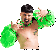
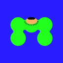
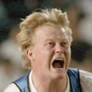

# Emotes

## \[^a-zA-Z:\]

<table style="text-align: center;width: 100%">
<tr>
<td style='width: 10%'></td>
<td style='width: 10%'></td>
<td style='width: 10%'></td>
<td style='width: 10%'></td>
<td style='width: 10%'></td>
<td style='width: 10%'></td>
<td style='width: 10%'></td>
<td style='width: 10%'></td>
<td style='width: 10%'></td>
<td style='width: 10%'></td>
</tr>
<tr>
<td style='width: 10%'></td>
<td style='width: 10%'></td>
<td style='width: 10%'></td>
<td style='width: 10%'></td>
<td style='width: 10%'></td>
</tr>
</table>

## a

<table style="text-align: center;width: 100%">
<tr>
<td style='width: 10%'></td>
<td style='width: 10%'></td>
<td style='width: 10%'></td>
<td style='width: 10%'></td>
<td style='width: 10%'></td>
<td style='width: 10%'></td>
<td style='width: 10%'></td>
<td style='width: 10%'></td>
<td style='width: 10%'></td>
<td style='width: 10%'></td>
</tr>
<tr>
<td style='width: 10%'></td>
<td style='width: 10%'></td>
<td style='width: 10%'></td>
<td style='width: 10%'></td>
<td style='width: 10%'></td>
<td style='width: 10%'></td>
<td style='width: 10%'></td>
<td style='width: 10%'></td>
<td style='width: 10%'></td>
<td style='width: 10%'></td>
</tr>
<tr>
<td style='width: 10%'></td>
<td style='width: 10%'></td>
<td style='width: 10%'></td>
<td style='width: 10%'></td>
<td style='width: 10%'></td>
<td style='width: 10%'></td>
<td style='width: 10%'></td>
<td style='width: 10%'></td>
<td style='width: 10%'></td>
<td style='width: 10%'></td>
</tr>
<tr>
<td style='width: 10%'></td>
<td style='width: 10%'></td>
<td style='width: 10%'></td>
<td style='width: 10%'></td>
<td style='width: 10%'></td>
<td style='width: 10%'></td>
<td style='width: 10%'></td>
<td style='width: 10%'></td>
<td style='width: 10%'></td>
<td style='width: 10%'></td>
</tr>
<tr>
<td style='width: 10%'></td>
<td style='width: 10%'></td>
<td style='width: 10%'></td>
<td style='width: 10%'></td>
<td style='width: 10%'></td>
<td style='width: 10%'></td>
<td style='width: 10%'></td>
<td style='width: 10%'></td>
<td style='width: 10%'></td>
<td style='width: 10%'></td>
</tr>
<tr>
<td style='width: 10%'></td>
<td style='width: 10%'></td>
<td style='width: 10%'></td>
<td style='width: 10%'></td>
<td style='width: 10%'></td>
<td style='width: 10%'></td>
<td style='width: 10%'></td>
<td style='width: 10%'></td>
<td style='width: 10%'></td>
<td style='width: 10%'></td>
</tr>
<tr>
<td style='width: 10%'></td>
<td style='width: 10%'></td>
<td style='width: 10%'></td>
<td style='width: 10%'></td>
<td style='width: 10%'></td>
<td style='width: 10%'></td>
<td style='width: 10%'></td>
<td style='width: 10%'></td>
<td style='width: 10%'></td>
<td style='width: 10%'></td>
</tr>
<tr>
<td style='width: 10%'></td>
<td style='width: 10%'></td>
<td style='width: 10%'></td>
<td style='width: 10%'></td>
<td style='width: 10%'></td>
<td style='width: 10%'></td>
<td style='width: 10%'></td>
<td style='width: 10%'></td>
<td style='width: 10%'></td>
<td style='width: 10%'></td>
</tr>
<tr>
<td style='width: 10%'></td>
<td style='width: 10%'></td>
<td style='width: 10%'></td>
<td style='width: 10%'></td>
<td style='width: 10%'></td>
<td style='width: 10%'></td>
<td style='width: 10%'></td>
<td style='width: 10%'></td>
<td style='width: 10%'></td>
<td style='width: 10%'></td>
</tr>
<tr>
<td style='width: 10%'></td>
<td style='width: 10%'></td>
<td style='width: 10%'></td>
<td style='width: 10%'></td>
<td style='width: 10%'></td>
<td style='width: 10%'></td>
<td style='width: 10%'></td>
<td style='width: 10%'></td>
<td style='width: 10%'></td>
<td style='width: 10%'></td>
</tr>
<tr>
<td style='width: 10%'></td>
<td style='width: 10%'></td>
<td style='width: 10%'></td>
<td style='width: 10%'></td>
<td style='width: 10%'></td>
<td style='width: 10%'></td>
<td style='width: 10%'></td>
<td style='width: 10%'></td>
<td style='width: 10%'></td>
<td style='width: 10%'></td>
</tr>
<tr>
<td style='width: 10%'></td>
<td style='width: 10%'></td>
<td style='width: 10%'></td>
<td style='width: 10%'></td>
<td style='width: 10%'></td>
<td style='width: 10%'></td>
<td style='width: 10%'></td>
<td style='width: 10%'></td>
<td style='width: 10%'></td>
<td style='width: 10%'></td>
</tr>
<tr>
<td style='width: 10%'></td>
<td style='width: 10%'></td>
<td style='width: 10%'></td>
<td style='width: 10%'></td>
<td style='width: 10%'></td>
<td style='width: 10%'></td>
<td style='width: 10%'></td>
<td style='width: 10%'></td>
<td style='width: 10%'></td>
<td style='width: 10%'></td>
</tr>
<tr>
<td style='width: 10%'></td>
<td style='width: 10%'></td>
<td style='width: 10%'></td>
<td style='width: 10%'></td>
<td style='width: 10%'></td>
<td style='width: 10%'></td>
<td style='width: 10%'></td>
<td style='width: 10%'></td>
<td style='width: 10%'></td>
<td style='width: 10%'></td>
</tr>
<tr>
<td style='width: 10%'></td>
<td style='width: 10%'></td>
<td style='width: 10%'></td>
<td style='width: 10%'></td>
<td style='width: 10%'></td>
<td style='width: 10%'></td>
<td style='width: 10%'></td>
<td style='width: 10%'></td>
<td style='width: 10%'></td>
<td style='width: 10%'></td>
</tr>
<tr>
<td style='width: 10%'></td>
<td style='width: 10%'></td>
<td style='width: 10%'></td>
</tr>
</table>

## b

<table style="text-align: center;width: 100%">
<tr>
<td style='width: 10%'></td>
<td style='width: 10%'></td>
<td style='width: 10%'></td>
<td style='width: 10%'></td>
<td style='width: 10%'></td>
<td style='width: 10%'></td>
<td style='width: 10%'></td>
<td style='width: 10%'></td>
<td style='width: 10%'></td>
<td style='width: 10%'></td>
</tr>
<tr>
<td style='width: 10%'></td>
<td style='width: 10%'></td>
<td style='width: 10%'></td>
<td style='width: 10%'></td>
<td style='width: 10%'></td>
<td style='width: 10%'></td>
<td style='width: 10%'></td>
<td style='width: 10%'></td>
<td style='width: 10%'></td>
<td style='width: 10%'></td>
</tr>
<tr>
<td style='width: 10%'></td>
<td style='width: 10%'></td>
<td style='width: 10%'></td>
<td style='width: 10%'></td>
<td style='width: 10%'></td>
<td style='width: 10%'></td>
<td style='width: 10%'></td>
<td style='width: 10%'></td>
<td style='width: 10%'></td>
<td style='width: 10%'></td>
</tr>
<tr>
<td style='width: 10%'></td>
<td style='width: 10%'></td>
<td style='width: 10%'></td>
<td style='width: 10%'></td>
<td style='width: 10%'></td>
<td style='width: 10%'></td>
<td style='width: 10%'></td>
<td style='width: 10%'></td>
<td style='width: 10%'></td>
<td style='width: 10%'></td>
</tr>
<tr>
<td style='width: 10%'></td>
<td style='width: 10%'></td>
<td style='width: 10%'></td>
<td style='width: 10%'></td>
<td style='width: 10%'></td>
<td style='width: 10%'></td>
<td style='width: 10%'></td>
<td style='width: 10%'></td>
<td style='width: 10%'></td>
<td style='width: 10%'></td>
</tr>
<tr>
<td style='width: 10%'></td>
<td style='width: 10%'></td>
<td style='width: 10%'></td>
<td style='width: 10%'></td>
<td style='width: 10%'></td>
<td style='width: 10%'></td>
<td style='width: 10%'></td>
<td style='width: 10%'></td>
<td style='width: 10%'></td>
<td style='width: 10%'></td>
</tr>
<tr>
<td style='width: 10%'></td>
<td style='width: 10%'></td>
<td style='width: 10%'></td>
<td style='width: 10%'></td>
<td style='width: 10%'></td>
<td style='width: 10%'></td>
<td style='width: 10%'></td>
<td style='width: 10%'></td>
<td style='width: 10%'></td>
<td style='width: 10%'></td>
</tr>
<tr>
<td style='width: 10%'></td>
<td style='width: 10%'></td>
<td style='width: 10%'></td>
<td style='width: 10%'></td>
<td style='width: 10%'></td>
<td style='width: 10%'></td>
<td style='width: 10%'></td>
<td style='width: 10%'></td>
<td style='width: 10%'></td>
<td style='width: 10%'></td>
</tr>
<tr>
<td style='width: 10%'></td>
<td style='width: 10%'></td>
<td style='width: 10%'></td>
<td style='width: 10%'></td>
<td style='width: 10%'></td>
<td style='width: 10%'></td>
<td style='width: 10%'></td>
</tr>
</table>

## c

<table style="text-align: center;width: 100%">
<tr>
<td style='width: 10%'></td>
<td style='width: 10%'></td>
<td style='width: 10%'></td>
<td style='width: 10%'></td>
<td style='width: 10%'></td>
<td style='width: 10%'></td>
<td style='width: 10%'></td>
<td style='width: 10%'></td>
<td style='width: 10%'></td>
<td style='width: 10%'></td>
</tr>
<tr>
<td style='width: 10%'></td>
<td style='width: 10%'></td>
<td style='width: 10%'></td>
<td style='width: 10%'></td>
<td style='width: 10%'></td>
<td style='width: 10%'></td>
<td style='width: 10%'></td>
<td style='width: 10%'></td>
<td style='width: 10%'></td>
<td style='width: 10%'></td>
</tr>
<tr>
<td style='width: 10%'></td>
<td style='width: 10%'></td>
<td style='width: 10%'></td>
<td style='width: 10%'></td>
<td style='width: 10%'></td>
<td style='width: 10%'></td>
<td style='width: 10%'></td>
<td style='width: 10%'></td>
<td style='width: 10%'></td>
<td style='width: 10%'></td>
</tr>
<tr>
<td style='width: 10%'></td>
<td style='width: 10%'></td>
<td style='width: 10%'></td>
<td style='width: 10%'></td>
<td style='width: 10%'></td>
<td style='width: 10%'></td>
<td style='width: 10%'></td>
<td style='width: 10%'></td>
<td style='width: 10%'></td>
<td style='width: 10%'></td>
</tr>
<tr>
<td style='width: 10%'></td>
<td style='width: 10%'></td>
<td style='width: 10%'></td>
<td style='width: 10%'></td>
<td style='width: 10%'></td>
<td style='width: 10%'></td>
<td style='width: 10%'></td>
<td style='width: 10%'></td>
<td style='width: 10%'></td>
<td style='width: 10%'></td>
</tr>
<tr>
<td style='width: 10%'></td>
<td style='width: 10%'></td>
<td style='width: 10%'></td>
<td style='width: 10%'></td>
<td style='width: 10%'></td>
<td style='width: 10%'></td>
<td style='width: 10%'></td>
<td style='width: 10%'></td>
<td style='width: 10%'></td>
<td style='width: 10%'></td>
</tr>
<tr>
<td style='width: 10%'></td>
<td style='width: 10%'></td>
<td style='width: 10%'></td>
<td style='width: 10%'></td>
<td style='width: 10%'></td>
<td style='width: 10%'></td>
<td style='width: 10%'></td>
<td style='width: 10%'></td>
<td style='width: 10%'></td>
<td style='width: 10%'></td>
</tr>
<tr>
<td style='width: 10%'></td>
<td style='width: 10%'></td>
<td style='width: 10%'></td>
<td style='width: 10%'></td>
<td style='width: 10%'></td>
<td style='width: 10%'></td>
<td style='width: 10%'></td>
<td style='width: 10%'></td>
<td style='width: 10%'></td>
<td style='width: 10%'></td>
</tr>
<tr>
<td style='width: 10%'></td>
<td style='width: 10%'></td>
<td style='width: 10%'></td>
<td style='width: 10%'></td>
<td style='width: 10%'></td>
<td style='width: 10%'></td>
<td style='width: 10%'></td>
<td style='width: 10%'></td>
<td style='width: 10%'></td>
<td style='width: 10%'></td>
</tr>
<tr>
<td style='width: 10%'></td>
<td style='width: 10%'></td>
<td style='width: 10%'></td>
<td style='width: 10%'></td>
<td style='width: 10%'></td>
<td style='width: 10%'></td>
<td style='width: 10%'></td>
<td style='width: 10%'></td>
<td style='width: 10%'></td>
<td style='width: 10%'></td>
</tr>
<tr>
<td style='width: 10%'></td>
<td style='width: 10%'></td>
<td style='width: 10%'></td>
<td style='width: 10%'></td>
<td style='width: 10%'></td>
<td style='width: 10%'></td>
<td style='width: 10%'></td>
<td style='width: 10%'></td>
<td style='width: 10%'></td>
<td style='width: 10%'></td>
</tr>
<tr>
<td style='width: 10%'></td>
<td style='width: 10%'></td>
<td style='width: 10%'></td>
<td style='width: 10%'></td>
<td style='width: 10%'></td>
<td style='width: 10%'></td>
<td style='width: 10%'></td>
<td style='width: 10%'></td>
<td style='width: 10%'></td>
<td style='width: 10%'></td>
</tr>
<tr>
<td style='width: 10%'></td>
<td style='width: 10%'></td>
<td style='width: 10%'></td>
<td style='width: 10%'></td>
<td style='width: 10%'></td>
<td style='width: 10%'></td>
<td style='width: 10%'></td>
<td style='width: 10%'></td>
<td style='width: 10%'></td>
<td style='width: 10%'></td>
</tr>
<tr>
<td style='width: 10%'></td>
<td style='width: 10%'></td>
<td style='width: 10%'></td>
<td style='width: 10%'></td>
<td style='width: 10%'></td>
<td style='width: 10%'></td>
<td style='width: 10%'></td>
<td style='width: 10%'></td>
<td style='width: 10%'></td>
<td style='width: 10%'></td>
</tr>
<tr>
<td style='width: 10%'></td>
<td style='width: 10%'></td>
<td style='width: 10%'></td>
<td style='width: 10%'></td>
<td style='width: 10%'></td>
<td style='width: 10%'></td>
<td style='width: 10%'></td>
<td style='width: 10%'></td>
<td style='width: 10%'></td>
<td style='width: 10%'></td>
</tr>
<tr>
<td style='width: 10%'></td>
<td style='width: 10%'></td>
<td style='width: 10%'></td>
<td style='width: 10%'></td>
<td style='width: 10%'></td>
<td style='width: 10%'></td>
<td style='width: 10%'></td>
<td style='width: 10%'></td>
<td style='width: 10%'></td>
</tr>
</table>

## d

<table style="text-align: center;width: 100%">
<tr>
<td style='width: 10%'></td>
<td style='width: 10%'></td>
<td style='width: 10%'></td>
<td style='width: 10%'></td>
<td style='width: 10%'></td>
<td style='width: 10%'></td>
<td style='width: 10%'></td>
<td style='width: 10%'></td>
<td style='width: 10%'></td>
<td style='width: 10%'></td>
</tr>
<tr>
<td style='width: 10%'></td>
<td style='width: 10%'></td>
<td style='width: 10%'></td>
<td style='width: 10%'></td>
<td style='width: 10%'></td>
<td style='width: 10%'></td>
<td style='width: 10%'></td>
<td style='width: 10%'></td>
<td style='width: 10%'></td>
<td style='width: 10%'></td>
</tr>
<tr>
<td style='width: 10%'></td>
<td style='width: 10%'></td>
<td style='width: 10%'></td>
<td style='width: 10%'></td>
<td style='width: 10%'></td>
<td style='width: 10%'></td>
<td style='width: 10%'></td>
<td style='width: 10%'></td>
<td style='width: 10%'></td>
<td style='width: 10%'></td>
</tr>
<tr>
<td style='width: 10%'></td>
<td style='width: 10%'></td>
<td style='width: 10%'></td>
<td style='width: 10%'></td>
<td style='width: 10%'></td>
<td style='width: 10%'></td>
<td style='width: 10%'></td>
<td style='width: 10%'></td>
<td style='width: 10%'></td>
<td style='width: 10%'></td>
</tr>
<tr>
<td style='width: 10%'></td>
<td style='width: 10%'></td>
<td style='width: 10%'></td>
<td style='width: 10%'></td>
<td style='width: 10%'></td>
<td style='width: 10%'></td>
<td style='width: 10%'></td>
<td style='width: 10%'></td>
<td style='width: 10%'></td>
<td style='width: 10%'></td>
</tr>
<tr>
<td style='width: 10%'></td>
<td style='width: 10%'></td>
<td style='width: 10%'></td>
<td style='width: 10%'></td>
<td style='width: 10%'></td>
<td style='width: 10%'></td>
<td style='width: 10%'></td>
<td style='width: 10%'></td>
<td style='width: 10%'></td>
<td style='width: 10%'></td>
</tr>
<tr>
<td style='width: 10%'></td>
<td style='width: 10%'></td>
<td style='width: 10%'></td>
<td style='width: 10%'></td>
<td style='width: 10%'></td>
<td style='width: 10%'></td>
<td style='width: 10%'></td>
<td style='width: 10%'></td>
<td style='width: 10%'></td>
<td style='width: 10%'></td>
</tr>
<tr>
<td style='width: 10%'></td>
<td style='width: 10%'></td>
<td style='width: 10%'></td>
<td style='width: 10%'></td>
<td style='width: 10%'></td>
<td style='width: 10%'></td>
<td style='width: 10%'></td>
<td style='width: 10%'></td>
<td style='width: 10%'></td>
<td style='width: 10%'></td>
</tr>
<tr>
<td style='width: 10%'></td>
<td style='width: 10%'></td>
<td style='width: 10%'></td>
<td style='width: 10%'></td>
<td style='width: 10%'></td>
<td style='width: 10%'></td>
<td style='width: 10%'></td>
<td style='width: 10%'></td>
<td style='width: 10%'></td>
<td style='width: 10%'></td>
</tr>
<tr>
<td style='width: 10%'></td>
</tr>
</table>

## e

<table style="text-align: center;width: 100%">
<tr>
<td style='width: 10%'></td>
<td style='width: 10%'></td>
<td style='width: 10%'></td>
<td style='width: 10%'></td>
<td style='width: 10%'></td>
<td style='width: 10%'></td>
<td style='width: 10%'></td>
<td style='width: 10%'></td>
<td style='width: 10%'></td>
<td style='width: 10%'></td>
</tr>
<tr>
<td style='width: 10%'></td>
<td style='width: 10%'></td>
<td style='width: 10%'></td>
<td style='width: 10%'></td>
<td style='width: 10%'></td>
<td style='width: 10%'></td>
<td style='width: 10%'></td>
<td style='width: 10%'></td>
<td style='width: 10%'></td>
<td style='width: 10%'></td>
</tr>
<tr>
<td style='width: 10%'></td>
<td style='width: 10%'></td>
<td style='width: 10%'></td>
<td style='width: 10%'></td>
<td style='width: 10%'></td>
<td style='width: 10%'></td>
<td style='width: 10%'></td>
<td style='width: 10%'></td>
<td style='width: 10%'></td>
<td style='width: 10%'></td>
</tr>
<tr>
<td style='width: 10%'></td>
<td style='width: 10%'></td>
<td style='width: 10%'></td>
<td style='width: 10%'></td>
<td style='width: 10%'></td>
<td style='width: 10%'></td>
<td style='width: 10%'></td>
<td style='width: 10%'></td>
<td style='width: 10%'></td>
<td style='width: 10%'></td>
</tr>
<tr>
<td style='width: 10%'></td>
<td style='width: 10%'></td>
<td style='width: 10%'></td>
<td style='width: 10%'></td>
<td style='width: 10%'></td>
<td style='width: 10%'></td>
<td style='width: 10%'></td>
<td style='width: 10%'></td>
<td style='width: 10%'></td>
<td style='width: 10%'></td>
</tr>
<tr>
<td style='width: 10%'></td>
<td style='width: 10%'></td>
<td style='width: 10%'></td>
<td style='width: 10%'></td>
<td style='width: 10%'></td>
<td style='width: 10%'></td>
<td style='width: 10%'></td>
<td style='width: 10%'></td>
<td style='width: 10%'></td>
<td style='width: 10%'></td>
</tr>
<tr>
<td style='width: 10%'></td>
</tr>
</table>

## f

<table style="text-align: center;width: 100%">
<tr>
<td style='width: 10%'></td>
<td style='width: 10%'></td>
<td style='width: 10%'></td>
<td style='width: 10%'></td>
<td style='width: 10%'></td>
<td style='width: 10%'></td>
<td style='width: 10%'></td>
<td style='width: 10%'></td>
<td style='width: 10%'></td>
<td style='width: 10%'></td>
</tr>
<tr>
<td style='width: 10%'></td>
<td style='width: 10%'></td>
<td style='width: 10%'></td>
<td style='width: 10%'></td>
<td style='width: 10%'></td>
<td style='width: 10%'></td>
<td style='width: 10%'></td>
<td style='width: 10%'></td>
<td style='width: 10%'></td>
<td style='width: 10%'></td>
</tr>
<tr>
<td style='width: 10%'></td>
<td style='width: 10%'></td>
<td style='width: 10%'></td>
<td style='width: 10%'></td>
<td style='width: 10%'></td>
<td style='width: 10%'></td>
<td style='width: 10%'></td>
<td style='width: 10%'></td>
<td style='width: 10%'></td>
<td style='width: 10%'></td>
</tr>
<tr>
<td style='width: 10%'></td>
<td style='width: 10%'></td>
<td style='width: 10%'></td>
<td style='width: 10%'></td>
<td style='width: 10%'></td>
<td style='width: 10%'></td>
<td style='width: 10%'></td>
<td style='width: 10%'></td>
<td style='width: 10%'></td>
<td style='width: 10%'></td>
</tr>
<tr>
<td style='width: 10%'></td>
<td style='width: 10%'></td>
<td style='width: 10%'></td>
<td style='width: 10%'></td>
<td style='width: 10%'></td>
<td style='width: 10%'></td>
<td style='width: 10%'></td>
<td style='width: 10%'></td>
<td style='width: 10%'></td>
<td style='width: 10%'></td>
</tr>
<tr>
<td style='width: 10%'></td>
<td style='width: 10%'></td>
<td style='width: 10%'></td>
<td style='width: 10%'></td>
<td style='width: 10%'></td>
<td style='width: 10%'></td>
<td style='width: 10%'></td>
<td style='width: 10%'></td>
<td style='width: 10%'></td>
<td style='width: 10%'></td>
</tr>
<tr>
<td style='width: 10%'></td>
<td style='width: 10%'></td>
<td style='width: 10%'></td>
<td style='width: 10%'></td>
<td style='width: 10%'></td>
<td style='width: 10%'></td>
<td style='width: 10%'></td>
<td style='width: 10%'></td>
<td style='width: 10%'></td>
<td style='width: 10%'></td>
</tr>
<tr>
<td style='width: 10%'></td>
<td style='width: 10%'></td>
<td style='width: 10%'></td>
<td style='width: 10%'></td>
<td style='width: 10%'></td>
<td style='width: 10%'></td>
<td style='width: 10%'></td>
<td style='width: 10%'></td>
<td style='width: 10%'></td>
<td style='width: 10%'></td>
</tr>
<tr>
<td style='width: 10%'></td>
<td style='width: 10%'></td>
<td style='width: 10%'></td>
<td style='width: 10%'></td>
<td style='width: 10%'></td>
<td style='width: 10%'></td>
<td style='width: 10%'></td>
<td style='width: 10%'></td>
<td style='width: 10%'></td>
<td style='width: 10%'></td>
</tr>
<tr>
<td style='width: 10%'></td>
<td style='width: 10%'></td>
<td style='width: 10%'></td>
<td style='width: 10%'></td>
<td style='width: 10%'></td>
<td style='width: 10%'></td>
<td style='width: 10%'></td>
<td style='width: 10%'></td>
<td style='width: 10%'></td>
<td style='width: 10%'></td>
</tr>
<tr>
<td style='width: 10%'></td>
<td style='width: 10%'></td>
<td style='width: 10%'></td>
<td style='width: 10%'></td>
<td style='width: 10%'></td>
<td style='width: 10%'></td>
<td style='width: 10%'></td>
<td style='width: 10%'></td>
<td style='width: 10%'></td>
<td style='width: 10%'></td>
</tr>
<tr>
<td style='width: 10%'></td>
<td style='width: 10%'></td>
<td style='width: 10%'></td>
<td style='width: 10%'></td>
<td style='width: 10%'></td>
<td style='width: 10%'></td>
<td style='width: 10%'></td>
<td style='width: 10%'></td>
<td style='width: 10%'></td>
<td style='width: 10%'></td>
</tr>
<tr>
<td style='width: 10%'></td>
<td style='width: 10%'></td>
<td style='width: 10%'></td>
<td style='width: 10%'></td>
<td style='width: 10%'></td>
</tr>
</table>

## g

<table style="text-align: center;width: 100%">
<tr>
<td style='width: 10%'></td>
<td style='width: 10%'></td>
<td style='width: 10%'></td>
<td style='width: 10%'></td>
<td style='width: 10%'></td>
<td style='width: 10%'></td>
<td style='width: 10%'></td>
<td style='width: 10%'></td>
<td style='width: 10%'></td>
<td style='width: 10%'></td>
</tr>
<tr>
<td style='width: 10%'></td>
<td style='width: 10%'></td>
<td style='width: 10%'></td>
<td style='width: 10%'></td>
<td style='width: 10%'></td>
<td style='width: 10%'></td>
<td style='width: 10%'></td>
<td style='width: 10%'></td>
<td style='width: 10%'></td>
<td style='width: 10%'></td>
</tr>
<tr>
<td style='width: 10%'></td>
<td style='width: 10%'></td>
<td style='width: 10%'></td>
<td style='width: 10%'></td>
<td style='width: 10%'></td>
<td style='width: 10%'></td>
<td style='width: 10%'></td>
<td style='width: 10%'></td>
<td style='width: 10%'></td>
<td style='width: 10%'></td>
</tr>
<tr>
<td style='width: 10%'></td>
<td style='width: 10%'></td>
<td style='width: 10%'></td>
<td style='width: 10%'></td>
<td style='width: 10%'></td>
<td style='width: 10%'></td>
<td style='width: 10%'></td>
<td style='width: 10%'></td>
<td style='width: 10%'></td>
<td style='width: 10%'></td>
</tr>
<tr>
<td style='width: 10%'></td>
<td style='width: 10%'></td>
<td style='width: 10%'></td>
<td style='width: 10%'></td>
<td style='width: 10%'></td>
<td style='width: 10%'></td>
<td style='width: 10%'></td>
<td style='width: 10%'></td>
<td style='width: 10%'></td>
<td style='width: 10%'></td>
</tr>
<tr>
<td style='width: 10%'></td>
<td style='width: 10%'></td>
<td style='width: 10%'></td>
<td style='width: 10%'></td>
<td style='width: 10%'></td>
<td style='width: 10%'></td>
<td style='width: 10%'></td>
<td style='width: 10%'></td>
<td style='width: 10%'></td>
<td style='width: 10%'></td>
</tr>
<tr>
<td style='width: 10%'></td>
<td style='width: 10%'></td>
<td style='width: 10%'></td>
<td style='width: 10%'></td>
<td style='width: 10%'></td>
<td style='width: 10%'></td>
<td style='width: 10%'></td>
<td style='width: 10%'></td>
<td style='width: 10%'></td>
<td style='width: 10%'></td>
</tr>
<tr>
<td style='width: 10%'></td>
<td style='width: 10%'></td>
<td style='width: 10%'></td>
<td style='width: 10%'></td>
<td style='width: 10%'></td>
<td style='width: 10%'></td>
<td style='width: 10%'></td>
<td style='width: 10%'></td>
<td style='width: 10%'></td>
<td style='width: 10%'></td>
</tr>
<tr>
<td style='width: 10%'></td>
<td style='width: 10%'></td>
<td style='width: 10%'></td>
<td style='width: 10%'></td>
<td style='width: 10%'></td>
<td style='width: 10%'></td>
<td style='width: 10%'></td>
<td style='width: 10%'></td>
<td style='width: 10%'></td>
<td style='width: 10%'></td>
</tr>
<tr>
<td style='width: 10%'></td>
<td style='width: 10%'></td>
<td style='width: 10%'></td>
<td style='width: 10%'></td>
<td style='width: 10%'></td>
<td style='width: 10%'></td>
<td style='width: 10%'></td>
<td style='width: 10%'></td>
<td style='width: 10%'></td>
<td style='width: 10%'></td>
</tr>
<tr>
<td style='width: 10%'></td>
<td style='width: 10%'></td>
</tr>
</table>

## h

<table style="text-align: center;width: 100%">
<tr>
<td style='width: 10%'></td>
<td style='width: 10%'></td>
<td style='width: 10%'></td>
<td style='width: 10%'></td>
<td style='width: 10%'></td>
<td style='width: 10%'></td>
<td style='width: 10%'></td>
<td style='width: 10%'></td>
<td style='width: 10%'></td>
<td style='width: 10%'></td>
</tr>
<tr>
<td style='width: 10%'></td>
<td style='width: 10%'></td>
<td style='width: 10%'></td>
<td style='width: 10%'></td>
<td style='width: 10%'></td>
<td style='width: 10%'></td>
<td style='width: 10%'></td>
<td style='width: 10%'></td>
<td style='width: 10%'></td>
<td style='width: 10%'></td>
</tr>
<tr>
<td style='width: 10%'></td>
<td style='width: 10%'></td>
<td style='width: 10%'></td>
<td style='width: 10%'></td>
<td style='width: 10%'></td>
<td style='width: 10%'></td>
<td style='width: 10%'></td>
<td style='width: 10%'></td>
<td style='width: 10%'></td>
<td style='width: 10%'></td>
</tr>
<tr>
<td style='width: 10%'></td>
<td style='width: 10%'></td>
<td style='width: 10%'></td>
<td style='width: 10%'></td>
<td style='width: 10%'></td>
<td style='width: 10%'></td>
<td style='width: 10%'></td>
<td style='width: 10%'></td>
<td style='width: 10%'></td>
<td style='width: 10%'></td>
</tr>
<tr>
<td style='width: 10%'></td>
<td style='width: 10%'></td>
<td style='width: 10%'></td>
<td style='width: 10%'></td>
<td style='width: 10%'></td>
<td style='width: 10%'></td>
<td style='width: 10%'></td>
<td style='width: 10%'></td>
<td style='width: 10%'></td>
<td style='width: 10%'></td>
</tr>
<tr>
<td style='width: 10%'></td>
<td style='width: 10%'></td>
<td style='width: 10%'></td>
<td style='width: 10%'></td>
<td style='width: 10%'></td>
<td style='width: 10%'></td>
<td style='width: 10%'></td>
<td style='width: 10%'></td>
<td style='width: 10%'></td>
<td style='width: 10%'></td>
</tr>
<tr>
<td style='width: 10%'></td>
<td style='width: 10%'></td>
<td style='width: 10%'></td>
<td style='width: 10%'></td>
<td style='width: 10%'></td>
<td style='width: 10%'></td>
<td style='width: 10%'></td>
<td style='width: 10%'></td>
<td style='width: 10%'></td>
<td style='width: 10%'></td>
</tr>
<tr>
<td style='width: 10%'></td>
<td style='width: 10%'></td>
<td style='width: 10%'></td>
<td style='width: 10%'></td>
<td style='width: 10%'></td>
<td style='width: 10%'></td>
<td style='width: 10%'></td>
<td style='width: 10%'></td>
<td style='width: 10%'></td>
<td style='width: 10%'></td>
</tr>
<tr>
<td style='width: 10%'></td>
<td style='width: 10%'></td>
<td style='width: 10%'></td>
<td style='width: 10%'></td>
<td style='width: 10%'></td>
<td style='width: 10%'></td>
<td style='width: 10%'></td>
<td style='width: 10%'></td>
<td style='width: 10%'></td>
<td style='width: 10%'></td>
</tr>
<tr>
<td style='width: 10%'></td>
<td style='width: 10%'></td>
<td style='width: 10%'></td>
<td style='width: 10%'></td>
<td style='width: 10%'></td>
<td style='width: 10%'></td>
<td style='width: 10%'></td>
<td style='width: 10%'></td>
<td style='width: 10%'></td>
<td style='width: 10%'></td>
</tr>
<tr>
<td style='width: 10%'></td>
<td style='width: 10%'></td>
<td style='width: 10%'></td>
<td style='width: 10%'></td>
<td style='width: 10%'></td>
<td style='width: 10%'></td>
<td style='width: 10%'></td>
<td style='width: 10%'></td>
<td style='width: 10%'></td>
<td style='width: 10%'></td>
</tr>
<tr>
<td style='width: 10%'></td>
<td style='width: 10%'></td>
<td style='width: 10%'></td>
<td style='width: 10%'></td>
<td style='width: 10%'></td>
<td style='width: 10%'></td>
<td style='width: 10%'></td>
<td style='width: 10%'></td>
<td style='width: 10%'></td>
<td style='width: 10%'></td>
</tr>
<tr>
<td style='width: 10%'></td>
<td style='width: 10%'></td>
<td style='width: 10%'></td>
</tr>
</table>

## i

<table style="text-align: center;width: 100%">
<tr>
<td style='width: 10%'></td>
<td style='width: 10%'></td>
<td style='width: 10%'></td>
<td style='width: 10%'></td>
<td style='width: 10%'></td>
<td style='width: 10%'></td>
<td style='width: 10%'></td>
<td style='width: 10%'></td>
<td style='width: 10%'></td>
<td style='width: 10%'></td>
</tr>
<tr>
<td style='width: 10%'></td>
<td style='width: 10%'></td>
<td style='width: 10%'></td>
<td style='width: 10%'></td>
<td style='width: 10%'></td>
<td style='width: 10%'></td>
<td style='width: 10%'></td>
<td style='width: 10%'></td>
<td style='width: 10%'></td>
<td style='width: 10%'></td>
</tr>
<tr>
<td style='width: 10%'></td>
<td style='width: 10%'></td>
<td style='width: 10%'></td>
<td style='width: 10%'></td>
<td style='width: 10%'></td>
<td style='width: 10%'></td>
<td style='width: 10%'></td>
<td style='width: 10%'></td>
<td style='width: 10%'></td>
<td style='width: 10%'></td>
</tr>
<tr>
<td style='width: 10%'></td>
<td style='width: 10%'></td>
<td style='width: 10%'></td>
<td style='width: 10%'></td>
<td style='width: 10%'></td>
<td style='width: 10%'></td>
<td style='width: 10%'></td>
<td style='width: 10%'></td>
<td style='width: 10%'></td>
<td style='width: 10%'></td>
</tr>
<tr>
<td style='width: 10%'></td>
</tr>
</table>

## j

<table style="text-align: center;width: 100%">
<tr>
<td style='width: 10%'></td>
<td style='width: 10%'></td>
<td style='width: 10%'></td>
<td style='width: 10%'></td>
<td style='width: 10%'></td>
<td style='width: 10%'></td>
<td style='width: 10%'></td>
<td style='width: 10%'></td>
<td style='width: 10%'></td>
<td style='width: 10%'></td>
</tr>
<tr>
<td style='width: 10%'></td>
<td style='width: 10%'></td>
<td style='width: 10%'></td>
<td style='width: 10%'></td>
<td style='width: 10%'></td>
<td style='width: 10%'></td>
<td style='width: 10%'></td>
<td style='width: 10%'></td>
<td style='width: 10%'></td>
<td style='width: 10%'></td>
</tr>
<tr>
<td style='width: 10%'></td>
<td style='width: 10%'></td>
<td style='width: 10%'></td>
<td style='width: 10%'></td>
<td style='width: 10%'></td>
<td style='width: 10%'></td>
<td style='width: 10%'></td>
<td style='width: 10%'></td>
<td style='width: 10%'></td>
<td style='width: 10%'></td>
</tr>
<tr>
<td style='width: 10%'></td>
<td style='width: 10%'></td>
<td style='width: 10%'></td>
<td style='width: 10%'></td>
<td style='width: 10%'></td>
<td style='width: 10%'></td>
<td style='width: 10%'></td>
<td style='width: 10%'></td>
<td style='width: 10%'></td>
<td style='width: 10%'></td>
</tr>
<tr>
<td style='width: 10%'></td>
<td style='width: 10%'></td>
<td style='width: 10%'></td>
<td style='width: 10%'></td>
</tr>
</table>

## k

<table style="text-align: center;width: 100%">
<tr>
<td style='width: 10%'></td>
<td style='width: 10%'></td>
<td style='width: 10%'></td>
<td style='width: 10%'></td>
<td style='width: 10%'></td>
<td style='width: 10%'></td>
<td style='width: 10%'></td>
<td style='width: 10%'></td>
<td style='width: 10%'></td>
<td style='width: 10%'></td>
</tr>
<tr>
<td style='width: 10%'></td>
<td style='width: 10%'></td>
<td style='width: 10%'></td>
<td style='width: 10%'></td>
<td style='width: 10%'></td>
<td style='width: 10%'></td>
<td style='width: 10%'></td>
<td style='width: 10%'></td>
<td style='width: 10%'></td>
<td style='width: 10%'></td>
</tr>
<tr>
<td style='width: 10%'></td>
<td style='width: 10%'></td>
<td style='width: 10%'></td>
<td style='width: 10%'></td>
<td style='width: 10%'></td>
<td style='width: 10%'></td>
<td style='width: 10%'></td>
<td style='width: 10%'></td>
<td style='width: 10%'></td>
<td style='width: 10%'></td>
</tr>
<tr>
<td style='width: 10%'></td>
<td style='width: 10%'></td>
<td style='width: 10%'></td>
<td style='width: 10%'></td>
<td style='width: 10%'></td>
<td style='width: 10%'></td>
<td style='width: 10%'></td>
<td style='width: 10%'></td>
<td style='width: 10%'></td>
<td style='width: 10%'></td>
</tr>
<tr>
<td style='width: 10%'></td>
<td style='width: 10%'></td>
<td style='width: 10%'></td>
<td style='width: 10%'></td>
<td style='width: 10%'></td>
<td style='width: 10%'></td>
<td style='width: 10%'></td>
<td style='width: 10%'></td>
<td style='width: 10%'></td>
<td style='width: 10%'></td>
</tr>
<tr>
<td style='width: 10%'></td>
<td style='width: 10%'></td>
<td style='width: 10%'></td>
<td style='width: 10%'></td>
<td style='width: 10%'></td>
<td style='width: 10%'></td>
<td style='width: 10%'></td>
<td style='width: 10%'></td>
<td style='width: 10%'></td>
<td style='width: 10%'></td>
</tr>
<tr>
<td style='width: 10%'></td>
<td style='width: 10%'></td>
<td style='width: 10%'></td>
<td style='width: 10%'></td>
<td style='width: 10%'></td>
<td style='width: 10%'></td>
<td style='width: 10%'></td>
<td style='width: 10%'></td>
<td style='width: 10%'></td>
<td style='width: 10%'></td>
</tr>
<tr>
<td style='width: 10%'></td>
<td style='width: 10%'></td>
<td style='width: 10%'></td>
<td style='width: 10%'></td>
<td style='width: 10%'></td>
<td style='width: 10%'></td>
<td style='width: 10%'></td>
<td style='width: 10%'></td>
<td style='width: 10%'></td>
<td style='width: 10%'></td>
</tr>
<tr>
<td style='width: 10%'></td>
<td style='width: 10%'></td>
<td style='width: 10%'></td>
<td style='width: 10%'></td>
<td style='width: 10%'></td>
<td style='width: 10%'></td>
<td style='width: 10%'></td>
<td style='width: 10%'></td>
<td style='width: 10%'></td>
<td style='width: 10%'></td>
</tr>
<tr>
<td style='width: 10%'></td>
<td style='width: 10%'></td>
<td style='width: 10%'></td>
<td style='width: 10%'></td>
<td style='width: 10%'></td>
<td style='width: 10%'></td>
<td style='width: 10%'></td>
<td style='width: 10%'></td>
<td style='width: 10%'></td>
<td style='width: 10%'></td>
</tr>
<tr>
<td style='width: 10%'></td>
<td style='width: 10%'></td>
<td style='width: 10%'></td>
</tr>
</table>

## l

<table style="text-align: center;width: 100%">
<tr>
<td style='width: 10%'></td>
<td style='width: 10%'></td>
<td style='width: 10%'></td>
<td style='width: 10%'></td>
<td style='width: 10%'></td>
<td style='width: 10%'></td>
<td style='width: 10%'></td>
<td style='width: 10%'></td>
<td style='width: 10%'></td>
<td style='width: 10%'></td>
</tr>
<tr>
<td style='width: 10%'></td>
<td style='width: 10%'></td>
<td style='width: 10%'></td>
<td style='width: 10%'></td>
<td style='width: 10%'></td>
<td style='width: 10%'></td>
<td style='width: 10%'></td>
<td style='width: 10%'></td>
<td style='width: 10%'></td>
<td style='width: 10%'></td>
</tr>
<tr>
<td style='width: 10%'></td>
<td style='width: 10%'></td>
<td style='width: 10%'></td>
<td style='width: 10%'></td>
<td style='width: 10%'></td>
<td style='width: 10%'></td>
<td style='width: 10%'></td>
<td style='width: 10%'></td>
<td style='width: 10%'></td>
<td style='width: 10%'></td>
</tr>
<tr>
<td style='width: 10%'></td>
<td style='width: 10%'></td>
<td style='width: 10%'></td>
<td style='width: 10%'></td>
<td style='width: 10%'></td>
<td style='width: 10%'></td>
<td style='width: 10%'></td>
<td style='width: 10%'></td>
<td style='width: 10%'></td>
<td style='width: 10%'></td>
</tr>
<tr>
<td style='width: 10%'></td>
<td style='width: 10%'></td>
<td style='width: 10%'></td>
<td style='width: 10%'></td>
<td style='width: 10%'></td>
<td style='width: 10%'></td>
<td style='width: 10%'></td>
<td style='width: 10%'></td>
<td style='width: 10%'></td>
<td style='width: 10%'></td>
</tr>
<tr>
<td style='width: 10%'></td>
<td style='width: 10%'></td>
<td style='width: 10%'></td>
<td style='width: 10%'></td>
<td style='width: 10%'></td>
<td style='width: 10%'></td>
<td style='width: 10%'></td>
<td style='width: 10%'></td>
<td style='width: 10%'></td>
<td style='width: 10%'></td>
</tr>
<tr>
<td style='width: 10%'></td>
<td style='width: 10%'></td>
<td style='width: 10%'></td>
<td style='width: 10%'></td>
</tr>
</table>

## m

<table style="text-align: center;width: 100%">
<tr>
<td style='width: 10%'></td>
<td style='width: 10%'></td>
<td style='width: 10%'></td>
<td style='width: 10%'></td>
<td style='width: 10%'></td>
<td style='width: 10%'></td>
<td style='width: 10%'></td>
<td style='width: 10%'></td>
<td style='width: 10%'></td>
<td style='width: 10%'></td>
</tr>
<tr>
<td style='width: 10%'></td>
<td style='width: 10%'></td>
<td style='width: 10%'></td>
<td style='width: 10%'></td>
<td style='width: 10%'></td>
<td style='width: 10%'></td>
<td style='width: 10%'></td>
<td style='width: 10%'></td>
<td style='width: 10%'></td>
<td style='width: 10%'></td>
</tr>
<tr>
<td style='width: 10%'></td>
<td style='width: 10%'></td>
<td style='width: 10%'></td>
<td style='width: 10%'></td>
<td style='width: 10%'></td>
<td style='width: 10%'></td>
<td style='width: 10%'></td>
<td style='width: 10%'></td>
<td style='width: 10%'></td>
<td style='width: 10%'></td>
</tr>
<tr>
<td style='width: 10%'></td>
<td style='width: 10%'></td>
<td style='width: 10%'></td>
<td style='width: 10%'></td>
<td style='width: 10%'></td>
<td style='width: 10%'></td>
<td style='width: 10%'></td>
<td style='width: 10%'></td>
<td style='width: 10%'></td>
<td style='width: 10%'></td>
</tr>
<tr>
<td style='width: 10%'></td>
<td style='width: 10%'></td>
<td style='width: 10%'></td>
<td style='width: 10%'></td>
<td style='width: 10%'></td>
<td style='width: 10%'></td>
<td style='width: 10%'></td>
<td style='width: 10%'></td>
<td style='width: 10%'></td>
<td style='width: 10%'></td>
</tr>
<tr>
<td style='width: 10%'></td>
<td style='width: 10%'></td>
<td style='width: 10%'></td>
<td style='width: 10%'></td>
<td style='width: 10%'></td>
<td style='width: 10%'></td>
<td style='width: 10%'></td>
<td style='width: 10%'></td>
<td style='width: 10%'></td>
<td style='width: 10%'></td>
</tr>
<tr>
<td style='width: 10%'></td>
<td style='width: 10%'></td>
<td style='width: 10%'></td>
<td style='width: 10%'></td>
<td style='width: 10%'></td>
<td style='width: 10%'></td>
<td style='width: 10%'></td>
<td style='width: 10%'></td>
<td style='width: 10%'></td>
<td style='width: 10%'></td>
</tr>
<tr>
<td style='width: 10%'></td>
<td style='width: 10%'></td>
<td style='width: 10%'></td>
<td style='width: 10%'></td>
<td style='width: 10%'></td>
<td style='width: 10%'></td>
<td style='width: 10%'></td>
<td style='width: 10%'></td>
<td style='width: 10%'></td>
<td style='width: 10%'></td>
</tr>
<tr>
<td style='width: 10%'></td>
<td style='width: 10%'></td>
<td style='width: 10%'></td>
<td style='width: 10%'></td>
<td style='width: 10%'></td>
<td style='width: 10%'></td>
<td style='width: 10%'></td>
<td style='width: 10%'></td>
<td style='width: 10%'></td>
<td style='width: 10%'></td>
</tr>
<tr>
<td style='width: 10%'></td>
<td style='width: 10%'></td>
<td style='width: 10%'></td>
<td style='width: 10%'></td>
<td style='width: 10%'></td>
<td style='width: 10%'></td>
<td style='width: 10%'></td>
<td style='width: 10%'></td>
<td style='width: 10%'></td>
<td style='width: 10%'></td>
</tr>
<tr>
<td style='width: 10%'></td>
<td style='width: 10%'></td>
<td style='width: 10%'></td>
<td style='width: 10%'></td>
<td style='width: 10%'></td>
<td style='width: 10%'></td>
<td style='width: 10%'></td>
<td style='width: 10%'></td>
<td style='width: 10%'></td>
<td style='width: 10%'></td>
</tr>
<tr>
<td style='width: 10%'></td>
<td style='width: 10%'></td>
<td style='width: 10%'></td>
<td style='width: 10%'></td>
<td style='width: 10%'></td>
<td style='width: 10%'></td>
<td style='width: 10%'></td>
<td style='width: 10%'></td>
<td style='width: 10%'></td>
<td style='width: 10%'></td>
</tr>
<tr>
<td style='width: 10%'></td>
<td style='width: 10%'></td>
<td style='width: 10%'></td>
<td style='width: 10%'></td>
<td style='width: 10%'></td>
<td style='width: 10%'></td>
<td style='width: 10%'></td>
<td style='width: 10%'></td>
<td style='width: 10%'></td>
<td style='width: 10%'></td>
</tr>
<tr>
<td style='width: 10%'></td>
<td style='width: 10%'></td>
<td style='width: 10%'></td>
<td style='width: 10%'></td>
<td style='width: 10%'></td>
<td style='width: 10%'></td>
<td style='width: 10%'></td>
<td style='width: 10%'></td>
<td style='width: 10%'></td>
<td style='width: 10%'></td>
</tr>
<tr>
<td style='width: 10%'></td>
<td style='width: 10%'></td>
<td style='width: 10%'></td>
<td style='width: 10%'></td>
<td style='width: 10%'></td>
<td style='width: 10%'></td>
<td style='width: 10%'></td>
<td style='width: 10%'></td>
<td style='width: 10%'></td>
<td style='width: 10%'></td>
</tr>
<tr>
<td style='width: 10%'></td>
<td style='width: 10%'></td>
<td style='width: 10%'></td>
<td style='width: 10%'></td>
<td style='width: 10%'></td>
<td style='width: 10%'></td>
<td style='width: 10%'></td>
<td style='width: 10%'></td>
<td style='width: 10%'></td>
<td style='width: 10%'></td>
</tr>
<tr>
<td style='width: 10%'></td>
<td style='width: 10%'></td>
<td style='width: 10%'></td>
<td style='width: 10%'></td>
<td style='width: 10%'></td>
<td style='width: 10%'></td>
<td style='width: 10%'></td>
<td style='width: 10%'></td>
<td style='width: 10%'></td>
<td style='width: 10%'></td>
</tr>
<tr>
<td style='width: 10%'></td>
<td style='width: 10%'></td>
<td style='width: 10%'></td>
<td style='width: 10%'></td>
<td style='width: 10%'></td>
<td style='width: 10%'></td>
<td style='width: 10%'></td>
<td style='width: 10%'></td>
<td style='width: 10%'></td>
<td style='width: 10%'></td>
</tr>
</table>

## n

<table style="text-align: center;width: 100%">
<tr>
<td style='width: 10%'></td>
<td style='width: 10%'></td>
<td style='width: 10%'></td>
<td style='width: 10%'></td>
<td style='width: 10%'></td>
<td style='width: 10%'></td>
<td style='width: 10%'></td>
<td style='width: 10%'></td>
<td style='width: 10%'></td>
<td style='width: 10%'></td>
</tr>
<tr>
<td style='width: 10%'></td>
<td style='width: 10%'></td>
<td style='width: 10%'></td>
<td style='width: 10%'></td>
<td style='width: 10%'></td>
<td style='width: 10%'></td>
<td style='width: 10%'></td>
<td style='width: 10%'></td>
<td style='width: 10%'></td>
<td style='width: 10%'></td>
</tr>
<tr>
<td style='width: 10%'></td>
<td style='width: 10%'></td>
<td style='width: 10%'></td>
<td style='width: 10%'></td>
<td style='width: 10%'></td>
<td style='width: 10%'></td>
<td style='width: 10%'></td>
<td style='width: 10%'></td>
<td style='width: 10%'></td>
<td style='width: 10%'></td>
</tr>
<tr>
<td style='width: 10%'></td>
<td style='width: 10%'></td>
<td style='width: 10%'></td>
<td style='width: 10%'></td>
<td style='width: 10%'></td>
<td style='width: 10%'></td>
<td style='width: 10%'></td>
<td style='width: 10%'></td>
<td style='width: 10%'></td>
<td style='width: 10%'></td>
</tr>
<tr>
<td style='width: 10%'></td>
<td style='width: 10%'></td>
<td style='width: 10%'></td>
<td style='width: 10%'></td>
<td style='width: 10%'></td>
<td style='width: 10%'></td>
<td style='width: 10%'></td>
<td style='width: 10%'></td>
<td style='width: 10%'></td>
<td style='width: 10%'></td>
</tr>
<tr>
<td style='width: 10%'></td>
<td style='width: 10%'></td>
<td style='width: 10%'></td>
<td style='width: 10%'></td>
<td style='width: 10%'></td>
<td style='width: 10%'></td>
<td style='width: 10%'></td>
<td style='width: 10%'></td>
<td style='width: 10%'></td>
<td style='width: 10%'></td>
</tr>
<tr>
<td style='width: 10%'></td>
<td style='width: 10%'></td>
<td style='width: 10%'></td>
<td style='width: 10%'></td>
<td style='width: 10%'></td>
<td style='width: 10%'></td>
<td style='width: 10%'></td>
<td style='width: 10%'></td>
<td style='width: 10%'></td>
<td style='width: 10%'></td>
</tr>
<tr>
<td style='width: 10%'></td>
<td style='width: 10%'></td>
<td style='width: 10%'></td>
<td style='width: 10%'></td>
<td style='width: 10%'></td>
<td style='width: 10%'></td>
<td style='width: 10%'></td>
<td style='width: 10%'></td>
<td style='width: 10%'></td>
<td style='width: 10%'></td>
</tr>
<tr>
<td style='width: 10%'></td>
<td style='width: 10%'></td>
<td style='width: 10%'></td>
<td style='width: 10%'></td>
<td style='width: 10%'></td>
<td style='width: 10%'></td>
<td style='width: 10%'></td>
</tr>
</table>

## o

<table style="text-align: center;width: 100%">
<tr>
<td style='width: 10%'></td>
<td style='width: 10%'></td>
<td style='width: 10%'></td>
<td style='width: 10%'></td>
<td style='width: 10%'></td>
<td style='width: 10%'></td>
<td style='width: 10%'></td>
<td style='width: 10%'></td>
<td style='width: 10%'></td>
<td style='width: 10%'></td>
</tr>
<tr>
<td style='width: 10%'></td>
<td style='width: 10%'></td>
<td style='width: 10%'></td>
<td style='width: 10%'></td>
<td style='width: 10%'></td>
<td style='width: 10%'></td>
<td style='width: 10%'></td>
<td style='width: 10%'></td>
<td style='width: 10%'></td>
<td style='width: 10%'></td>
</tr>
<tr>
<td style='width: 10%'></td>
<td style='width: 10%'></td>
<td style='width: 10%'></td>
<td style='width: 10%'></td>
<td style='width: 10%'></td>
<td style='width: 10%'></td>
<td style='width: 10%'></td>
<td style='width: 10%'></td>
<td style='width: 10%'></td>
<td style='width: 10%'></td>
</tr>
<tr>
<td style='width: 10%'></td>
<td style='width: 10%'></td>
<td style='width: 10%'></td>
<td style='width: 10%'></td>
<td style='width: 10%'></td>
<td style='width: 10%'></td>
<td style='width: 10%'></td>
<td style='width: 10%'></td>
<td style='width: 10%'></td>
<td style='width: 10%'></td>
</tr>
<tr>
<td style='width: 10%'></td>
<td style='width: 10%'></td>
<td style='width: 10%'></td>
<td style='width: 10%'></td>
<td style='width: 10%'></td>
<td style='width: 10%'></td>
<td style='width: 10%'></td>
<td style='width: 10%'></td>
<td style='width: 10%'></td>
<td style='width: 10%'></td>
</tr>
<tr>
<td style='width: 10%'></td>
<td style='width: 10%'></td>
<td style='width: 10%'></td>
<td style='width: 10%'></td>
<td style='width: 10%'></td>
<td style='width: 10%'></td>
<td style='width: 10%'></td>
<td style='width: 10%'></td>
<td style='width: 10%'></td>
</tr>
</table>

## p

<table style="text-align: center;width: 100%">
<tr>
<td style='width: 10%'></td>
<td style='width: 10%'></td>
<td style='width: 10%'></td>
<td style='width: 10%'></td>
<td style='width: 10%'></td>
<td style='width: 10%'></td>
<td style='width: 10%'></td>
<td style='width: 10%'></td>
<td style='width: 10%'></td>
<td style='width: 10%'></td>
</tr>
<tr>
<td style='width: 10%'></td>
<td style='width: 10%'></td>
<td style='width: 10%'></td>
<td style='width: 10%'></td>
<td style='width: 10%'></td>
<td style='width: 10%'></td>
<td style='width: 10%'></td>
<td style='width: 10%'></td>
<td style='width: 10%'></td>
<td style='width: 10%'></td>
</tr>
<tr>
<td style='width: 10%'></td>
<td style='width: 10%'></td>
<td style='width: 10%'></td>
<td style='width: 10%'></td>
<td style='width: 10%'></td>
<td style='width: 10%'></td>
<td style='width: 10%'></td>
<td style='width: 10%'></td>
<td style='width: 10%'></td>
<td style='width: 10%'></td>
</tr>
<tr>
<td style='width: 10%'></td>
<td style='width: 10%'></td>
<td style='width: 10%'></td>
<td style='width: 10%'></td>
<td style='width: 10%'></td>
<td style='width: 10%'></td>
<td style='width: 10%'></td>
<td style='width: 10%'></td>
<td style='width: 10%'></td>
<td style='width: 10%'></td>
</tr>
<tr>
<td style='width: 10%'></td>
<td style='width: 10%'></td>
<td style='width: 10%'></td>
<td style='width: 10%'></td>
<td style='width: 10%'></td>
<td style='width: 10%'></td>
<td style='width: 10%'></td>
<td style='width: 10%'></td>
<td style='width: 10%'></td>
<td style='width: 10%'></td>
</tr>
<tr>
<td style='width: 10%'></td>
<td style='width: 10%'></td>
<td style='width: 10%'></td>
<td style='width: 10%'></td>
<td style='width: 10%'></td>
<td style='width: 10%'></td>
<td style='width: 10%'></td>
<td style='width: 10%'></td>
<td style='width: 10%'></td>
<td style='width: 10%'></td>
</tr>
<tr>
<td style='width: 10%'></td>
<td style='width: 10%'></td>
<td style='width: 10%'></td>
<td style='width: 10%'></td>
<td style='width: 10%'></td>
<td style='width: 10%'></td>
<td style='width: 10%'></td>
<td style='width: 10%'></td>
<td style='width: 10%'></td>
<td style='width: 10%'></td>
</tr>
<tr>
<td style='width: 10%'></td>
<td style='width: 10%'></td>
<td style='width: 10%'></td>
<td style='width: 10%'></td>
<td style='width: 10%'></td>
<td style='width: 10%'></td>
<td style='width: 10%'></td>
<td style='width: 10%'></td>
<td style='width: 10%'></td>
<td style='width: 10%'></td>
</tr>
<tr>
<td style='width: 10%'></td>
<td style='width: 10%'></td>
<td style='width: 10%'></td>
<td style='width: 10%'></td>
<td style='width: 10%'></td>
<td style='width: 10%'></td>
<td style='width: 10%'></td>
<td style='width: 10%'></td>
<td style='width: 10%'></td>
<td style='width: 10%'></td>
</tr>
<tr>
<td style='width: 10%'></td>
<td style='width: 10%'></td>
<td style='width: 10%'></td>
<td style='width: 10%'></td>
<td style='width: 10%'></td>
<td style='width: 10%'></td>
<td style='width: 10%'></td>
<td style='width: 10%'></td>
<td style='width: 10%'></td>
<td style='width: 10%'></td>
</tr>
<tr>
<td style='width: 10%'></td>
<td style='width: 10%'></td>
<td style='width: 10%'></td>
<td style='width: 10%'></td>
<td style='width: 10%'></td>
<td style='width: 10%'></td>
<td style='width: 10%'></td>
<td style='width: 10%'></td>
<td style='width: 10%'></td>
<td style='width: 10%'></td>
</tr>
<tr>
<td style='width: 10%'></td>
<td style='width: 10%'></td>
<td style='width: 10%'></td>
<td style='width: 10%'></td>
<td style='width: 10%'></td>
<td style='width: 10%'></td>
<td style='width: 10%'></td>
<td style='width: 10%'></td>
<td style='width: 10%'></td>
<td style='width: 10%'></td>
</tr>
<tr>
<td style='width: 10%'></td>
<td style='width: 10%'></td>
<td style='width: 10%'></td>
<td style='width: 10%'></td>
<td style='width: 10%'></td>
<td style='width: 10%'></td>
<td style='width: 10%'></td>
<td style='width: 10%'></td>
<td style='width: 10%'></td>
<td style='width: 10%'></td>
</tr>
<tr>
<td style='width: 10%'></td>
<td style='width: 10%'></td>
<td style='width: 10%'></td>
<td style='width: 10%'></td>
<td style='width: 10%'></td>
<td style='width: 10%'></td>
<td style='width: 10%'></td>
<td style='width: 10%'></td>
<td style='width: 10%'></td>
<td style='width: 10%'></td>
</tr>
<tr>
<td style='width: 10%'></td>
<td style='width: 10%'></td>
<td style='width: 10%'></td>
<td style='width: 10%'></td>
<td style='width: 10%'></td>
<td style='width: 10%'></td>
<td style='width: 10%'></td>
<td style='width: 10%'></td>
<td style='width: 10%'></td>
<td style='width: 10%'></td>
</tr>
<tr>
<td style='width: 10%'></td>
<td style='width: 10%'></td>
<td style='width: 10%'></td>
<td style='width: 10%'></td>
<td style='width: 10%'></td>
<td style='width: 10%'></td>
<td style='width: 10%'></td>
<td style='width: 10%'></td>
<td style='width: 10%'></td>
<td style='width: 10%'></td>
</tr>
<tr>
<td style='width: 10%'></td>
<td style='width: 10%'></td>
<td style='width: 10%'></td>
<td style='width: 10%'></td>
<td style='width: 10%'></td>
<td style='width: 10%'></td>
<td style='width: 10%'></td>
<td style='width: 10%'></td>
<td style='width: 10%'></td>
<td style='width: 10%'></td>
</tr>
<tr>
<td style='width: 10%'></td>
<td style='width: 10%'></td>
<td style='width: 10%'></td>
<td style='width: 10%'></td>
<td style='width: 10%'></td>
<td style='width: 10%'></td>
<td style='width: 10%'></td>
<td style='width: 10%'></td>
<td style='width: 10%'></td>
<td style='width: 10%'></td>
</tr>
<tr>
<td style='width: 10%'></td>
<td style='width: 10%'></td>
<td style='width: 10%'></td>
<td style='width: 10%'></td>
<td style='width: 10%'></td>
</tr>
</table>

## q

<table style="text-align: center;width: 100%">
<tr>
<td style='width: 10%'></td>
<td style='width: 10%'></td>
<td style='width: 10%'></td>
<td style='width: 10%'></td>
<td style='width: 10%'></td>
</tr>
</table>

## r

<table style="text-align: center;width: 100%">
<tr>
<td style='width: 10%'></td>
<td style='width: 10%'></td>
<td style='width: 10%'></td>
<td style='width: 10%'></td>
<td style='width: 10%'></td>
<td style='width: 10%'></td>
<td style='width: 10%'></td>
<td style='width: 10%'></td>
<td style='width: 10%'></td>
<td style='width: 10%'></td>
</tr>
<tr>
<td style='width: 10%'></td>
<td style='width: 10%'></td>
<td style='width: 10%'></td>
<td style='width: 10%'></td>
<td style='width: 10%'></td>
<td style='width: 10%'></td>
<td style='width: 10%'></td>
<td style='width: 10%'></td>
<td style='width: 10%'></td>
<td style='width: 10%'></td>
</tr>
<tr>
<td style='width: 10%'></td>
<td style='width: 10%'></td>
<td style='width: 10%'></td>
<td style='width: 10%'></td>
<td style='width: 10%'></td>
<td style='width: 10%'></td>
<td style='width: 10%'></td>
<td style='width: 10%'></td>
<td style='width: 10%'></td>
<td style='width: 10%'></td>
</tr>
<tr>
<td style='width: 10%'></td>
<td style='width: 10%'></td>
<td style='width: 10%'></td>
<td style='width: 10%'></td>
<td style='width: 10%'></td>
<td style='width: 10%'></td>
<td style='width: 10%'></td>
<td style='width: 10%'></td>
<td style='width: 10%'></td>
<td style='width: 10%'></td>
</tr>
<tr>
<td style='width: 10%'></td>
<td style='width: 10%'></td>
<td style='width: 10%'></td>
<td style='width: 10%'></td>
<td style='width: 10%'></td>
<td style='width: 10%'></td>
<td style='width: 10%'></td>
<td style='width: 10%'></td>
<td style='width: 10%'></td>
<td style='width: 10%'></td>
</tr>
<tr>
<td style='width: 10%'></td>
<td style='width: 10%'></td>
<td style='width: 10%'></td>
<td style='width: 10%'></td>
<td style='width: 10%'></td>
<td style='width: 10%'></td>
<td style='width: 10%'></td>
<td style='width: 10%'></td>
<td style='width: 10%'></td>
<td style='width: 10%'></td>
</tr>
<tr>
<td style='width: 10%'></td>
<td style='width: 10%'></td>
<td style='width: 10%'></td>
<td style='width: 10%'></td>
<td style='width: 10%'></td>
<td style='width: 10%'></td>
<td style='width: 10%'></td>
<td style='width: 10%'></td>
<td style='width: 10%'></td>
<td style='width: 10%'></td>
</tr>
<tr>
<td style='width: 10%'></td>
<td style='width: 10%'></td>
<td style='width: 10%'></td>
<td style='width: 10%'></td>
<td style='width: 10%'></td>
<td style='width: 10%'></td>
<td style='width: 10%'></td>
<td style='width: 10%'></td>
<td style='width: 10%'></td>
<td style='width: 10%'></td>
</tr>
<tr>
<td style='width: 10%'></td>
<td style='width: 10%'></td>
<td style='width: 10%'></td>
<td style='width: 10%'></td>
<td style='width: 10%'></td>
<td style='width: 10%'></td>
<td style='width: 10%'></td>
<td style='width: 10%'></td>
<td style='width: 10%'></td>
<td style='width: 10%'></td>
</tr>
<tr>
<td style='width: 10%'></td>
<td style='width: 10%'></td>
<td style='width: 10%'></td>
<td style='width: 10%'></td>
<td style='width: 10%'></td>
<td style='width: 10%'></td>
<td style='width: 10%'></td>
<td style='width: 10%'></td>
</tr>
</table>

## s

<table style="text-align: center;width: 100%">
<tr>
<td style='width: 10%'></td>
<td style='width: 10%'></td>
<td style='width: 10%'></td>
<td style='width: 10%'></td>
<td style='width: 10%'></td>
<td style='width: 10%'></td>
<td style='width: 10%'></td>
<td style='width: 10%'></td>
<td style='width: 10%'></td>
<td style='width: 10%'></td>
</tr>
<tr>
<td style='width: 10%'></td>
<td style='width: 10%'></td>
<td style='width: 10%'></td>
<td style='width: 10%'></td>
<td style='width: 10%'></td>
<td style='width: 10%'></td>
<td style='width: 10%'></td>
<td style='width: 10%'></td>
<td style='width: 10%'></td>
<td style='width: 10%'></td>
</tr>
<tr>
<td style='width: 10%'></td>
<td style='width: 10%'></td>
<td style='width: 10%'></td>
<td style='width: 10%'></td>
<td style='width: 10%'></td>
<td style='width: 10%'></td>
<td style='width: 10%'></td>
<td style='width: 10%'></td>
<td style='width: 10%'></td>
<td style='width: 10%'></td>
</tr>
<tr>
<td style='width: 10%'></td>
<td style='width: 10%'></td>
<td style='width: 10%'></td>
<td style='width: 10%'></td>
<td style='width: 10%'></td>
<td style='width: 10%'></td>
<td style='width: 10%'></td>
<td style='width: 10%'></td>
<td style='width: 10%'></td>
<td style='width: 10%'></td>
</tr>
<tr>
<td style='width: 10%'></td>
<td style='width: 10%'></td>
<td style='width: 10%'></td>
<td style='width: 10%'></td>
<td style='width: 10%'></td>
<td style='width: 10%'></td>
<td style='width: 10%'></td>
<td style='width: 10%'></td>
<td style='width: 10%'></td>
<td style='width: 10%'></td>
</tr>
<tr>
<td style='width: 10%'></td>
<td style='width: 10%'></td>
<td style='width: 10%'></td>
<td style='width: 10%'></td>
<td style='width: 10%'></td>
<td style='width: 10%'></td>
<td style='width: 10%'></td>
<td style='width: 10%'></td>
<td style='width: 10%'></td>
<td style='width: 10%'></td>
</tr>
<tr>
<td style='width: 10%'></td>
<td style='width: 10%'></td>
<td style='width: 10%'></td>
<td style='width: 10%'></td>
<td style='width: 10%'></td>
<td style='width: 10%'></td>
<td style='width: 10%'></td>
<td style='width: 10%'></td>
<td style='width: 10%'></td>
<td style='width: 10%'></td>
</tr>
<tr>
<td style='width: 10%'></td>
<td style='width: 10%'></td>
<td style='width: 10%'></td>
<td style='width: 10%'></td>
<td style='width: 10%'></td>
<td style='width: 10%'></td>
<td style='width: 10%'></td>
<td style='width: 10%'></td>
<td style='width: 10%'></td>
<td style='width: 10%'></td>
</tr>
<tr>
<td style='width: 10%'></td>
<td style='width: 10%'></td>
<td style='width: 10%'></td>
<td style='width: 10%'></td>
<td style='width: 10%'></td>
<td style='width: 10%'></td>
<td style='width: 10%'></td>
<td style='width: 10%'></td>
<td style='width: 10%'></td>
<td style='width: 10%'></td>
</tr>
<tr>
<td style='width: 10%'></td>
<td style='width: 10%'></td>
<td style='width: 10%'></td>
<td style='width: 10%'></td>
<td style='width: 10%'></td>
<td style='width: 10%'></td>
<td style='width: 10%'></td>
<td style='width: 10%'></td>
<td style='width: 10%'></td>
<td style='width: 10%'></td>
</tr>
<tr>
<td style='width: 10%'></td>
<td style='width: 10%'></td>
<td style='width: 10%'></td>
<td style='width: 10%'></td>
<td style='width: 10%'></td>
<td style='width: 10%'></td>
<td style='width: 10%'></td>
<td style='width: 10%'></td>
<td style='width: 10%'></td>
<td style='width: 10%'></td>
</tr>
<tr>
<td style='width: 10%'></td>
<td style='width: 10%'></td>
<td style='width: 10%'></td>
<td style='width: 10%'></td>
<td style='width: 10%'></td>
<td style='width: 10%'></td>
<td style='width: 10%'></td>
<td style='width: 10%'></td>
<td style='width: 10%'></td>
<td style='width: 10%'></td>
</tr>
<tr>
<td style='width: 10%'></td>
<td style='width: 10%'></td>
<td style='width: 10%'></td>
<td style='width: 10%'></td>
<td style='width: 10%'></td>
<td style='width: 10%'></td>
<td style='width: 10%'></td>
<td style='width: 10%'></td>
<td style='width: 10%'></td>
<td style='width: 10%'></td>
</tr>
<tr>
<td style='width: 10%'></td>
<td style='width: 10%'></td>
<td style='width: 10%'></td>
<td style='width: 10%'></td>
<td style='width: 10%'></td>
<td style='width: 10%'></td>
<td style='width: 10%'></td>
<td style='width: 10%'></td>
<td style='width: 10%'></td>
<td style='width: 10%'></td>
</tr>
<tr>
<td style='width: 10%'></td>
<td style='width: 10%'></td>
<td style='width: 10%'></td>
<td style='width: 10%'></td>
<td style='width: 10%'></td>
<td style='width: 10%'></td>
<td style='width: 10%'></td>
<td style='width: 10%'></td>
<td style='width: 10%'></td>
<td style='width: 10%'></td>
</tr>
<tr>
<td style='width: 10%'></td>
<td style='width: 10%'></td>
<td style='width: 10%'></td>
<td style='width: 10%'></td>
<td style='width: 10%'></td>
<td style='width: 10%'></td>
<td style='width: 10%'></td>
<td style='width: 10%'></td>
<td style='width: 10%'></td>
<td style='width: 10%'></td>
</tr>
<tr>
<td style='width: 10%'></td>
<td style='width: 10%'></td>
<td style='width: 10%'></td>
<td style='width: 10%'></td>
<td style='width: 10%'></td>
<td style='width: 10%'></td>
<td style='width: 10%'></td>
<td style='width: 10%'></td>
<td style='width: 10%'></td>
<td style='width: 10%'></td>
</tr>
<tr>
<td style='width: 10%'></td>
<td style='width: 10%'></td>
<td style='width: 10%'></td>
<td style='width: 10%'></td>
<td style='width: 10%'></td>
<td style='width: 10%'></td>
<td style='width: 10%'></td>
<td style='width: 10%'></td>
<td style='width: 10%'></td>
<td style='width: 10%'></td>
</tr>
<tr>
<td style='width: 10%'></td>
<td style='width: 10%'></td>
<td style='width: 10%'></td>
<td style='width: 10%'></td>
<td style='width: 10%'></td>
<td style='width: 10%'></td>
<td style='width: 10%'></td>
<td style='width: 10%'></td>
<td style='width: 10%'></td>
<td style='width: 10%'></td>
</tr>
<tr>
<td style='width: 10%'></td>
<td style='width: 10%'></td>
<td style='width: 10%'></td>
<td style='width: 10%'></td>
<td style='width: 10%'></td>
<td style='width: 10%'></td>
<td style='width: 10%'></td>
<td style='width: 10%'></td>
<td style='width: 10%'></td>
<td style='width: 10%'></td>
</tr>
<tr>
<td style='width: 10%'></td>
<td style='width: 10%'></td>
<td style='width: 10%'></td>
<td style='width: 10%'></td>
<td style='width: 10%'></td>
<td style='width: 10%'></td>
<td style='width: 10%'></td>
<td style='width: 10%'></td>
<td style='width: 10%'></td>
<td style='width: 10%'></td>
</tr>
<tr>
<td style='width: 10%'></td>
<td style='width: 10%'></td>
<td style='width: 10%'></td>
<td style='width: 10%'></td>
<td style='width: 10%'></td>
<td style='width: 10%'></td>
<td style='width: 10%'></td>
<td style='width: 10%'></td>
<td style='width: 10%'></td>
<td style='width: 10%'></td>
</tr>
<tr>
<td style='width: 10%'></td>
<td style='width: 10%'></td>
<td style='width: 10%'></td>
<td style='width: 10%'></td>
<td style='width: 10%'></td>
<td style='width: 10%'></td>
<td style='width: 10%'></td>
<td style='width: 10%'></td>
<td style='width: 10%'></td>
<td style='width: 10%'></td>
</tr>
<tr>
<td style='width: 10%'></td>
<td style='width: 10%'></td>
<td style='width: 10%'></td>
<td style='width: 10%'></td>
</tr>
</table>

## t

<table style="text-align: center;width: 100%">
<tr>
<td style='width: 10%'></td>
<td style='width: 10%'></td>
<td style='width: 10%'></td>
<td style='width: 10%'></td>
<td style='width: 10%'></td>
<td style='width: 10%'></td>
<td style='width: 10%'></td>
<td style='width: 10%'></td>
<td style='width: 10%'></td>
<td style='width: 10%'></td>
</tr>
<tr>
<td style='width: 10%'></td>
<td style='width: 10%'></td>
<td style='width: 10%'></td>
<td style='width: 10%'></td>
<td style='width: 10%'></td>
<td style='width: 10%'></td>
<td style='width: 10%'></td>
<td style='width: 10%'></td>
<td style='width: 10%'></td>
<td style='width: 10%'></td>
</tr>
<tr>
<td style='width: 10%'></td>
<td style='width: 10%'></td>
<td style='width: 10%'></td>
<td style='width: 10%'></td>
<td style='width: 10%'></td>
<td style='width: 10%'></td>
<td style='width: 10%'></td>
<td style='width: 10%'></td>
<td style='width: 10%'></td>
<td style='width: 10%'></td>
</tr>
<tr>
<td style='width: 10%'></td>
<td style='width: 10%'></td>
<td style='width: 10%'></td>
<td style='width: 10%'></td>
<td style='width: 10%'></td>
<td style='width: 10%'></td>
<td style='width: 10%'></td>
<td style='width: 10%'></td>
<td style='width: 10%'></td>
<td style='width: 10%'></td>
</tr>
<tr>
<td style='width: 10%'></td>
<td style='width: 10%'></td>
<td style='width: 10%'></td>
<td style='width: 10%'></td>
<td style='width: 10%'></td>
<td style='width: 10%'></td>
<td style='width: 10%'></td>
<td style='width: 10%'></td>
<td style='width: 10%'></td>
<td style='width: 10%'></td>
</tr>
<tr>
<td style='width: 10%'></td>
<td style='width: 10%'></td>
<td style='width: 10%'></td>
<td style='width: 10%'></td>
<td style='width: 10%'></td>
<td style='width: 10%'></td>
<td style='width: 10%'></td>
<td style='width: 10%'></td>
<td style='width: 10%'></td>
<td style='width: 10%'></td>
</tr>
<tr>
<td style='width: 10%'></td>
<td style='width: 10%'></td>
<td style='width: 10%'></td>
<td style='width: 10%'></td>
<td style='width: 10%'></td>
<td style='width: 10%'></td>
<td style='width: 10%'></td>
<td style='width: 10%'></td>
<td style='width: 10%'></td>
<td style='width: 10%'></td>
</tr>
<tr>
<td style='width: 10%'></td>
<td style='width: 10%'></td>
<td style='width: 10%'></td>
<td style='width: 10%'></td>
<td style='width: 10%'></td>
<td style='width: 10%'></td>
<td style='width: 10%'></td>
<td style='width: 10%'></td>
<td style='width: 10%'></td>
<td style='width: 10%'></td>
</tr>
<tr>
<td style='width: 10%'></td>
<td style='width: 10%'></td>
<td style='width: 10%'></td>
<td style='width: 10%'></td>
<td style='width: 10%'></td>
<td style='width: 10%'></td>
<td style='width: 10%'></td>
<td style='width: 10%'></td>
<td style='width: 10%'></td>
<td style='width: 10%'></td>
</tr>
<tr>
<td style='width: 10%'></td>
<td style='width: 10%'></td>
<td style='width: 10%'></td>
<td style='width: 10%'></td>
<td style='width: 10%'></td>
<td style='width: 10%'></td>
<td style='width: 10%'></td>
<td style='width: 10%'></td>
<td style='width: 10%'></td>
<td style='width: 10%'></td>
</tr>
<tr>
<td style='width: 10%'></td>
<td style='width: 10%'></td>
<td style='width: 10%'></td>
<td style='width: 10%'></td>
<td style='width: 10%'></td>
<td style='width: 10%'></td>
<td style='width: 10%'></td>
<td style='width: 10%'></td>
<td style='width: 10%'></td>
<td style='width: 10%'></td>
</tr>
<tr>
<td style='width: 10%'></td>
<td style='width: 10%'></td>
<td style='width: 10%'></td>
<td style='width: 10%'></td>
<td style='width: 10%'></td>
<td style='width: 10%'></td>
<td style='width: 10%'></td>
<td style='width: 10%'></td>
<td style='width: 10%'></td>
<td style='width: 10%'></td>
</tr>
<tr>
<td style='width: 10%'></td>
<td style='width: 10%'></td>
<td style='width: 10%'></td>
<td style='width: 10%'></td>
<td style='width: 10%'></td>
<td style='width: 10%'></td>
<td style='width: 10%'></td>
<td style='width: 10%'></td>
<td style='width: 10%'></td>
<td style='width: 10%'></td>
</tr>
<tr>
<td style='width: 10%'></td>
<td style='width: 10%'></td>
<td style='width: 10%'></td>
<td style='width: 10%'></td>
<td style='width: 10%'></td>
<td style='width: 10%'></td>
<td style='width: 10%'></td>
<td style='width: 10%'></td>
<td style='width: 10%'></td>
<td style='width: 10%'></td>
</tr>
<tr>
<td style='width: 10%'></td>
<td style='width: 10%'></td>
<td style='width: 10%'></td>
<td style='width: 10%'></td>
<td style='width: 10%'></td>
<td style='width: 10%'></td>
<td style='width: 10%'></td>
<td style='width: 10%'></td>
<td style='width: 10%'></td>
<td style='width: 10%'></td>
</tr>
<tr>
<td style='width: 10%'></td>
<td style='width: 10%'></td>
<td style='width: 10%'></td>
<td style='width: 10%'></td>
<td style='width: 10%'></td>
<td style='width: 10%'></td>
<td style='width: 10%'></td>
<td style='width: 10%'></td>
<td style='width: 10%'></td>
<td style='width: 10%'></td>
</tr>
<tr>
<td style='width: 10%'></td>
<td style='width: 10%'></td>
<td style='width: 10%'></td>
<td style='width: 10%'></td>
<td style='width: 10%'></td>
<td style='width: 10%'></td>
<td style='width: 10%'></td>
<td style='width: 10%'></td>
<td style='width: 10%'></td>
<td style='width: 10%'></td>
</tr>
<tr>
<td style='width: 10%'></td>
<td style='width: 10%'></td>
<td style='width: 10%'></td>
<td style='width: 10%'></td>
<td style='width: 10%'></td>
<td style='width: 10%'></td>
<td style='width: 10%'></td>
<td style='width: 10%'></td>
<td style='width: 10%'></td>
<td style='width: 10%'></td>
</tr>
<tr>
<td style='width: 10%'></td>
<td style='width: 10%'></td>
<td style='width: 10%'></td>
<td style='width: 10%'></td>
<td style='width: 10%'></td>
<td style='width: 10%'></td>
<td style='width: 10%'></td>
<td style='width: 10%'></td>
<td style='width: 10%'></td>
<td style='width: 10%'></td>
</tr>
<tr>
<td style='width: 10%'></td>
<td style='width: 10%'></td>
<td style='width: 10%'></td>
<td style='width: 10%'></td>
<td style='width: 10%'></td>
<td style='width: 10%'></td>
<td style='width: 10%'></td>
<td style='width: 10%'></td>
<td style='width: 10%'></td>
<td style='width: 10%'></td>
</tr>
<tr>
<td style='width: 10%'></td>
<td style='width: 10%'></td>
<td style='width: 10%'></td>
<td style='width: 10%'></td>
<td style='width: 10%'></td>
<td style='width: 10%'></td>
<td style='width: 10%'></td>
<td style='width: 10%'></td>
<td style='width: 10%'></td>
<td style='width: 10%'></td>
</tr>
<tr>
<td style='width: 10%'></td>
<td style='width: 10%'></td>
<td style='width: 10%'></td>
<td style='width: 10%'></td>
<td style='width: 10%'></td>
<td style='width: 10%'></td>
<td style='width: 10%'></td>
</tr>
</table>

## u

<table style="text-align: center;width: 100%">
<tr>
<td style='width: 10%'></td>
<td style='width: 10%'></td>
<td style='width: 10%'></td>
<td style='width: 10%'></td>
<td style='width: 10%'></td>
<td style='width: 10%'></td>
<td style='width: 10%'></td>
<td style='width: 10%'></td>
<td style='width: 10%'></td>
<td style='width: 10%'></td>
</tr>
<tr>
<td style='width: 10%'></td>
<td style='width: 10%'></td>
<td style='width: 10%'></td>
<td style='width: 10%'></td>
<td style='width: 10%'></td>
<td style='width: 10%'></td>
<td style='width: 10%'></td>
<td style='width: 10%'></td>
<td style='width: 10%'></td>
<td style='width: 10%'></td>
</tr>
<tr>
<td style='width: 10%'></td>
<td style='width: 10%'></td>
<td style='width: 10%'></td>
<td style='width: 10%'></td>
<td style='width: 10%'></td>
</tr>
</table>

## v

<table style="text-align: center;width: 100%">
<tr>
<td style='width: 10%'></td>
<td style='width: 10%'></td>
<td style='width: 10%'></td>
<td style='width: 10%'></td>
<td style='width: 10%'></td>
<td style='width: 10%'></td>
<td style='width: 10%'></td>
<td style='width: 10%'></td>
<td style='width: 10%'></td>
<td style='width: 10%'></td>
</tr>
<tr>
<td style='width: 10%'></td>
<td style='width: 10%'></td>
<td style='width: 10%'></td>
<td style='width: 10%'></td>
<td style='width: 10%'></td>
<td style='width: 10%'></td>
<td style='width: 10%'></td>
<td style='width: 10%'></td>
<td style='width: 10%'></td>
<td style='width: 10%'></td>
</tr>
<tr>
<td style='width: 10%'></td>
<td style='width: 10%'></td>
<td style='width: 10%'></td>
<td style='width: 10%'></td>
<td style='width: 10%'></td>
<td style='width: 10%'></td>
<td style='width: 10%'></td>
<td style='width: 10%'></td>
<td style='width: 10%'></td>
<td style='width: 10%'></td>
</tr>
<tr>
<td style='width: 10%'></td>
<td style='width: 10%'></td>
<td style='width: 10%'></td>
<td style='width: 10%'></td>
<td style='width: 10%'></td>
<td style='width: 10%'></td>
<td style='width: 10%'></td>
<td style='width: 10%'></td>
<td style='width: 10%'></td>
<td style='width: 10%'></td>
</tr>
<tr>
<td style='width: 10%'></td>
<td style='width: 10%'></td>
<td style='width: 10%'></td>
<td style='width: 10%'></td>
<td style='width: 10%'></td>
<td style='width: 10%'></td>
<td style='width: 10%'></td>
<td style='width: 10%'></td>
<td style='width: 10%'></td>
<td style='width: 10%'></td>
</tr>
<tr>
<td style='width: 10%'></td>
<td style='width: 10%'></td>
<td style='width: 10%'></td>
<td style='width: 10%'></td>
<td style='width: 10%'></td>
<td style='width: 10%'></td>
</tr>
</table>

## w

<table style="text-align: center;width: 100%">
<tr>
<td style='width: 10%'></td>
<td style='width: 10%'></td>
<td style='width: 10%'></td>
<td style='width: 10%'></td>
<td style='width: 10%'></td>
<td style='width: 10%'></td>
<td style='width: 10%'></td>
<td style='width: 10%'></td>
<td style='width: 10%'></td>
<td style='width: 10%'></td>
</tr>
<tr>
<td style='width: 10%'></td>
<td style='width: 10%'></td>
<td style='width: 10%'></td>
<td style='width: 10%'></td>
<td style='width: 10%'></td>
<td style='width: 10%'></td>
<td style='width: 10%'></td>
<td style='width: 10%'></td>
<td style='width: 10%'></td>
<td style='width: 10%'></td>
</tr>
<tr>
<td style='width: 10%'></td>
<td style='width: 10%'></td>
<td style='width: 10%'></td>
<td style='width: 10%'></td>
<td style='width: 10%'></td>
<td style='width: 10%'></td>
<td style='width: 10%'></td>
<td style='width: 10%'></td>
<td style='width: 10%'></td>
<td style='width: 10%'></td>
</tr>
<tr>
<td style='width: 10%'></td>
<td style='width: 10%'></td>
<td style='width: 10%'></td>
<td style='width: 10%'></td>
<td style='width: 10%'></td>
<td style='width: 10%'></td>
<td style='width: 10%'></td>
<td style='width: 10%'></td>
<td style='width: 10%'></td>
<td style='width: 10%'></td>
</tr>
<tr>
<td style='width: 10%'></td>
<td style='width: 10%'></td>
<td style='width: 10%'></td>
<td style='width: 10%'></td>
<td style='width: 10%'></td>
<td style='width: 10%'></td>
<td style='width: 10%'></td>
<td style='width: 10%'></td>
<td style='width: 10%'></td>
<td style='width: 10%'></td>
</tr>
<tr>
<td style='width: 10%'></td>
<td style='width: 10%'></td>
<td style='width: 10%'></td>
<td style='width: 10%'></td>
<td style='width: 10%'></td>
<td style='width: 10%'></td>
<td style='width: 10%'></td>
<td style='width: 10%'></td>
<td style='width: 10%'></td>
<td style='width: 10%'></td>
</tr>
<tr>
<td style='width: 10%'></td>
<td style='width: 10%'></td>
<td style='width: 10%'></td>
<td style='width: 10%'></td>
<td style='width: 10%'></td>
<td style='width: 10%'></td>
<td style='width: 10%'></td>
<td style='width: 10%'></td>
<td style='width: 10%'></td>
</tr>
</table>

## x

<table style="text-align: center;width: 100%">
<tr>
<td style='width: 10%'></td>
<td style='width: 10%'></td>
<td style='width: 10%'></td>
</tr>
</table>

## y

<table style="text-align: center;width: 100%">
<tr>
<td style='width: 10%'></td>
<td style='width: 10%'></td>
<td style='width: 10%'></td>
<td style='width: 10%'></td>
<td style='width: 10%'></td>
<td style='width: 10%'></td>
<td style='width: 10%'></td>
<td style='width: 10%'></td>
<td style='width: 10%'></td>
<td style='width: 10%'></td>
</tr>
<tr>
<td style='width: 10%'></td>
<td style='width: 10%'></td>
<td style='width: 10%'></td>
<td style='width: 10%'></td>
<td style='width: 10%'></td>
<td style='width: 10%'></td>
<td style='width: 10%'></td>
<td style='width: 10%'></td>
<td style='width: 10%'></td>
<td style='width: 10%'></td>
</tr>
<tr>
<td style='width: 10%'></td>
<td style='width: 10%'></td>
<td style='width: 10%'></td>
<td style='width: 10%'></td>
</tr>
</table>

## z

<table style="text-align: center;width: 100%">
<tr>
<td style='width: 10%'></td>
<td style='width: 10%'></td>
<td style='width: 10%'></td>
<td style='width: 10%'></td>
<td style='width: 10%'></td>
<td style='width: 10%'></td>
<td style='width: 10%'></td>
<td style='width: 10%'></td>
<td style='width: 10%'></td>
<td style='width: 10%'></td>
</tr>
<tr>
<td style='width: 10%'></td>
<td style='width: 10%'></td>
</tr>
</table>

 Generated: 2024-04-22T12:40:52+00:00